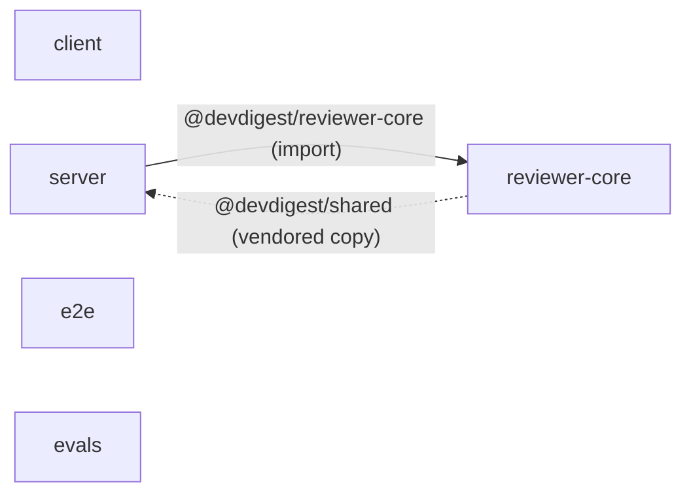

# Dependency Checker

One cheap pass, no agents: a bundled script measures every number and
detects every edge/finding from disk; you only format the fixed report.
Never estimate a size, invent an edge, or add a finding the script didn't
print.

## Hard rules

- **No network calls.** Sizes are on-disk `node_modules` size (`du -sk -L`,
  symlinks followed — required because pnpm links packages into the
  content-addressable store; without `-L` every pnpm-managed package reports
  0 KB). This is not npm registry "unpacked size" and not production bundle
  size — say so if asked for either of those.
- **Every number and every finding comes from the script.** If a package's
  `node_modules` isn't installed, report "not installed" for it. If the
  script reports "none detected" for drift/unused/cross-package imports,
  report that plainly — don't invent a finding to fill the section.
- **This repo is NOT a pnpm/npm workspace.** Every package
  (client/server/reviewer-core/e2e/evals) has its own `package.json` and
  lockfile. Never describe an internal edge as `workspace:*` or "workspace
  dependency" — it is a TypeScript path-alias in `tsconfig.json` `paths`
  pointing directly at a sibling package's source tree (see
  `reviewer-core/AGENTS.md` / `server/AGENTS.md` for why: shared code is
  copy/aliased, not published).
- **Internal (path-alias) vs external (npm) dependencies are never merged.**
  The graph shows only internal edges; external npm deps live in the size
  tables. Don't describe an npm dependency as an internal edge or vice versa.
- Severity tiers, most to least urgent: **P0** (architecture-boundary
  violation — a cross-package relative import bypassing a public entry
  point/alias), **P1** (version drift on a dependency, or a possibly-unused
  dependency that is heavy), **P2** (a possibly-unused dependency that is
  small), **Info** (size stats and observations with no required action).
  Every finding gets exactly one tier — no unranked bullets.
- Possibly-unused and cross-package-import findings are **heuristics**
  (regex over source text, not a type-checker). Phrase them as something for
  the developer to confirm before acting — never as already fixed/removed,
  and never claim a dependency is *definitely* dead (it may be used via a
  build config, CLI, or dynamic string not matched by the grep).
- Prioritization by size (P1/P2 tiering) is a proxy for "worth reviewing,"
  not outdated or insecure — that needs `pnpm outdated` / `pnpm audit`
  (network calls this skill does not make); say so if asked for that angle.
- Every finding names a specific package, dependency, or file — never
  generic advice like "consider optimizing dependencies."
- Narrative sections in the developer's language; table/labels stay English.

## Step 1 — collect metrics

```bash
python3 .claude/skills/dependency-checker/scripts/analyze.py
```

Prints, per package (`client`, `server`, `reviewer-core`, `e2e`, `evals`):
direct/dev dependency counts, total `node_modules` size, top-15 heaviest
installed packages with % share. Then: repo-wide total footprint and top-15
size ranking; internal package edges from `tsconfig.json` `paths`; version
drift (same dependency, different version string across package.json
files); possibly-unused dependencies (declared, no import found in that
package's own source); cross-package relative imports (reaching into a
sibling package's source tree by relative path instead of its alias/entry
point).

## Step 2 — report (fixed template, in chat)

```
Dependency Report — DevDigest

## Scope
Packages analyzed: client, server, reviewer-core, e2e, evals — each has its
own package.json/lockfile (not a pnpm/npm workspace).

## Package graph (internal, path-alias edges only — external npm deps are in the size tables below)



Solid arrow = `[import]` edge (live path-alias import). Dashed arrow labeled
"vendored copy" = `[vendored]` edge (source copied, not live-imported).
Packages with zero detected edges still appear as isolated nodes.

## Size per package

<one table per package: dependency | size | % of package total — script's
top entries, verbatim numbers>

## Repo-wide footprint
Total on-disk `node_modules` across all packages: <script's total>

## Findings & Priorities

Group every item from the script's version-drift, possibly-unused, and
cross-package-import sections under its tier — each line names the
package/dependency/file:

**P0**
<cross-package relative-import findings, if any — "none" if the script found none>

**P1**
<version drift entries; possibly-unused deps that rank in the repo-wide top
size tier for their package>

**P2**
<remaining possibly-unused deps>

**Info**
<repo-wide top-15 size ranking; anything else observational, not actionable>

## Summary
<3-5 numbered, concrete, priority-ordered takeaways — each names a specific
package/dependency/file and phrases any removal/fix as a recommendation to
confirm, not as already done>
```

## Step 3 — close

End by asking if the developer wants a deeper look at any one package (e.g.
re-run after `pnpm install` if something showed "not installed"), or whether
they also want an outdated/vulnerability pass (`pnpm outdated` / `pnpm
audit`, out of scope for this skill's default run since it needs network
access).
