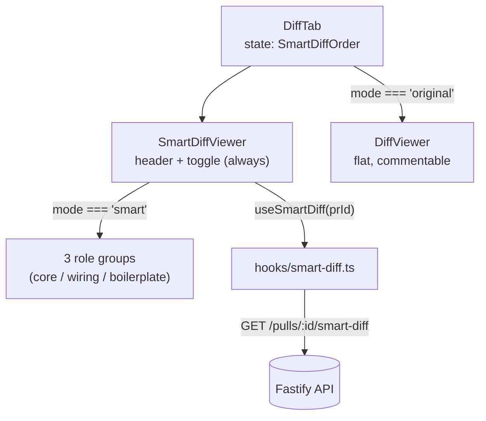

# Smart Diff Viewer (`_components/SmartDiffViewer/`)

Risk-ordered diff layout for the PR-detail "Files changed" tab: changed files
grouped `core` / `wiring` / `boilerplate`, with "N findings" badges from the
latest review and a badge-click-to-scroll interaction. Backed by the
server's `GET /pulls/:id/smart-diff` (see `server/docs/smart-diff.md`).

## Where it lives

`SmartDiffViewer` mounts at the **top of `DiffTab.tsx`**, above the
pre-existing flat, commentable `DiffViewer`. `DiffTab` owns the mode state,
`SmartDiffOrder` (`"smart" | "original"`, exported by `SmartDiffViewer`):

- **`"smart"`** — `SmartDiffViewer` renders its header *and* the three
  role groups.
- **`"original"`** — `SmartDiffViewer` renders only its header (label +
  files/± summary + toggle); `DiffTab` renders the pre-existing
  `SectionLabel` + `DiffViewer` (the flat, per-line commentable diff with the
  show/hide-comments button) below it instead.

The two layouts are mutually exclusive — there is never a duplicate file
list. `DiffTab` passes `mode`/`onModeChange` down; `SmartDiffViewer` never
holds the mode itself.



## Header

Rendered in **both** modes, so switching order never reflows the page above
the diff:

- A `"Reviewer-ordered diff"` uppercase section label (`t("sectionLabel")`).
- A summary line — `"N files · +X −Y"` — computed directly from the `files`
  prop (`PrFile[]`, the same list `DiffTab` already has), **not** from the
  `useSmartDiff` query. This is why the header (and the toggle) render
  instantly on tab open, before the smart-diff request even resolves; the
  query only ever feeds the grouped file list.
- The `"Smart order" / "Original order"` pill toggle (`role="group"`, each
  button `aria-pressed`), calling `onModeChange` on click.

## Groups

The viewer always lays out all three role sections, in the fixed order
`core → wiring → boilerplate`, regardless of what the server returned. The
server response omits a role entirely when it has no files
(`server/docs/smart-diff.md` §Composition rules); the client backfills any
missing role with an empty group (`{ role, files: [] }`) before rendering, so
the three labeled sections — with descriptions "The substance of the change
— review closely" / "Hooks the core into the app" / "Generated / mechanical
— skim" — are always present. An empty group shows a muted
`"No files in this category"` placeholder and a `"0 files"` count instead of
file cards.

Each group is a flat label row (colored square bullet + name + description +
file count) followed by one card per file — not a collapsible box. Every
file in the group is always listed; what collapses is each file's *diff
content*, not the group.

## Expansion model

Per-file open/closed state is **not** stored per file by default — it's
computed from `finding_lines`, with per-file overrides once the user
interacts:

- `openOverrides: Map<string, boolean>` holds only files the user has
  explicitly toggled (via header click or a badge click).
- `isFileOpen(file)` reads the override if present, otherwise defaults to
  `file.finding_lines.length > 0` — a file the latest review flagged starts
  **expanded**; every other file starts **collapsed**.
- There is no separate "collapse boilerplate" rule — a lock file (or any
  other file) starts collapsed purely because it has no `finding_lines`,
  the same as an unflagged `core`/`wiring` file would.

A muted warning dot renders next to the path of any file with
`finding_lines.length > 0`, independent of open/closed state.

## Findings overlay

A file with `finding_lines.length > 0` gets a clickable `"N findings"` badge
in its header row, styled with `SEV.WARNING.c`/`SEV.WARNING.bg` from
`@devdigest/ui` — never a hand-rolled color, to stay consistent with every
other severity-colored badge in the client (`SeverityCounts`, `FindingCard`).
`finding_lines` holds actual line **numbers** (the `start_line`s from the
server), not a count — the badge text and the accessible label both derive
from `finding_lines.length`.

Clicking the badge:

1. Calls `e.stopPropagation()` so it doesn't also toggle the file header.
2. If the file is already open, it `querySelector`s the finding line inside
   that file's container (`[data-sd-line="<line>"]`, set on each rendered
   diff line during `FileDiff`'s render) and calls `scrollIntoView` directly.
3. If the file is closed, it stores `{ path, line }` in `pendingScrollRef`
   and opens the file; a `useEffect` keyed on `openOverrides` then runs after
   the next render (once the diff content is in the DOM), finds the same
   `data-sd-line` element, and scrolls to it.

```mermaid
sequenceDiagram
  participant U as User
  participant V as SmartDiffViewer
  participant D as FileDiff (DOM)
  U->>V: click "N findings" badge
  alt file already open
    V->>D: querySelector [data-sd-line] + scrollIntoView
  else file closed
    V->>V: pendingScrollRef = {path, line}; open file
    V->>D: re-render with diff content
    V->>D: effect: querySelector + scrollIntoView; clear pendingScrollRef
  end
```

`FileDiff` is a small local component, not the shared `diff-viewer`
`FileCard`/`CodeLine` — those expose no open-state or scroll API, so
`SmartDiffViewer` renders its own diff lines instead of extending them.

## Data

`useSmartDiff(prId)` (`client/src/lib/hooks/smart-diff.ts`) is a thin
TanStack Query wrapper: `queryKey: ["pull", prId, "smart-diff"]`,
`queryFn: () => api.get<SmartDiff>(`/pulls/${prId}/smart-diff`)`,
`enabled: prId != null`. It returns before any review has run — every file's
`finding_lines` is `[]` until the first review completes, and the layout
still renders.

Each file's diff patch itself does not come from this hook — `SmartDiffViewer`
cross-references the `SmartDiff` file list (by `path`) against the `files:
PrFile[]` prop it already receives from `DiffTab`, and parses that file's
`patch` with `parsePatch`, re-exported (alongside its `Line` type) from
`@/components/diff-viewer`'s public barrel rather than deep-imported from an
internal helper file.

## i18n

All copy comes from the `smartDiff` next-intl namespace
(`client/messages/en/smartDiff.json`) via one `useTranslations("smartDiff")`
call. Pluralized strings (`filesSummary`, `fileCount`) use ICU plural syntax,
e.g. `"{count, plural, one {# file} other {# files}}"`; the findings badge
text (`"{count} findings"`) is not pluralized through ICU since it's always
`> 0` at render time.

## Testing

`SmartDiffViewer.test.tsx` mocks `useSmartDiff` (`vi.mock` the hook module,
cast the stub `as unknown as ReturnType<typeof useSmartDiff>`), and wraps the
component in both `QueryClientProvider` and `NextIntlClientProvider`
(importing `smartDiff.json` directly, mirroring `ConfigTab.test.tsx`).
Covered behaviors include: header/toggle rendering in both modes, canonical
group order and client-side backfill of an empty role, auto-expand vs
collapsed-by-default per `finding_lines`, badge visibility only on flagged
files, and the badge-click scroll path for both an already-open and a
closed file (the latter via `waitFor` on the post-render effect). A fixture
gotcha to preserve: `finding_lines` values are line numbers, not a count, so
a stub needs one array element per finding the test expects the badge to
report.
