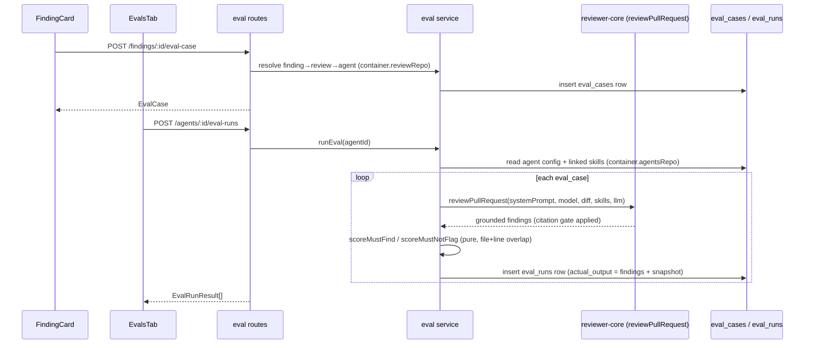

## Implementation Plan — L06 Eval Pipeline
**Date:** 2026-07-17

### 1. Objective
Governing spec: `specs/eval-pipeline.md` (SPEC-03, approved, D1–D8 frozen). Build the eval pipeline end-to-end per SPEC-03 §Acceptance criteria — HOW only, no restatement of WHAT/WHY.

### 2. Requirements review & recommendations

Gaps found in the spec that needed a HOW-level design decision (not spec contradictions — SPEC-03 deliberately leaves route granularity to the plan: "already implied by `eval-ci.ts`'s shapes, not new contracts"):

- **Route surface is under-specified.** The spec names 5 routes; the ACs require 13 (single-case get/update/run, case status list, multi-agent summary, version snapshot, promote, and the FindingCard creation path). All 13 are frozen in §6 below, reusing existing shared contracts wherever the shape already exists and adding small **module-local** (not shared-package) types otherwise.
- **"Turn into eval case" (AC-1–4) diff-fragment construction.** Two designs were possible: (a) client assembles `input_diff` from `pr.files[].patch` and POSTs the generic `EvalCaseInput`, requiring `agentId`+`prFiles` to be threaded down 5 component levels (page→FindingsTab→ReviewRunAccordion→FindingsPanel→FindingCard); or (b) a dedicated `POST /findings/:id/eval-case` route resolves finding→review→agent_id→PR files **server-side** via the already-exposed `container.reviewRepo` accessor (`getFinding`/`getReview`/`getPrFiles` all exist today, used identically by `diff-loader.ts`). **Adopted: (b)** — zero new client prop-threading, zero duplicated diff-header-wrapping logic, `FindingCard` needs no new props at all (just `f.id/accepted_at/dismissed_at`, which it already has). Frozen in §6/§7.
- **Zero-denominator scoring convention** (AC-14 leaves `TP/(TP+FN)` etc. undefined when the denominator is 0 — e.g. a must_not_flag case alone has no must_find skeletons at all). **Resolved and approved by the developer**: the standard IR convention — recall = 1 when `TP+FN=0`, precision = 1 when `TP+FP=0`, citation_accuracy = 1 when `TP=0` ("nothing expected/claimed, nothing missed"). Adopted as-is; see §6.3.
- **Failed-case row (AC-9) vs. `EvalRunResult.result: EvalRun`.** `EvalRunRecord` (persisted, nullable metrics) and `EvalRun` (the response's `result`, non-nullable per its Zod schema) can't both hold `null`. Resolved: the **persisted** row keeps `pass=false, recall/precision/citation_accuracy=null` (AC-9, literal); the **in-flight response**'s `EvalRun` degenerates that case to `recall=0, precision=0, citation_accuracy=0, traces_passed=0, traces_total=1` for immediate UI feedback. Documented in §6.3.
- **`eval.json`/`nav.ts` are shared files touched by 3 parallel client tasks.** No missing requirement, but a real ownership hazard — resolved in §7 (additive-only, sequenced).

No simpler alternative to the spec's overall shape was found — the design above only fills in HOW, not a different WHAT.

### 3. Acceptance criteria
See `specs/eval-pipeline.md` §Acceptance criteria (EARS), AC-1…AC-39. Not restated here.

### 4. Scope
See `specs/eval-pipeline.md` §Scope. Plan-introduced deltas only:
- IN (plan-level, not spec-listed): 8 additional routes beyond the spec's 5 (single-case get/update/run, case-status list, multi-agent summary, version snapshot, promote-config, from-finding creation) — all reuse existing shared contracts or small module-local types, no new `@devdigest/shared` shapes.
- OUT: case **delete** (an `evalsTab.delete` i18n key exists in `client/messages/en/eval.json` from earlier scaffolding, but no AC requires delete — not built, per Hard Rule 5).
- OUT: any `owner_kind="skill"` UI/route wiring (contract supports it; unused here, per spec).

### 5. Affected packages & modules

| Package/module | Onion layer(s) | Why touched |
|---|---|---|
| `server/src/modules/eval/` (new) | routes, service, repository, pure domain (scoring/aggregate) | Core feature: case CRUD, run execution, scoring, dashboard, promote |
| `server/src/modules/index.ts` | wiring | Register `eval` module (1 import + 1 entry) |
| `server/src/db/rows.ts` | shared row types | Add `EvalCaseRow`/`EvalRunRow` (existing append-only pattern, no schema change) |
| `client/src/app/agents/[id]/_components/AgentEditor/` | UI | 4th tab (Evals) + case editor modal |
| `client/src/app/eval-dashboard/` (new) | UI | Multi-agent overview + per-agent detail page |
| `client/src/app/repos/[repoId]/pulls/[number]/_components/FindingCard/` | UI | "Turn into eval case" button |
| `client/src/lib/hooks/eval.ts` (new) | data | All eval React Query hooks |
| `client/src/vendor/ui/nav.ts` | config | Sidebar entry (SKILLS LAB group) |
| `client/messages/en/{eval,prReview}.json` | i18n | New/missing strings |
| `scripts/verify-l06.sh`, `server/package.json`, `client/package.json` | verification | `pnpm verify:l06` wiring |

No DB migration (D3) — `server/src/db/migrations/` untouched.

### 6. Frozen interface contracts

#### 6.1 Server routes (all in `modules/eval/routes.ts` unless noted)

| # | Route | Body | Response | Origin |
|---|---|---|---|---|
| 1 | `GET /agents/:id/eval-cases` | — | `EvalCase[]` | spec |
| 2 | `POST /agents/:id/eval-cases` | `EvalCaseInput` (server **overrides** `owner_kind='agent'`, `owner_id=:id` regardless of body) | `EvalCase` (201) | spec — manual/editor creation |
| 3 | `GET /agents/:id/eval-cases/:caseId` | — | `EvalCase` | plan addition |
| 4 | `PATCH /agents/:id/eval-cases/:caseId` | `EvalCaseInput` (full replace) | `EvalCase` | plan addition — editor Save |
| 5 | `GET /agents/:id/eval-cases/status` | — | `EvalCaseStatus[]` (module-local, §6.2) | plan addition — AC-18 |
| 6 | `POST /findings/:id/eval-case` | — (no body) | `EvalCase` (201) | plan addition — "Turn into eval case" (AC-1–4), cross-domain via `container.reviewRepo` |
| 7 | `POST /agents/:id/eval-cases/:caseId/run` | — | `EvalRunResult` | plan addition — AC-21/26 |
| 8 | `POST /agents/:id/eval-runs` | — | `EvalRunResult[]` | spec — AC-7–10 |
| 9 | `GET /agents/:id/eval-runs` | — | `EvalRunRecord[]` (all persisted rows for this agent's cases, `ran_at` desc) | spec |
| 10 | `GET /agents/:id/eval-runs/:version/snapshot` | — | `EvalRunSnapshot` (module-local, §6.2) | plan addition — Compare/Promote |
| 11 | `GET /eval/dashboard?owner_kind=&owner_id=` | — | `EvalDashboard` (both query params optional → workspace-wide when omitted, uses `.nullable()` owner fields already in the contract) | spec |
| 12 | `GET /eval/dashboard/agents` | — | `EvalAgentSummary[]` (module-local, §6.2) — only `owner_kind='agent'` owners with ≥1 case | plan addition — AC-29 |
| 13 | `POST /agents/:id/promote-config` | `{ version: number }` | `Agent` (updated DTO) | plan addition — name taken verbatim from the spec's own architecture diagram |

Route 6 (`/findings/:id/eval-case`) resolves: `finding = container.reviewRepo.getFinding(id)` → 404 if missing → `review = container.reviewRepo.getReview(finding.reviewId)` → 400 `ValidationError` if `review.agentId` is null (no owner to attach the case to) → 400 if `finding.accepted_at` and `finding.dismissed_at` are both null (button is only ever shown on an accepted/dismissed finding, but the route defends independently) → `prFiles = container.reviewRepo.getPrFiles(review.prId)` → build `input_diff`/`input_files`/`input_meta`/`expected_output` per D1/D5 (see §6.3).

#### 6.2 Module-local types (`server/src/modules/eval/types.ts` — NOT added to `@devdigest/shared`)

```ts
export const FindingSkeleton = z.object({
  file: z.string(),
  start_line: z.number().int(),
  end_line: z.number().int(),
  severity: Severity.optional(),
  category: FindingCategory.optional(),
  title: z.string().optional(),
});
export const ExpectedOutput = z.array(FindingSkeleton); // AC-24 boundary validation

export interface RunSnapshot { system_prompt: string; model: string; skills: string[] /* skill IDs, not bodies */; version: number; }
export type EvalRunSnapshot = RunSnapshot & { ran_at: string };

export interface EvalCaseStatus {
  case_id: string; name: string;
  status: 'passing' | 'failing' | 'never-run';
  severity: string | null; category: string | null; title: string | null; // sourced from input_meta (D5) — same for both case types
  last_run: EvalRunRecord | null;
}
export interface EvalAgentSummary { agent_id: string; agent_name: string; dashboard: EvalDashboard; }
```

`ALERT_THRESHOLD_PP = 2` lives in `modules/eval/constants.ts` (D7).

#### 6.3 D3 run-snapshot + diff-fragment format + scoring conventions (frozen so client/server never diverge)

- Snapshot embedded in `eval_runs.actual_output` on every run: `{ findings: Finding[], snapshot: { system_prompt, model, skills, version } }`. `skills` = **skill IDs** (array of uuid strings, matching `agent_versions.configJson.skills`'s existing format from `AgentsRepository.skillIdsForAgent`) — required so Promote (route 13) can feed them straight into `agentsRepo.setSkills()`.
- `input_diff` fragment format (built server-side only, route 6): `` `diff --git a/${file} b/${file}\n--- a/${file}\n+++ b/${file}\n${patch}` `` — identical header convention to `diffFromPrFiles` in `modules/reviews/diff-loader.ts`, so `parseUnifiedDiff` (existing adapter, `server/src/adapters/git/diff-parser.ts`) round-trips it at run time. `input_files` stores `[{ path: file, patch }]`.
- **Scoring zero-denominator convention — approved, final:** recall = 1 when `TP+FN=0`; precision = 1 when `TP+FP=0`; citation_accuracy = 1 when `TP=0` (standard IR "nothing expected/claimed, nothing missed" convention).
- Failed-case (AC-9) representation: persisted `EvalRunRecord` keeps real `null`s; the same case inside a batch's `EvalRunResult[]` response degenerates to `recall=0, precision=0, citation_accuracy=0, pass=false, traces_passed=0, traces_total=1`.

#### 6.4 Promote call sequence (route 13, T-A — no new container accessor, reuses `container.agentsRepo` per the 2026-07-03 insight)

```ts
await container.agentsRepo.setSkills(agentId, snapshot.skills); // 1) apply skills FIRST — no version bump
const updated = await container.agentsRepo.update(workspaceId, agentId, {
  model: snapshot.model,
  systemPrompt: snapshot.system_prompt,
}); // 2) bumps version + snapshots — snapshotVersion() reads CURRENT skills, so ordering matters
```
Ordering is load-bearing: reversing it snapshots the OLD skill set into the new `agent_versions` row.

#### 6.5 Client hooks (`client/src/lib/hooks/eval.ts`, owned by T-B, imported by T-C/T-D/T-E)

```ts
useEvalCaseStatuses(agentId)                      // GET .../eval-cases/status
useEvalCase(agentId, caseId)                      // GET single
useCreateEvalCase(agentId)                        // POST .../eval-cases  (manual/editor create)
useCreateEvalCaseFromFinding()                    // POST /findings/:id/eval-case
useUpdateEvalCase(agentId, caseId)                // PATCH
useRunEvalCase(agentId, caseId)                   // POST .../eval-cases/:id/run
useRunAllEvals(agentId)                           // POST .../eval-runs
useEvalDashboard(ownerKind?, ownerId?)             // GET /eval/dashboard
useEvalAgentSummaries()                            // GET /eval/dashboard/agents
useEvalRunSnapshot(agentId, version)               // GET .../eval-runs/:version/snapshot
usePromoteConfig(agentId)                          // POST .../promote-config
```
`usePromoteConfig`'s `onSuccess` MUST invalidate `["agents"]`, `["agent", agentId]`, `["agent-skills", agentId]` (existing keys, per the 2026-07-12 cross-hook-file invalidation insight) **and** `["eval-dashboard", ...]`/`["eval-cases", agentId]` (new keys) — freezing this list here so it isn't missed.

#### 6.6 `CompareRunsModal` props (decouples T-C from T-E)

```ts
interface CompareRunsModalProps {
  agentId: string;
  versions: [number, number]; // exactly two selected version-groups
  onClose: () => void;
  onPromoted?: () => void;
}
```

#### 6.7 Client routes
- `client/src/app/eval-dashboard/page.tsx` — multi-agent overview.
- `client/src/app/eval-dashboard/[agentId]/page.tsx` — per-agent detail (metric cards, trend chart, recent-runs checkboxes, Compare/Promote).
- `nav.ts`: `{ key: "eval", label: "Eval Dashboard", icon: "..." , href: "/eval-dashboard" }` under `SKILLS LAB` — `activeKeyFor` already handles `pathname.startsWith("/eval")` (existing code, no change needed there).

### 7. Directory ownership map (non-overlapping)

| Task | Surface | Owns |
|---|---|---|
| T-A | backend | `server/src/modules/eval/**`, `server/src/modules/index.ts` (+1 import/entry), `server/src/db/rows.ts` (+2 type lines) |
| T-B | ui | `AgentEditor/_components/EvalsTab/**` (incl. nested `EvalCaseEditorModal/**`), `AgentEditor/AgentEditor.tsx` (+branch), `AgentEditor/constants.ts` (+tab entry), `client/src/lib/hooks/eval.ts` (new, full ownership) |
| T-C | ui | `client/src/app/eval-dashboard/**` **except** `_components/CompareRunsModal/**`, `client/src/vendor/ui/nav.ts` (+1 entry) |
| T-D | ui | `FindingCard/**` only (no other file — see §2) |
| T-E | ui | `eval-dashboard/_components/CompareRunsModal/**` only |
| T-F | verify | `scripts/verify-l06.sh`, `server/package.json`/`client/package.json` (`verify:l06` alias, mirrors `verify:l03`) |

**Shared-file exceptions (sequential, additive-only — same category as `modules/index.ts`):**
- `client/messages/en/eval.json` — T-B adds first (fills the existing `evalsTab.*`/`caseEditor.*` sections, incl. the missing "Finding skeleton" label), then T-C appends a new top-level overview key, then T-E appends a new top-level `compare.*` key. Never edit another task's existing keys.
- `client/messages/en/prReview.json` — T-D only (adds `finding.turnIntoEvalCase`).
- `client/messages/en/agents.json` — **no edit needed**, `tabs.evals` label already present.

No two tasks touch the same file.

### 8. Execution mode

**Recommendation only — the final team-vs-single choice is confirmed at the start of the implementation session, not in this planning session (no code is written here).**

Recommended: **team (parallel implementers)**, in three waves:
- Wave 1 (parallel, no dependency between them): **T-A**, **T-B**.
- Wave 2 (parallel, depends on T-B's `hooks/eval.ts` landing — frozen signatures in §6.5 let them be written against the contract immediately, but should merge after T-B): **T-C**, **T-D**, **T-E**.
- Wave 3 (last, depends on everything): **T-F**.

Given the `eval.json` sequencing note in §7, a single-agent sequential pass remains the lower-coordination-risk (if slower) alternative — re-confirm at implementation kickoff.

### 9. Tasks

**T-A — Server eval module** (backend)
Goal: implement all 13 routes (§6.1), scoring (AC-11–16), dashboard/version-group aggregation (D4, AC-33), Promote (§6.4).
Dependencies: none. Merge order: wave 1.
Skills: `onion-architecture`, `fastify-best-practices`, `drizzle-orm-patterns`, `zod`, `typescript-expert`, `security` (route 6 reads cross-domain finding/PR data — validate ownership scoping), `engineering-insights` (end of session).
Done-conditions:
- All 13 routes registered and workspace-scoped via `getContext`.
- `container.agentsRepo`/`container.reviewRepo` used for all cross-domain reads; zero `new AgentsRepository(...)`/`new ReviewRepository(...)` inside `modules/eval/`.
- `overlaps`/`scoreMustFind`/`scoreMustNotFlag` are pure, unit-tested, and do not import from or modify `reviewer-core/src/grounding.ts`.
- Batch run (`POST /agents/:id/eval-runs`) persists a row per case even when one case's execution throws (AC-9), and does not abort remaining cases.
- Promote applies `setSkills` before `update` (§6.4 ordering).
- No new file under `server/src/db/migrations/`.
- `vitest run src/modules/eval` and `tsc --noEmit -p tsconfig.json` (server) green.

**T-B — EvalsTab + Eval-case editor modal + shared hooks** (ui)
Goal: Group D (Evals tab, AC-17–22) + Group E (editor modal, AC-23–27) + `client/src/lib/hooks/eval.ts` (§6.5).
Dependencies: none (writes against T-A's frozen route contracts). Merge order: wave 1.
Skills: `ui-architecture`, `react-best-practices`, `next-best-practices`, `react-testing-library`, `zod` (Expected-output JSON validation, AC-24), `typescript-expert`, `engineering-insights`.
Done-conditions:
- 4th tab wired in `AgentEditor.tsx`/`constants.ts`, reusing `Tabs`/`MetricCard`/`Sparkline` from `@devdigest/ui` (no hand-rolled severity colors — use `SEV`, per the 2026-06-24/07-03 insight).
- Editor modal validates Expected-output JSON at the boundary (module-local `ExpectedOutput` Zod schema, not the shared contract) and blocks Save on invalid input (AC-24).
- "Run on save" toggle triggers `useRunEvalCase` after `useUpdateEvalCase`/`useCreateEvalCase` succeeds (AC-26).
- `AgentEditor.test.tsx` (composite) mocks the new eval hooks per the 2026-07-06 insight (child hook → parent composite test needs its own mock).
- `vitest run "EvalsTab"` and `tsc --noEmit` (client) green.

**T-C — Eval Dashboard (multi-agent + per-agent detail)** (ui)
Goal: Group F (AC-28–33), minus the Compare modal.
Dependencies: T-B (`hooks/eval.ts`). Merge order: wave 2, after T-B.
Skills: `ui-architecture`, `react-best-practices`, `next-best-practices`, `react-testing-library`, `typescript-expert`, `engineering-insights`.
Done-conditions:
- `nav.ts` entry added (`key: "eval"`, `href: "/eval-dashboard"`); no edit to `components/app-shell/helpers.ts` needed (`/eval` prefix already mapped).
- Page padding matches the `pageHeader`/`tableCard` convention (AppFrame has no default padding — 2026-06-28 insight).
- "Metric trend" uses `LineChart`, mini-trend uses `Sparkline`, cards use `MetricCard` (all from `@devdigest/ui/charts` — no bespoke chart code).
- Alert string (AC-33) renders only when non-null; null on the first-ever run (no preceding version-group).
- "Run all agents" loops `useRunAllEvals` per agent id from the overview list (no new server route).
- Detail view renders `<CompareRunsModal agentId versions onClose onPromoted />` against the §6.6 contract without needing T-E's implementation to exist for its own tests (mock the import).
- `vitest run "eval-dashboard"` and `tsc --noEmit` (client) green.

**T-D — FindingCard "Turn into eval case"** (ui)
Goal: AC-1–6.
Dependencies: T-B (`useCreateEvalCaseFromFinding`). Merge order: wave 2.
Skills: `ui-architecture`, `react-best-practices`, `react-testing-library`, `typescript-expert`, `engineering-insights`.
Done-conditions:
- Button shown when `f.accepted_at || f.dismissed_at` is set; no new props added to `FindingCard`/`FindingsPanel`/`ReviewRunAccordion`.
- Click always creates a NEW case (no dedup against an existing one, AC-6), disabled while the mutation is pending.
- Failure (e.g. null `review.agent_id` edge case) surfaces via `notify.error`, not a silent no-op.
- `finding.turnIntoEvalCase` key added to `prReview.json`.
- `vitest run "FindingCard"` and `tsc --noEmit` (client) green.

**T-E — Compare-runs modal + Promote** (ui)
Goal: Group G (AC-34–37).
Dependencies: T-C (integration point only — implements against the frozen §6.6 props, not T-C's internals). Merge order: wave 2.
Skills: `ui-architecture`, `react-best-practices`, `react-testing-library`, `zod`, `typescript-expert`, `engineering-insights`.
Done-conditions:
- Fetches both selected versions' snapshots via `useEvalRunSnapshot` (route 10) and renders a plain line-level diff of `system_prompt` (no new npm dependency — hand-rolled pure line-diff helper, matching the project's existing hand-rolled `parsePatch` convention in `components/diff-viewer`).
- Metric deltas (recall/precision/citation_accuracy/cost) computed from the two `EvalTrendPoint`s already available via `EvalDashboard.trend` (passed in or refetched), not re-derived from raw runs.
- "Promote" calls `usePromoteConfig`, is a real backend effect (not visual-only, AC-36/D8), and calls `onPromoted?.()` on success.
- "Close" makes no request (AC-37).
- `vitest run "CompareRunsModal"` and `tsc --noEmit` (client) green.

**T-F — `pnpm verify:l06` wiring** (verify)
Goal: finalize/adjust the already-present `scripts/verify-l06.sh` draft; add the `verify:l06` alias to both package.jsons (mirrors `verify:l03`).
Dependencies: T-A, T-B, T-C, T-D, T-E (must all be merged). Merge order: last.
Skills: `engineering-insights`.
Done-conditions:
- `./scripts/verify-l06.sh` runs server typecheck, server eval tests, client typecheck, client eval tests (EvalsTab/eval-dashboard/CompareRunsModal/FindingCard) and exits 0.
- Given the 2026-06-30 insight (vitest CLI substring/regex gotcha), verify the `"EvalsTab|eval-dashboard|CompareRunsModal|FindingCard"` pattern actually matches all four suites before declaring done — split into separate `vitest run` calls per suite if the combined pattern misses any.

### 10. Test commands per scope

- **T-A:** `cd server && ./node_modules/.bin/tsc --noEmit -p tsconfig.json && ./node_modules/.bin/vitest run src/modules/eval`
- **T-B:** `cd client && ./node_modules/.bin/vitest run "EvalsTab" && ./node_modules/.bin/tsc --noEmit`
- **T-C:** `cd client && ./node_modules/.bin/vitest run "eval-dashboard" && ./node_modules/.bin/tsc --noEmit`
- **T-D:** `cd client && ./node_modules/.bin/vitest run "FindingCard" && ./node_modules/.bin/tsc --noEmit`
- **T-E:** `cd client && ./node_modules/.bin/vitest run "CompareRunsModal" && ./node_modules/.bin/tsc --noEmit`
- **T-F:** `./scripts/verify-l06.sh` (from repo root)

### 11. Relevant engineering insights

- `container.ts:70-72` exposes `agentsRepo`/`reviewRepo` specifically so cross-domain modules avoid `new XRepository(...)` — used throughout T-A (server/INSIGHTS.md, 2026-07-03).
- Severity/category colors must come from `SEV` (`@devdigest/ui`), never hand-rolled — repeated violation history (client/INSIGHTS.md, 2026-06-24 and 2026-07-03).
- CSS-in-JS `styles.ts` + `var(--token)`, not Tailwind (client/INSIGHTS.md, 2026-06-24).
- `src/vendor/ui/nav.ts` is an explicit, intended edit point for new sidebar items despite the general vendor do-not-touch rule (client/INSIGHTS.md, 2026-06-28).
- `AppFrame`'s `<main>` has no default padding — every new page must add its own (client/INSIGHTS.md, 2026-06-28).
- `vitest run` CLI pattern matching is a plain substring, not dot-matching regex — verify the T-F combined pattern actually hits all 4 suites (client/INSIGHTS.md, 2026-06-30).
- A child component gaining a data hook requires updating every composite parent test that renders it (client/INSIGHTS.md, 2026-07-06) — relevant to `AgentEditor.test.tsx` once `EvalsTab` calls hooks.
- Cross-hook-file query-key invalidation is easy to miss (client/INSIGHTS.md, 2026-07-12) — directly informs the `usePromoteConfig` invalidation list in §6.5.
- Adding a required field to an inferred DB row type forces a repo-wide fixture sweep (server/INSIGHTS.md, 2026-07-11) — **not triggered by this plan**, since D3 reuses existing jsonb columns and no schema/migration changes are made; flagged here only to confirm the risk was checked and ruled out.

### 12. Architecture diagram



### 13. Risks & integration concerns

- `eval.json`/`prReview.json` additive-only sequencing (§7) — real risk under true parallel execution; mitigated by explicit per-task key ownership, but flagged for the orchestrator's attention.
- Eval runs call `container.llm(agent.provider)` like a normal review — a missing provider API key surfaces as a bare 500 (`ConfigError`, server/INSIGHTS.md 2026-06-28); worth a clear error message in the batch-run response rather than a silent per-case failure.
- ≥8 real eval cases (AC-38) must be authored for the demo — not scaffolding, real content; not this plan's job to author them, but the DoD check belongs to whichever task finishes last (T-F) or a separate manual step before sign-off.
- Non-functional cost note from the spec (repeated ≥8 cases × repeated runs = real LLM spend) — no action needed in this plan beyond not faking execution.

### 14. Open questions

— none — both prior open items are resolved: zero-denominator scoring convention adopted as-is (§2, §6.3); execution mode recommendation (team, 3 waves) stands per §8, with the final team-vs-single choice reconfirmed at the start of the implementation session (no code was written in this planning session).
