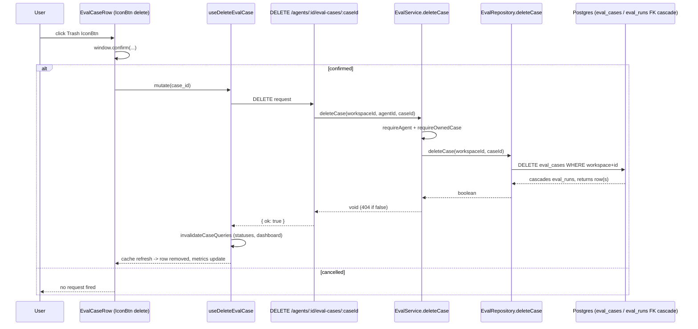

## Implementation Plan — Evals tab redesign + eval-case delete
**Date:** 2026-07-17

### 1. Objective
Restyle the Agent Editor's Evals tab to match the target mockup's compact header/action layout (metrics label, relocated action buttons, icon-only case-row actions) and remove the dashboard link, plus add a fully functional "delete eval case" action (new server `DELETE` route + client wiring). Plan-without-spec path — no governing `SPEC-NN`; requirements come from the developer's TЗ text plus the two reference screenshots.

### 2. Requirements review & recommendations

**Gaps found / resolved:**
- The original `plans/eval-pipeline.md` explicitly listed case delete as OUT of scope ("no AC requires delete — not built"), but noted the `evalsTab.delete` i18n key was pre-seeded ("Delete"). Confirms this task is additive, not a revert of a deliberate omission.
- Point 1's target mockup shows the "EVAL METRICS" label with **no subtitle line** beneath it (unlike the current `metricsSubtitle` paragraph). The TЗ text only mentions the heading's *style*, not the subtitle's removal — but per design-parity, I'm treating the mockup as binding: the subtitle paragraph is dropped along with the `<h2>`. The `evalsTab.metricsSubtitle` i18n key becomes unused; recommend leaving it in `eval.json` (harmless dead key, not worth a special cleanup task) rather than deleting it.
- `IconBtn` (vendor primitive) has no `disabled`/`loading` props, unlike `Button`. The current Run button disables itself while `run.isPending`. Resolution: guard inside the `onClick` handler (`() => !run.isPending && run.mutate()`) instead of a visual disabled state — matches "just switch to IconBtn," no primitive changes.
- Server test coverage for the new `deleteCase` service method: the TЗ only flags the **client** `EvalsTab.test.tsx` as deferred to a later test-writer stage; it says nothing about backend tests. Since `server/src/modules/eval/service.test.ts` already covers `updateCase`'s ownership-scoping with an easily-extended in-memory fake, I'm including a matching `deleteCase` test as part of the backend task (T1) rather than deferring it — it's a small, mechanical addition to an existing fake, not a new test-writer stage.

**Recommendations:**
- None beyond the above — the requested approach (icon-only actions via the existing `IconBtn` primitive, `window.confirm` over a new dialog component, reusing `RunReviewDropdown`'s icon/label text without reusing the component itself) is already the simplest viable path; no lower-risk alternative to suggest.

### 3. Acceptance criteria
1. Given the Evals tab, when it renders, then the "Eval metrics" region shows a small uppercase label with a leading icon (no `<h2>`/subtitle).
2. Given the Agent Editor page header, when it renders, then the top-right button reads "Run Review" with a `Sparkles` icon (no dropdown), and clicking it still calls `router.push("/")`.
3. Given the Evals tab, when it renders, then "Run all evals" and "New eval case" sit on the same row as the "Eval cases" heading, below the 4 metric cards — not in the top header.
4. Given that row, when it renders, then the `{passing}/{total} passing` counter sits to the left of those two buttons (paired with the "Eval cases" heading).
5. Given the Evals tab, when it renders, then no "View full dashboard →" link exists anywhere on the page (the `/eval-dashboard` route itself is untouched).
6. Given an eval-case row, when it renders, then it shows exactly 3 icon-only buttons (run, edit, delete) — no visible "Run"/"Edit" text.
7. Given the delete icon is clicked, when the user confirms via `window.confirm`, then `DELETE /agents/:agentId/eval-cases/:caseId` fires, the case (and its runs, via DB cascade) is removed, and the case list/metrics refresh without a page reload. Cancelling the confirm fires no request.

### 4. Scope
- **IN:** Points 1–6 as specified (client-only restyle for 1–5 and the run/edit icon-swap in 6; new full-stack delete for the rest of 6).
- **OUT:** Relocating the dashboard link (it's deleted, not moved) · a dropdown/chevron on "Run Review" · a new `ConfirmDialog` component · any DB migration/schema change (confirmed unnecessary — `eval_runs.case_id` already has `ON DELETE CASCADE`) · any change to existing eval routes (create/update/run/dashboard) · updating `EvalsTab.test.tsx` (flagged for a later test-writer stage per the developer's instruction, not built here) · touching `client/messages/en/agents.json`'s now-still-unused `editor.runOnPr` key.

### 5. Affected packages & modules
| Package/module | Onion layer(s) | Why touched |
|---|---|---|
| `server/src/modules/eval/routes.ts` | presentation | new `DELETE /agents/:id/eval-cases/:caseId` route |
| `server/src/modules/eval/service.ts` | application | new `deleteCase` method |
| `server/src/modules/eval/repository.ts` | data-access | new `deleteCase` method |
| `server/src/modules/eval/service.test.ts` | test | extend fake repo + add `deleteCase` tests |
| `client/src/app/agents/[id]/page.tsx` | UI | "Run Review" button copy/icon |
| `client/src/app/agents/[id]/_components/AgentEditor/_components/EvalsTab/EvalsTab.tsx` | UI | header restyle, button relocation, dashboard-link removal, icon-only row actions, delete wiring |
| `client/src/app/agents/[id]/_components/AgentEditor/_components/EvalsTab/styles.ts` | UI | new/removed style tokens |
| `client/src/lib/hooks/eval.ts` | UI (data hook) | new `useDeleteEvalCase` mutation |
| `client/messages/en/eval.json` | i18n | `evalsTab.newCase` copy change |

Not touched: `server/src/modules/index.ts` (eval module already registered), `server/src/db/migrations/` (no schema delta), `client/src/vendor/ui/nav.ts` (no new route).

### 6. Frozen interface contracts

**Server — new route** (in `routes.ts`, reusing the already-declared `CaseParams` schema):
```ts
app.delete(
  '/agents/:id/eval-cases/:caseId',
  { schema: { params: CaseParams } },
  async (req) => {
    const { workspaceId } = await getContext(app.container, req);
    await service.deleteCase(workspaceId, req.params.id, req.params.caseId);
    return { ok: true };
  },
);
```

**Server — service** (in `service.ts`, alongside `updateCase`):
```ts
/** Route 14 (new) — delete a case. Ownership re-verified via
 *  `requireOwnedCase` (same pattern as update/get), repo call is itself
 *  workspace-scoped as a second guard; `eval_runs` cascade via the DB FK,
 *  no explicit run deletion needed. */
async deleteCase(workspaceId: string, agentId: string, caseId: string): Promise<void> {
  await this.requireAgent(workspaceId, agentId);
  await this.requireOwnedCase(workspaceId, agentId, caseId);
  const ok = await this.repo.deleteCase(workspaceId, caseId);
  if (!ok) throw new NotFoundError('Eval case not found');
}
```

**Server — repository** (in `repository.ts`, alongside `updateCase`):
```ts
async deleteCase(workspaceId: string, id: string): Promise<boolean> {
  const rows = await this.db
    .delete(t.evalCases)
    .where(and(eq(t.evalCases.workspaceId, workspaceId), eq(t.evalCases.id, id)))
    .returning({ id: t.evalCases.id });
  return rows.length > 0;
}
```

**Client — hook** (in `lib/hooks/eval.ts`, after `useUpdateEvalCase`, same `invalidateCaseQueries` helper the sibling mutations use):
```ts
export function useDeleteEvalCase(agentId: string | null | undefined) {
  const qc = useQueryClient();
  return useMutation({
    mutationFn: (caseId: string) => api.del<{ ok: boolean }>(`/agents/${agentId}/eval-cases/${caseId}`),
    onSuccess: () => {
      invalidateCaseQueries(qc, agentId ?? undefined);
    },
  });
}
```

**Client — `EvalsTab.tsx` structure (top-level, replaces current `s.header` block):**
```tsx
<div style={s.metricsLabel}>
  <Icon.Target size={14} style={{ color: "var(--text-secondary)" }} />
  <span style={s.metricsLabelText}>{t("evalsTab.metricsTitle")}</span>
</div>
{/* metricsGrid unchanged */}
<div style={s.casesHeader}>
  <div style={s.casesHeaderLeft}>
    <h3 style={s.h3}>{t("evalsTab.casesHeading")}</h3>
    {!statusesLoading && (
      <span style={s.passingCounter}>{t("evalsTab.passingCounter", { passing, total: cases.length })}</span>
    )}
  </div>
  <div style={s.headerActions}>
    <Button kind="secondary" icon="RefreshCw" onClick={() => runAll.mutate()}
      disabled={runAll.isPending || cases.length === 0} loading={runAll.isPending}>
      {runAll.isPending ? t("evalsTab.running") : t("evalsTab.runAll")}
    </Button>
    <Button kind="primary" icon="Plus" onClick={() => setModalCaseId(null)}>
      {t("evalsTab.newCase")}
    </Button>
  </div>
</div>
```
`Link`/`s.dashboardLink` removed entirely (point 5); `Icon` added to the `@devdigest/ui` import.

**Client — `EvalCaseRow` actions (replaces the two `Button`s):**
```tsx
const del = useDeleteEvalCase(agentId);
const handleDelete = () => {
  if (window.confirm(`Delete eval case "${status.name}"? This cannot be undone.`)) {
    del.mutate(status.case_id);
  }
};
// ...
<div style={s.rowActions}>
  <IconBtn icon="Play" label={run.isPending ? t("evalsTab.running") : t("evalsTab.run")}
    onClick={() => !run.isPending && run.mutate()} />
  <IconBtn icon="Edit" label={t("evalsTab.edit")} onClick={onEdit} />
  <IconBtn icon="Trash" label={t("evalsTab.delete")} danger onClick={handleDelete} />
</div>
```
`IconBtn` imported from `@devdigest/ui` (already exported there). No new i18n keys needed for run/edit/delete labels (`evalsTab.run`/`evalsTab.edit`/`evalsTab.delete` already exist).

**Client — `page.tsx` header button:**
```tsx
const t = useTranslations("prReview"); // new, alongside existing hooks
// ...
<Button kind="secondary" size="sm" icon="Sparkles" onClick={() => router.push("/")}>
  {t("runReview.runReview")}
</Button>
```

**i18n delta** (`client/messages/en/eval.json`): `evalsTab.newCase` changes from `"New case"` → `"New eval case"`.

**`styles.ts` deltas:** remove `header`, `h2`, `subtitle`, `dashboardLink`; add `metricsLabel` (`display:flex, alignItems:center, gap:6, marginBottom:12`) and `metricsLabelText` (`fontSize:11, fontWeight:700, textTransform:uppercase, letterSpacing:0.05em, color:var(--text-secondary)`) — a plain `<span>`, not `SectionLabel` (client INSIGHTS 2026-06-30: `SectionLabel`'s baked-in `marginBottom` doesn't fit an inline row, and here there's no adjacent action anymore, but staying consistent with that precedent). `metricsGrid` drops its now-redundant `marginTop: 16` (label's own `marginBottom` replaces it). `rowActions` gap/IconBtn `size` are implementer's visual discretion against the target screenshot — not pixel-frozen.

### 7. Directory ownership map
Single-agent pass — no parallel ownership needed, but for reference:
| Task | Surface | Owns |
|---|---|---|
| T1 | backend | `server/src/modules/eval/{routes,service,repository,service.test}.ts` |
| T2 | client (hooks) | `client/src/lib/hooks/eval.ts` |
| T3 | client (UI) | `client/src/app/agents/[id]/page.tsx`, `.../EvalsTab/{EvalsTab,styles}.ts`, `client/messages/en/eval.json` |

### 8. Execution mode
**Single-agent pass** (developer's decision from the gate batch, already supplied — not re-asked). No architecture review afterward (developer's decision: small, contained CRUD addition to an existing module). Tasks below are sequenced in implementation order for that one agent.

### 9. Tasks

**T1 — backend delete route** (surface: backend, deps: none, merge order: 1)
- Goal: add `DELETE /agents/:id/eval-cases/:caseId` per §6 contracts.
- Skills: `onion-architecture`, `fastify-best-practices`, `drizzle-orm-patterns`, `zod`, `typescript-expert`, `security` (destructive action — verify workspace + agent-ownership scoping before delete, mirroring `updateCase`'s re-pin pattern).
- Done-conditions:
  - `EvalRepository.deleteCase` added exactly as frozen in §6; no other repository method changed.
  - `EvalService.deleteCase` added exactly as frozen in §6, placed in the "Case CRUD" section.
  - Route added in `routes.ts`'s case-CRUD block, reusing `CaseParams`.
  - `FakeEvalRepository` in `service.test.ts` gets an `override async deleteCase(workspaceId, id)` that removes the matching row from `this.cases` (and its `this.runs`, simulating the cascade) and returns a boolean, mirroring the existing `updateCase` fake.
  - New tests added to `service.test.ts`'s case-CRUD `describe` block: (a) deleting an owned case succeeds and the case no longer appears in `listCases`; (b) deleting a case that belongs to a different agent (or doesn't exist) throws `NotFoundError`.
  - `./node_modules/.bin/tsc --noEmit -p tsconfig.json` and the eval test file both pass.
  - No changes to `server/src/db/schema/eval.ts`, `server/src/db/migrations/`, or `server/src/modules/index.ts`.

**T2 — client delete hook** (surface: backend-adjacent/client, deps: T1, merge order: 2)
- Goal: add `useDeleteEvalCase` to `client/src/lib/hooks/eval.ts` per §6.
- Skills: `typescript-expert`, `zod` (contract shape awareness only, no schema authored here).
- Done-conditions:
  - Hook added exactly as frozen in §6, placed after `useUpdateEvalCase`; existing hooks/exports in the file are unchanged (per the file's own frozen-signatures header comment).
  - `./node_modules/.bin/tsc --noEmit` clean for the client package (or the project's equivalent typecheck command).

**T3 — Evals tab redesign + delete wiring + Run Review button** (surface: ui, deps: T2, merge order: 3)
- Goal: implement points 1–6 in `EvalsTab.tsx`/`styles.ts`/`page.tsx`/`eval.json` per §6.
- Skills: `ui-architecture`, `react-best-practices`, `next-best-practices`, `typescript-expert`, `engineering-insights` (session-end check for both `client/` and `server/`, since both were touched this session).
- Done-conditions:
  - `page.tsx`: button reads "Run Review" with `Sparkles` icon via `useTranslations("prReview")`; `onClick` still `() => router.push("/")`; no dropdown added.
  - `EvalsTab.tsx`: header is the compact `Target` + uppercase label (no `<h2>`/subtitle); "Run all evals"/"New eval case" render on the cases-heading row (right side); passing counter renders on that same row's left side, next to the heading; the dashboard `<Link>` and its import are gone.
  - `evalsTab.newCase` copy is "New eval case" in `eval.json`.
  - `EvalCaseRow` renders exactly 3 `IconBtn`s (run/edit/delete, icon-only, no visible text) wired per §6; delete gated behind `window.confirm` and calls `useDeleteEvalCase(agentId).mutate(status.case_id)` only on confirm.
  - `styles.ts` matches the §6 deltas (no leftover unused `header`/`h2`/`subtitle`/`dashboardLink` keys).
  - Visual check against the target screenshot (`/Users/usuario/Desktop/Screenshot 2026-07-16 at 20.30.09.png`) for the Evals-tab layout only (ignore its sidebar/tab differences, per the developer's note).
  - `EvalsTab.test.tsx` is explicitly NOT updated in this task (deferred to a later test-writer stage) — expect it to fail after this change; that's expected, not a regression to fix here.

### 10. Test commands per scope
- Server: `cd /Users/usuario/Desktop/GitHub/dev-digest-main/server && ./node_modules/.bin/tsc --noEmit -p tsconfig.json && ./node_modules/.bin/vitest run "eval/service"`
- Client: `cd /Users/usuario/Desktop/GitHub/dev-digest-main/client && ./node_modules/.bin/tsc --noEmit` (or the project's standard client typecheck command) — do NOT run `EvalsTab.test.tsx` as a pass/fail gate for T3 (expected to fail until the deferred test-writer stage updates it); confirm via typecheck + manual/visual check only.

### 11. Relevant engineering insights
- `client/INSIGHTS.md` 2026-06-30 — `SectionLabel` has baked-in `marginBottom`, wrong for an inline title+action row → use a plain styled `<span>` (applied to `metricsLabelText`, though here there's no adjacent action either way).
- `client/INSIGHTS.md` 2026-06-30 — Edit-tool corruption risk near existing non-ASCII (`—`, `…`, `·`, curly quotes). `eval.json`'s `evalsTab.viewDashboard` (being deleted) contains `→`, and `passingCounter`/other nearby keys are plain ASCII — low risk here, but use care editing near the `→`/`…` glyphs still present elsewhere in the file (e.g. `compare.json` region uses none nearby to `newCase`).
- `server/INSIGHTS.md` 2026-07-17 — the eval module reads agents/reviews data EXCLUSIVELY through `container.agentsRepo`/`container.reviewRepo`, never `new XRepository(...)`. Not directly triggered by this delete (it's a same-module `eval_cases` row delete via the module's own `EvalRepository`), but the convention to preserve if the delete path ever needed a cross-module read.
- `server/INSIGHTS.md` — `db/rows.ts` re-exports row shapes for cross-module consumers; not needed here since `deleteCase` stays entirely inside `eval/`.

### 12. Architecture diagram


### 13. Risks & integration concerns
- `EvalsTab.test.tsx` will fail after T3 lands (relocated buttons, renamed copy, removed link, icon-only actions) — expected, deferred to a later test-writer stage per the developer's explicit instruction; not a T3 blocker.
- `IconBtn` has no built-in loading/disabled affordance — the Run action's in-flight state is only guarded in the click handler, not visually indicated (acceptable per the "just switch to IconBtn" instruction, but a minor UX regression from the old `Button`'s spinner — flagging so it isn't mistaken for an oversight).
- The target screenshot's sidebar/tab set (Stats, CI, Onboarding Tour, etc.) differs from this app's current build — confirmed out of scope per the developer's note; only the Evals-tab layout is being matched.

### 14. Open questions
— none —
