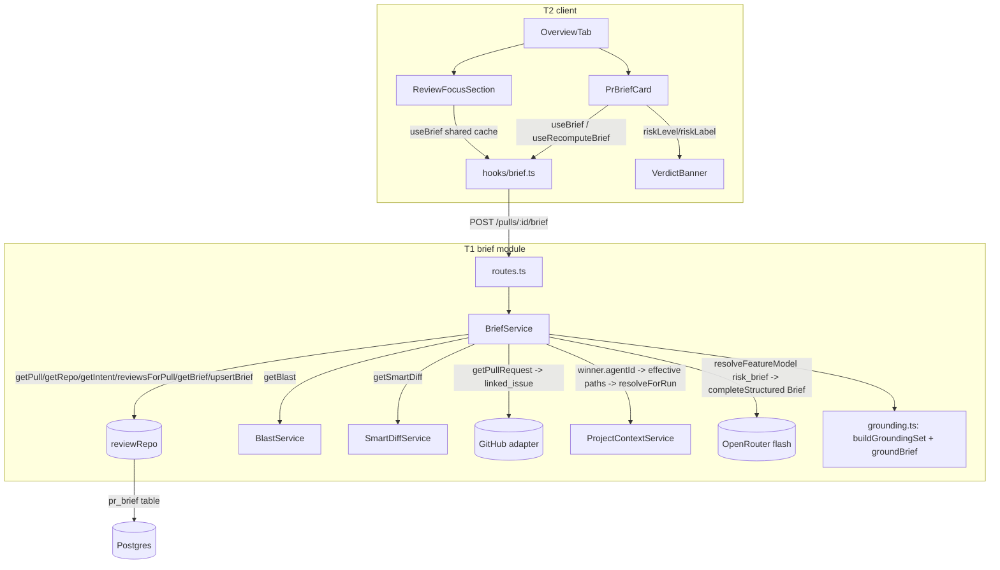

## Implementation Plan — PR Why + Risk Brief (SPEC-02)
**Date:** 2026-07-12

### 1. Objective
See `specs/SPEC-02-pr-why-risk-brief.md` for the full Problem/Why. One-line objective: ship `POST /pulls/:id/brief` (cache-or-compute + explicit recompute) that synthesizes intent/blast/smart-diff/linked-issue/attached-specs into a grounded `Brief`, and surface it via the amended `PrBriefCard` + a new Review-Focus section.

### 2. Requirements review & recommendations

**Gaps found and how resolved:**
- **`risks[]` has no UI acceptance criterion.** AC-4/5/6 ground and compute `risks[]`, but the spec's UI Goals only mention `PrBriefCard` (what/why/risk_level) and the new Review-Focus section — nothing renders `risks[]`. The obvious candidate slot (`IntentCard`'s "Risk areas" honest-empty-state, earmarked in `client/INSIGHTS.md` 2026-07-02 for exactly this future backend) is explicitly foreclosed by this spec's own Non-goals: *"Any change to intent/blast-radius/smart-diff's own... UI cards beyond what's needed for Brief to read their existing data — all three are consumed strictly read-only."* Resolution: `risks[]` is computed, grounded, and cached this iteration but **not rendered anywhere** — `IntentCard` stays untouched. **Developer-confirmed 2026-07-12**: fine as-is; a future amendment may wire it into `IntentCard`'s existing "Risk areas" empty slot.
- **Spec's Security wording** ("same untrusted-wrapping convention `wrapUntrusted`/`INJECTION_GUARD` already established for intent") doesn't literally match the code: `intent/service.ts` doesn't call `wrapUntrusted` (that helper lives in `reviewer-core/src/prompt.ts`, used only when the *already-computed* intent is later injected into a review prompt — a different pipeline `server/` doesn't import). Resolved as: Brief's own structured-call prompt follows intent's actual precedent — clearly delimited sections + an explicit system-prompt instruction to treat PR/issue/spec content as data, never instructions. Same protection in spirit, no non-existent cross-package import invented.
- **Recompute request shape** wasn't frozen in the spec (by design — implementation-planner decision). Frozen below: `POST` body `{ recompute?: boolean }`, default `false`.
- **Size caps for the LLM input** — spec explicitly defers this to the planner (Edge cases). Frozen in §6 constants.

**Recommendations (developer-approved 2026-07-12):**
1. **Fix the pre-scaffolded `risk_brief` feature-model slot.** `vendor/shared/contracts/platform.ts` (both copies) already declares `risk_brief` defaulting to `openai/gpt-4.1` — the exact antipattern already hit twice (`server/INSIGHTS.md` 2026-06-28 ×2, fixed for `review_intent`/`conventions`): a missing `OPENAI_API_KEY` turns into a bare 500. Fix to `openrouter`/`deepseek/deepseek-v4-flash` on both server and client mirrors, reusing this slot id for Brief's LLM call rather than adding a new one.
2. **`Brief` types replace, not add to,** the dead scaffolded `PrBrief` composite (`intent`+`blast`+`risks`+`history`) in `vendor/shared/contracts/brief.ts` — verified unused anywhere except a dead re-export in `client/src/lib/types.ts:41`. Safe to remove/replace; `Risk`/`Risks`/`PrHistory`/`Intent`/`BlastRadius` stay untouched (still used or reserved for future features per Non-goals).
3. **2-way (not 3-way) team split.** The backend is one cohesive service+contract+route with no natural sub-boundary; the UI's two pieces (`PrBriefCard` amendment + new Review-Focus section) both depend on the same new `useBrief` hook file and both touch `OverviewTab.tsx` — splitting UI into two parallel sub-agents risks same-file contention for no real independence gain. T1 backend / T2 ui, matching the developer's "≥2 non-overlapping areas" ask without forcing an artificial 3rd track.

### 3. Acceptance criteria
See `SPEC-02 §Acceptance criteria (EARS)` (AC-1…AC-18). Not restated here.

### 4. Scope
See `SPEC-02 §Goals / Non-goals`. Deltas this plan itself introduces (not in the spec's own text):
- Removes the dead `PrBrief` composite type from `vendor/shared/contracts/brief.ts` (both copies), replaced by the new `Brief`/`BriefRisk`/`BriefReviewFocusItem` schemas.
- Fixes `risk_brief`'s feature-model default (bug fix riding along, not a new feature).
- Adds new DB-facing repo methods `getBrief`/`upsertBrief` on `ReviewRepository` (no migration — the `pr_brief` table already exists).

### 5. Affected packages & modules
| Package/module | Onion layer(s) | Why touched |
|---|---|---|
| `server/src/modules/brief/` (NEW) | presentation (routes), application (service), domain (grounding, pure) | New feature module |
| `server/src/modules/reviews/repository.ts` + `repository/pull.repo.ts` | infrastructure | Add `getBrief`/`upsertBrief` (dual-declaration, per server INSIGHTS 2026-06-20) |
| `server/src/modules/index.ts` | composition | Register `brief` module |
| `server/src/vendor/shared/contracts/brief.ts` (+ client mirror) | shared contract | Add `Brief`/`BriefRisk`/`BriefReviewFocusItem`; remove dead `PrBrief` |
| `server/src/vendor/shared/contracts/platform.ts` (+ client mirror) | shared contract | Fix `risk_brief` default provider/model |
| `client/src/lib/hooks/brief.ts` (NEW) + `hooks/index.ts` | data | `useBrief`/`useRecomputeBrief` |
| `client/.../_components/PrBriefCard/` | UI | In-place amendment (narrative/color from Brief) |
| `client/.../_components/VerdictBanner/` | UI | Additive, backward-compatible `riskLevel`/`riskLabel` override |
| `client/.../_components/ReviewFocusSection/` (NEW) | UI | New "REVIEW FOCUS" section |
| `client/.../_components/OverviewTab/` | UI | Mount the new section |
| `client/messages/en/brief.json` | i18n | New copy keys |
| `client/src/lib/types.ts`, `client/src/lib/feature-models.ts` | client config | `PrBrief`→`Brief` rename; `risk_brief` default fix |

Reused read-only (not modified): `blast/service.ts` (`BlastService`), `smart-diff/service.ts` (`SmartDiffService`), `project-context/service.ts` (`ProjectContextService`) + `effective-set.ts` (`computeEffectiveAttachedPaths`, pure helper import — same precedent as `diff-parser.ts`, server INSIGHTS 2026-07-06), `container.reviewRepo`/`agentsRepo`/`github()`.

### 6. Frozen interface contracts

**6.1 `@devdigest/shared` — `contracts/brief.ts` delta (byte-identical on both `server/src/vendor/...` and `client/src/vendor/...`; REMOVE the unused `PrBrief` export + type):**
```ts
export const BriefRisk = z.object({
  title: z.string(),
  explanation: z.string(),
  /** File paths / "METHOD /path" endpoint strings / cron strings this risk cites. */
  file_refs: z.array(z.string()),
});
export type BriefRisk = z.infer<typeof BriefRisk>;

export const BriefReviewFocusItem = z.object({
  file: z.string(),
  line: z.number().int(),
  reason: z.string(),
});
export type BriefReviewFocusItem = z.infer<typeof BriefReviewFocusItem>;

export const Brief = z.object({
  what: z.string(),
  why: z.string(),
  risk_level: RiskSeverity,          // existing enum, unchanged: 'high'|'medium'|'low'
  risks: z.array(BriefRisk),
  review_focus: z.array(BriefReviewFocusItem),
});
export type Brief = z.infer<typeof Brief>;
```
Update the `index.ts` header comment on both sides (`... SmartDiff, Brief` instead of `..., PrBrief`).

**6.2 HTTP API**
```
POST /pulls/:id/brief
  params: IdParams
  body:   { recompute?: boolean }        // BriefRequestBody, module-local Zod, default false
  200 → { brief: Brief }
  404 → NotFoundError('Pull request not found')
  5xx → LLM/provider error surfaces as-is; any existing cached Brief is left untouched (AC-12)
```
No separate `GET` route (per spec).

**6.3 `BriefService` composition (frozen semantics, `server/src/modules/brief/service.ts`):**
```ts
class BriefService {
  constructor(container: Container, overrides?: {
    reviewRepo?: ReviewRepository;
    blastService?: Pick<BlastService, 'getBlast'>;
    smartDiffService?: Pick<SmartDiffService, 'getSmartDiff'>;
    projectContextService?: Pick<ProjectContextService, 'resolveForRun'>;
  });
  getBrief(workspaceId: string, prId: string, opts: { recompute?: boolean }): Promise<{ brief: Brief }>;
}
```
Steps:
1. `pull = reviewRepo.getPull(workspaceId, prId)` → 404 if absent. `repoRow = reviewRepo.getRepo(pull.repoId)` → 404 if absent.
2. `if (!opts.recompute)`: `cached = reviewRepo.getBrief(prId)`; if present → return `{ brief: cached }` immediately (AC-9, zero LLM calls).
3. Gather inputs (all optional/degrade-gracefully, per spec Reliability):
   - `intent = reviewRepo.getIntent(prId)`.
   - `blastResponse = (overrides.blastService ?? new BlastService(container)).getBlast(...)` — reused precedent: MCP already direct-constructs `BlastService` this way (`specs/blast-radius.md` §5.4).
   - `smartDiff = (overrides.smartDiffService ?? new SmartDiffService(container)).getSmartDiff(...)`.
   - Linked issue: same try/catch-as-absent pattern as `intent/service.ts` (`container.github()` → `getPullRequest` → `.linked_issue`; offline/error → omitted, AC never blocks).
   - `reviewRows = reviewRepo.reviewsForPull(prId)` (newest-first) → `winner = selectMostBlockingReview(reviewRows)` (new pure helper, ported 1:1 from `PrBriefCard.tsx`'s algorithm, operating on `{review: ReviewRow; findings: FindingRow[]}[]` instead of `ReviewRecord[]` — **this is a deliberate duplication**, flagged in §13).
   - Project Context (AC-2/AC-3): if `winner?.review.agentId` present → `agent = agentsRepo.getById(...)`, `linkedSkills = agentsRepo.linkedSkills(agent.id)`, `effectivePaths = computeEffectiveAttachedPaths(agent.projectContextPaths ?? [], skillPathLists)`, `(overrides.projectContextService ?? new ProjectContextService(container)).resolveForRun(repoRef, effectivePaths)` → `specs[]`. Else `specs = []` (AC-3).
4. Compose the prompt (sections: title/body, intent block if present, linked-issue block if present [capped], blast summary + capped downstream list, smart-diff groups + capped file list per group, attached specs [already capped by `resolveForRun`'s `MAX_SPEC_CHARS`]) — every untrusted section (title/body, issue, spec content) is clearly labeled as DATA in the prompt; `BRIEF_SYSTEM_PROMPT` explicitly instructs the model never to treat it as instructions (same practical protection as `intent/service.ts`, see §2).
5. One structured call: `resolveFeatureModel(container, workspaceId, 'risk_brief')` → `container.llm(provider).completeStructured({ model, schema: Brief, schemaName: 'Brief', temperature: 0, messages })`.
6. `groundingSet = buildGroundingSet(smartDiff, blastResponse.blast)`; `grounded = groundBrief(raw.data, groundingSet)` (pure, deterministic — AC-5/6/7/8).
7. `reviewRepo.upsertBrief(prId, grounded)` — only reached on LLM success, so a thrown error naturally satisfies AC-12 (cache untouched, error propagates).
8. Return `{ brief: grounded }`.

**6.4 Grounding (`server/src/modules/brief/grounding.ts`, pure, unit-tested in isolation):**
```ts
function buildGroundingSet(smartDiff: SmartDiff, blast: BlastRadius): {
  knownFiles: Set<string>;                       // all smartDiff.groups[].files[].path
  knownEndpointsOrCrons: Set<string>;             // union of blast.downstream[].{endpoints_affected,crons_affected}
  knownLinesByFile: Map<string, Set<number>>;     // blast callers' (file,line) ∪ smartDiff finding_lines' (path,line)
};
function groundBrief(raw: Brief, g: ReturnType<typeof buildGroundingSet>): Brief {
  // risks: keep only items with ≥1 file_ref in knownFiles ∪ knownEndpointsOrCrons (AC-5/6)
  // review_focus: keep only items where knownLinesByFile.get(file)?.has(line) (AC-7/8)
}
```

**6.5 Repository delta (`server/src/modules/reviews/repository.ts` facade + `repository/pull.repo.ts` impl — BOTH, per the dual-declaration precedent):**
```ts
// pull.repo.ts
export async function upsertBrief(db: Db, prId: string, brief: Brief): Promise<void>;
export async function getBrief(db: Db, prId: string): Promise<Brief | undefined>;
// getBrief: Brief.safeParse(row.json) — parse failure => undefined (treated as cache miss, never throws)
```

**6.6 Constants (`server/src/modules/brief/constants.ts`):**
```ts
export const BRIEF_SCHEMA_NAME = 'Brief';
export const BRIEF_FEATURE_SLOT = 'risk_brief';         // reuse the pre-scaffolded slot id
export const MAX_LINKED_ISSUE_BODY_CHARS = 2_000;       // same cap as intent
export const MAX_BLAST_SYMBOLS_IN_PROMPT = 15;
export const MAX_CALLERS_PER_SYMBOL_IN_PROMPT = 5;
export const MAX_SMARTDIFF_FILES_PER_GROUP_IN_PROMPT = 25;
export const BRIEF_SYSTEM_PROMPT = '...';               // instructs: cite only provided files/endpoints/lines; untrusted-data framing
```

**6.7 `vendor/shared/contracts/platform.ts` fix (both copies):** `risk_brief` → `defaultProvider: 'openrouter'`, `defaultModel: 'deepseek/deepseek-v4-flash'`.

**6.8 Client hook (`client/src/lib/hooks/brief.ts`):**
```ts
export interface BriefResponse { brief: Brief; }
export function useBrief(prId: string | number | null | undefined): UseQueryResult<BriefResponse>;
// queryKey: ["pull", prId, "brief"]; queryFn: api.post<BriefResponse>(`/pulls/${prId}/brief`, {}); enabled: prId != null
export function useRecomputeBrief(prId: string | number): UseMutationResult<BriefResponse>;
// mutationFn: api.post<BriefResponse>(`/pulls/${prId}/brief`, { recompute: true }); onSuccess -> qc.setQueryData(key, data)
```

**6.9 `VerdictBanner` delta (additive, backward-compatible — `ReviewRunAccordion`'s existing usage is unaffected since it never passes the new props):**
```ts
interface VerdictBannerProps {
  verdict?: Verdict;                 // now optional; still required in practice for legacy callers
  riskLevel?: RiskSeverity;          // SPEC-02: when present, wins over verdict for icon/color/label
  riskLabel?: string;                // pre-translated by the caller (PrBriefCard uses its own "brief" namespace)
  summary: string | null; score: number | null; findingsCount: number; blockers: number;
  agentName?: string | null; cost?: number | null; tokensIn?: number | null; tokensOut?: number | null;
}
// meta = riskLevel ? RISK_META[riskLevel] : (VERDICT_META[verdict ?? 'comment']);
// label = riskLevel ? riskLabel : t(`verdict.${meta.labelKey}`);
```
New `RISK_META` in `VerdictBanner/constants.ts` — reuses `SEV` tokens directly (satisfies the spec's Non-functional Consistency rule, "reuse SEV or VERDICT_META... never hand-roll"):
```ts
export const RISK_META: Record<RiskSeverity, { c: string; bg: string; icon: IconName; labelKey: RiskSeverity }> = {
  high:   { c: SEV.CRITICAL.c,   bg: SEV.CRITICAL.bg,   icon: SEV.CRITICAL.icon,   labelKey: 'high' },
  medium: { c: SEV.WARNING.c,    bg: SEV.WARNING.bg,    icon: SEV.WARNING.icon,    labelKey: 'medium' },
  low:    { c: SEV.SUGGESTION.c, bg: SEV.SUGGESTION.bg, icon: SEV.SUGGESTION.icon, labelKey: 'low' },
};
```

**6.10 `PrBriefCard` composition (in-place amendment):** keep `usePrReviews`/`usePrRuns` + `selectMostBlockingReview` unchanged for the pill/score/cost (AC-13's "findings·blockers pill and score ring... remain unchanged"); add `useBrief`/`useRecomputeBrief`. Loading → skeleton, Recompute disabled (AC-14). Brief error/empty → reuse existing `unavailable`/`unavailableHint` copy keys (already apt) + a visible Recompute button so the user can retry (AC-15). Populated → `VerdictBanner riskLevel={brief.risk_level} riskLabel={t("riskLevel."+brief.risk_level)} summary={`${brief.what} ${brief.why}`} score={selected?.score ?? null} findingsCount={selected?.findings.length ?? 0} blockers={run?.blockers ?? 0} .../>` plus the Recompute button.

**6.11 `ReviewFocusSection` (new component, own `useBrief(prId)` call — shares the TanStack cache with `PrBriefCard`, no prop drilling):**
```ts
interface ReviewFocusSectionProps { prId: string | number; repoFullName: string | null; headSha: string | null; }
```
Header: section label "REVIEW FOCUS — READ THESE FIRST" + count badge = `review_focus.length` (AC-16). Loading → muted `t("reviewFocus.loading")`. Error or empty `review_focus` → explicit honest empty state, `t("reviewFocus.empty")` (AC-18; error treated the same as empty — no duplicate error UI, `PrBriefCard` already surfaces the Brief error). Item: `<a href={githubBlobUrl(repoFullName, headSha, item.file, item.line)} target="_blank" rel="noreferrer">{item.file}:{item.line} — {item.reason}</a>` (plain text when `repoFullName`/`headSha` is null, mirroring `BlastRadiusCard`'s caller-link precedent) (AC-17).

**6.12 New `brief.json` keys:** `riskLevel.{high,medium,low}` ("High risk"/"Medium risk"/"Low risk"), `reviewFocus.{title,empty,loading}` — `title` contains an em dash (`—`), so insert via a Python byte-replace into the existing ASCII file, **not** the `Edit` tool (per `client/INSIGHTS.md` 2026-06-30/2026-07-06). Reused as-is: `unavailable`, `unavailableHint`, `recompute`.

### 7. Directory ownership map (non-overlapping)
| Task | Agent surface | Owns (dirs/files) |
|---|---|---|
| **T1** | backend | `server/src/modules/brief/**` (NEW: `routes.ts`, `service.ts`, `grounding.ts`+test, `helpers.ts`+test, `constants.ts`, `service.test.ts`); EDIT `server/src/modules/index.ts`; EDIT `server/src/modules/reviews/repository.ts` + `repository/pull.repo.ts`; EDIT `server/src/vendor/shared/contracts/brief.ts` + `index.ts` (comment); EDIT `server/src/vendor/shared/contracts/platform.ts` |
| **T2** | ui | `client/src/lib/hooks/brief.ts` (NEW) + `hooks/index.ts` (append); `client/.../_components/PrBriefCard/**`; `client/.../_components/VerdictBanner/**`; `client/.../_components/ReviewFocusSection/**` (NEW); EDIT `client/.../_components/OverviewTab/{OverviewTab.tsx,OverviewTab.test.tsx}`; EDIT `client/messages/en/brief.json`; EDIT `client/src/vendor/shared/contracts/brief.ts` + `index.ts` (comment); EDIT `client/src/lib/types.ts`; EDIT `client/src/lib/feature-models.ts` |

No file is owned by both. The two vendor `brief.ts`/`platform.ts` copies are genuinely separate files per package (not a monorepo) — each task applies the byte-identical frozen §6.1/§6.7 text to its own copy; `ReviewRunAccordion.tsx` (also a `VerdictBanner` consumer) is untouched by either task since §6.9 is additive/backward-compatible.

### 8. Execution mode
**Multi-agent team, 2 parallel implementers (T1 backend, T2 ui)** — as given by the developer's gate-batch decision ("a TEAM of parallel implementer agents"). The task decomposition confirms exactly 2 non-overlapping areas (§2 recommendation #3 explains why not 3); no mismatch to flag.

### 9. Tasks

**T1 — Backend `brief` module** (surface: backend; deps: none; merge order: independent of T2)
- Goal: implement §6.3–6.7 in full — module, route, grounding, helper, repo methods, contract + feature-model fixes.
- Done-conditions: `POST /pulls/:id/brief` returns cached Brief with zero LLM calls when uncached-absent-recompute is false and a cache row exists; computes+persists on first call or `recompute:true`; a thrown LLM error leaves any prior cached row untouched (verify via a unit test that pre-seeds a cache row, forces the LLM stub to throw, and asserts the row is unchanged); `groundBrief` unit tests prove an ungrounded risk/review_focus item is dropped and a grounded one survives; `risk_brief` resolves to `openrouter`/`deepseek-v4-flash` by default; module registered in `modules/index.ts`; `Brief`/`BriefRisk`/`BriefReviewFocusItem` exist in `server/src/vendor/shared/contracts/brief.ts`, `PrBrief` removed.
- Skills: `onion-architecture`, `fastify-best-practices`, `drizzle-orm-patterns`, `zod`, `security` (untrusted PR/issue/spec text — data-only framing; no fetch of external URLs), `typescript-expert`, `engineering-insights`.

**T2 — UI: PrBriefCard amendment + Review Focus section** (surface: ui; deps: §6.1/§6.2/§6.8 frozen — builds in parallel against the contract, mocks the hook in tests)
- Goal: implement §6.8–6.12 — hook, `PrBriefCard` in-place amendment, `VerdictBanner` additive delta, new `ReviewFocusSection`, `OverviewTab` mount, copy, client contract/config mirrors.
- Done-conditions: `PrBriefCard` shows a loading skeleton with Recompute disabled while the Brief request is in flight; shows the existing `unavailable`/`unavailableHint` state plus a working Recompute button on Brief error, with the findings·blockers pill and score ring still rendering independently from `usePrReviews`/`usePrRuns`; populated state shows `what`+`why` as narrative and `risk_level`-colored icon/label via `RISK_META` (no hand-rolled color literal — grep confirms only `SEV`-sourced values used); `ReviewFocusSection` renders a count badge equal to `review_focus.length`, each item a working `githubBlobUrl` deep link opening in a new tab pinned to head sha, and an honest empty state when `review_focus` is empty; `OverviewTab.test.tsx` mocks `@/lib/hooks/brief` (per `client/INSIGHTS.md` 2026-07-06 composite-test rule); `client/src/lib/types.ts` exports `Brief` not `PrBrief`; `risk_brief` in `feature-models.ts` matches the server default.
- Skills: `ui-architecture`, `react-best-practices`, `next-best-practices`, `react-testing-library`, `zod`, `security` (render LLM-derived text as plain text, no `dangerouslySetInnerHTML`), `typescript-expert`, `engineering-insights`.

### 10. Test commands per scope
- **T1** (from `server/`): `./node_modules/.bin/tsc --noEmit -p tsconfig.json` and `./node_modules/.bin/vitest run brief`.
- **T2** (from `client/`): `./node_modules/.bin/tsc --noEmit` and `./node_modules/.bin/vitest run PrBriefCard ReviewFocusSection VerdictBanner OverviewTab` (plain substrings — bracketed route dirs don't regex-match, per `client/INSIGHTS.md` 2026-06-30).

### 11. Relevant engineering insights
- **`risk_brief`/`review_intent`/`conventions` feature-slot default must be `openrouter`/`deepseek-v4-flash`** — `openai` without a configured key is a bare 500 (`server/INSIGHTS.md` 2026-06-28 ×2). Drives §6.7.
- **`resolveFeatureModel` → `completeStructured`** is the established system-LLM pattern (`server/INSIGHTS.md` 2026-06-30, generalized from `conventions`/`intent`). T1 is its third real consumer.
- **Cross-module service reuse via direct construction + `overrides` for tests** is already precedented (MCP directly constructs `BlastService`, `specs/blast-radius.md` §5.4) — T1 extends this to `SmartDiffService`/`ProjectContextService`, avoiding cross-module `Service`-to-`Service` imports that don't exist elsewhere.
- **Dual-declaration sync risk** (`server/INSIGHTS.md` 2026-06-20): `getBrief`/`upsertBrief` must be added to BOTH `repository.ts` (facade) and `repository/pull.repo.ts` (impl).
- **Non-ASCII copy insertion** (`client/INSIGHTS.md` 2026-06-30/2026-07-06): the `reviewFocus.title` em dash must go into `brief.json` via a byte-safe Python replace, not the `Edit` tool.
- **Never hand-roll severity colors** (`client/INSIGHTS.md` 2026-06-24, recurred twice) — `RISK_META` reuses `SEV` tokens directly.
- **Composite test must mock every hook a child card gains** (`client/INSIGHTS.md` 2026-07-06) — `OverviewTab.test.tsx` needs a `useBrief` mock.
- **`vitest run` CLI filters are plain substrings** (`client/INSIGHTS.md` 2026-06-30).

### 12. Architecture diagram


### 13. Risks & integration concerns
- **`selectMostBlockingReview` is duplicated** (client `PrBriefCard.tsx` operates on `ReviewRecord[]`; server `brief/helpers.ts` operates on `{review: ReviewRow}[]`) — no shared package exists for pure cross-side algorithms outside `@devdigest/shared`'s Zod contracts. Any future change to the ranking algorithm (`BLOCKING_RANK`, tie-break) must update BOTH files — flagged the same way as the `completeAgentRun` dual-declaration note (`server/INSIGHTS.md` 2026-06-20).
- **Dual vendor mirrors** (`server/src/vendor/shared/contracts/brief.ts` and `platform.ts` vs their `client/` copies) must land byte-identical; the architecture-reviewer's post-implementation pass (already scheduled by the developer) should diff the two copies.
- **`VerdictBanner`'s `verdict` prop going optional** is backward-compatible by construction (`ReviewRunAccordion` never passes `riskLevel`/`riskLabel`), but T2 must run `VerdictBanner.test.tsx` unmodified-behavior assertions to prove it.
- **Large-PR prompt size** — cap constants in §6.6 are a first pass; if the model still overflows on a real large PR, tightening them is a config change, not a contract change.
- **`risks[]` is computed but unrendered this iteration** (§2) — intentional per spec's Non-goals; developer-confirmed 2026-07-12; not a defect.

### 14. Open questions
— none — (both items raised during planning — `risks[]` UI deferral, and the plan as a whole including the `risk_brief` default fix and the `PrBrief`→`Brief` replacement — were confirmed by the developer on 2026-07-12.)
