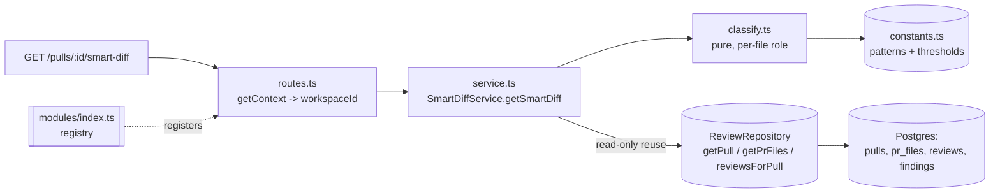

# Smart Diff (`modules/smart-diff/`)

Risk-ordered diff layout for a pull request: every changed file is bucketed
into `core` / `wiring` / `boilerplate` so a reviewer's eye lands on business
logic first, findings from the latest review are overlaid per file, and an
oversized PR gets a suggested split. **Token-free** — the module makes zero
`container.llm` calls; it only reshapes data the Structured Reviewer already
produced (PR files + findings), which is why it works immediately after PR
import, before any review has run.

## Endpoint

```
GET /pulls/:id/smart-diff
  params: IdParams               // { id: string }
  auth/scoping: getContext(container, req) -> workspaceId
  200 -> SmartDiff                // @devdigest/shared
  404 -> NotFoundError('Pull request not found')
```

`routes.ts` resolves `workspaceId` via the shared `getContext` helper (same
pattern as `intent`/`reviews`), then delegates everything else to
`SmartDiffService.getSmartDiff(workspaceId, prId)`. No request body, no query
params — `id` is the only input. The response type is exactly `SmartDiff`,
defined in `server/src/vendor/shared/contracts/brief.ts` and re-exported by
`@devdigest/shared`; the route never redeclares the shape.

`SmartDiffService.getSmartDiff` looks the PR up via
`ReviewRepository.getPull(workspaceId, prId)` first — a PR absent from, or
belonging to a different workspace than, `workspaceId` throws `NotFoundError`
before any file/finding data is touched.

## Classification (`classify.ts`)

`classify(path): SmartDiffRole` tests a changed file's path against two
pattern lists in `constants.ts`, in a fixed precedence order — **boilerplate
first, then wiring, `core` is the default** when nothing matches:

1. `BOILERPLATE_PATTERNS` — lock files (`package-lock.json`, `pnpm-lock.yaml`,
   `yarn.lock`, `bun.lockb`, and the Composer/Bundler/Poetry/Cargo/Go
   equivalents), generated/build output (`dist/`, `build/`, `out/`,
   `coverage/`, `.next/`), snapshot tests (`__snapshots__/`, `*.snap`), and
   minified assets (`*.min.js`, `*.min.css`).
2. `WIRING_PATTERNS` — barrel files (`index.ts`/`.tsx`/`.js`/`.jsx`), `*.config.*`
   files, `tsconfig*.json`/`package.json`, dotfile configs (`.eslintrc`,
   `.prettierrc`, `.npmrc`, `.nvmrc`), any `.yml`/`.yaml` (CI/compose),
   `Dockerfile`, `.env*`, and ambient `*.d.ts` files.

The precedence matters concretely: `pnpm-lock.yaml` ends in `.yaml`, which
would also match the wiring `/\.(ya?ml)$/` pattern, but boilerplate is checked
first so it resolves to `boilerplate`. Likewise a generated `.ts` file under
`dist/` resolves to `boilerplate`, not the `core` default. `classify.ts` is a
pure function — no I/O, no config lookup beyond the two arrays — which is why
`classify.test.ts` needs no DB, mocks, or LLM stub.

## Composition rules (`service.ts`)

`getSmartDiff` runs in five steps after the PR lookup:

1. **Load PR files** — `ReviewRepository.getPrFiles(prId)`.
2. **Load the latest review** — `reviewsForPull(prId)` returns entries
   newest-first; the service takes the first entry whose `review.kind ===
   'review'` (skipping `'summary'` entries) and reads its `findings`. No
   review yet (or none of kind `'review'`) → every file's `finding_lines` is
   `[]`.
3. **Classify + compute `finding_lines` per file** — for each `prFiles` entry,
   `classify(path)` assigns the role, and `finding_lines` is built from the
   latest review's findings where `finding.file === path` **and**
   `finding.dismissedAt == null`, mapped to `startLine`, deduped via a `Set`,
   and sorted ascending.
4. **Group and sort** — files are bucketed by role and emitted in the fixed
   order `core → wiring → boilerplate`; a role with zero files is omitted
   entirely (the client is responsible for backfilling it — see
   `client/docs/smart-diff-viewer.md`). Within a group, files sort by:
   `finding_lines.length` descending, then `additions + deletions` descending,
   then `path` ascending as a deterministic tie-break. `pseudocode_summary` is
   always `null` (out of scope for this feature).
5. **Split suggestion** — `total_lines` is `Σ(additions + deletions)` over
   *all* `prFiles` (not just `core`), and `too_big` is
   `total_lines > SPLIT_TOTAL_LINES_THRESHOLD` (`constants.ts`, currently
   `500`). When `too_big`, `proposed_splits` is built by grouping **core**
   files by their top-level path segment (the substring before the first
   `/`, or `ROOT_SPLIT_NAME` — `"(root)"` — for a file with no `/`), one split
   per segment named after it; if any wiring/boilerplate files exist, one more
   split is appended named `SPLIT_CHORE_NAME`
   (`"chore: config & generated"`) holding all of them. Splits are then sorted
   by descending file count. When `!too_big`, `proposed_splits` is `[]`.

A PR with no files returns `groups: []` and `total_lines: 0`, `too_big:
false` — a valid, tested response shape, not an error.

## Onion layering



`routes.ts` → `service.ts` → `classify.ts`/`constants.ts` follows the same
presentation → application → domain shape as every other module. There is no
new infrastructure layer: `SmartDiffService` constructs
`new ReviewRepository(container.db)` directly and reuses its existing
`getPull`/`getPrFiles`/`reviewsForPull` methods read-only — the same
cross-domain, read-only pattern the `intent` module set as precedent, since
Smart Diff spans two domains (PR files from `pulls`, findings from `reviews`)
without belonging to either. The module registers itself with one import +
one entry in `modules/index.ts`, alongside every other feature module.

## How to tune

Every pattern, threshold, and label the feature uses lives in `constants.ts`
— `BOILERPLATE_PATTERNS`, `WIRING_PATTERNS`, `SPLIT_TOTAL_LINES_THRESHOLD`,
`SPLIT_CHORE_NAME`, `ROOT_SPLIT_NAME`, `SMART_DIFF_SCHEMA_NAME`. To reclassify
a file type or change the split threshold, edit an entry there; never inline
a new regex or a raw number in `classify.ts`/`service.ts`.

## Testing

- `classify.test.ts` — pure unit tests per bucket (boilerplate / wiring /
  core) plus explicit precedence cases (a lockfile that also matches a wiring
  pattern, a generated `.ts` under `dist/`).
- `service.test.ts` — composition tests against a stub `ReviewRepository`
  (injected via the service's optional second constructor argument, so no DB
  is needed): group order, empty-group omission, in-group sort, `finding_lines`
  from the latest `kind='review'` review only (older reviews and `summary`
  entries excluded, dismissed findings excluded, dedupe/sort), `total_lines`/
  `too_big`/`proposed_splits` at and over the threshold, the no-review and
  no-files edge cases, and an assertion that `container.llm` is never invoked.
- `./scripts/verify-l03.sh` (run from the repo root) chains all four checks
  the feature's definition of done requires: server typecheck, server
  `smart-diff` tests, client typecheck, client `SmartDiffViewer` tests — using
  the local `tsc`/`vitest` binaries directly rather than `pnpm` scripts (see
  server `INSIGHTS.md`, Tooling Notes, for the `ERR_PNPM_IGNORED_BUILDS`
  reason).
