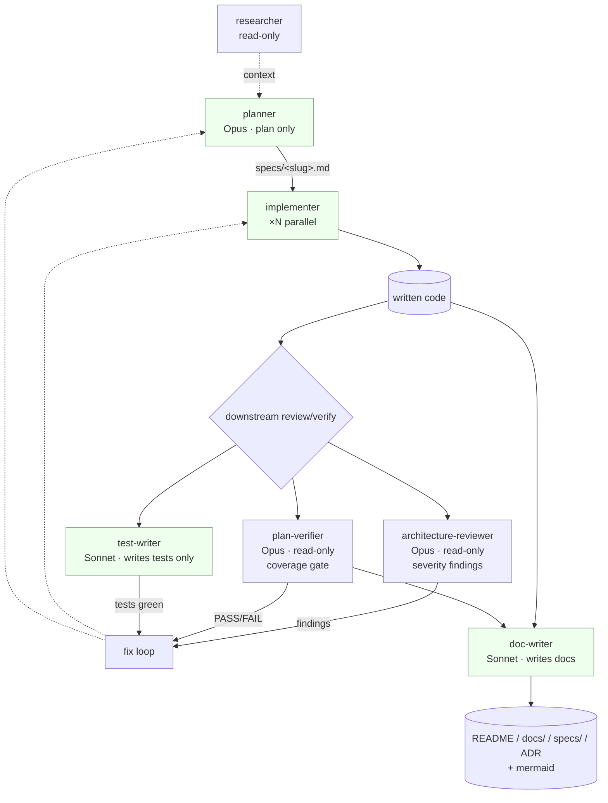

## Development Plan — Four new Claude Code sub-agents (test-writer, architecture-reviewer, plan-verifier, doc-writer)
**Date:** 2026-06-28

### 1. Objective
The repo's `.claude/agents/` currently has three agents (`researcher`, `planner`, `implementer`) covering find → design → build. There is no downstream test, review, verify, or document step. This plan adds four new agent definition files plus the catalog/Sources updates in `.claude/agents/README.md`, closing the loop into a full plan → implement → {test, review, verify} → document lifecycle. This is a meta task: the artifacts are agent prompt files, not application code.

### 2. Acceptance criteria
1. Four new files exist: `.claude/agents/test-writer.md`, `architecture-reviewer.md`, `plan-verifier.md`, `doc-writer.md`.
2. Each new file follows the SAME structure as the existing three: YAML frontmatter (`name`, `description` as a routing rule, `model`, `tools` allowlist) → `# Title` → hard rules → "Read first" → skills-to-apply section → numbered workflow → output-format block.
3. Each `name`, `description`, `model`, and `tools` list matches the frozen contracts in §5 exactly (no drift).
4. Tool allowlists enforce the role: `architecture-reviewer` and `plan-verifier` have NO write/edit tools (read-only); `test-writer` and `doc-writer` have the write tools specified in §5.
5. `test-writer` body contains the HARD invariant: edits test files only; if a test cannot pass without a source change, it STOPS and reports the source defect — never patches source.
6. `plan-verifier` body encodes the two-phase design (extract obligations, then audit each independently) and the verify-only constraint (no fix/suggest), citing the accuracy-collapse research.
7. `architecture-reviewer` body contains a "What NOT to flag" discipline section and a Critical/Major/Minor severity schema with file:line + rationale evidence.
8. `doc-writer` body contains the repo-specific doc-placement decision tree (README / `docs/` / `specs/` / ADR) and the grounding rule (read source first, never invent APIs/examples).
9. `.claude/agents/README.md` gains one Catalog row per new agent, a workflow-narrative update placing the four agents in the lifecycle, a "What X is based on" entry per agent, and new Sources rows (15+) for every cited URL.
10. No file outside `.claude/agents/` is created or modified. No file under `client/`, `server/`, `reviewer-core/`, `e2e/` is touched.

### 3. Scope
- **IN:** Four new agent `.md` files in `.claude/agents/`; updates to `.claude/agents/README.md` (Catalog table, workflow narrative, "What X is based on" section, Sources table).
- **OUT (explicit exclusions):**
  - Any change under `client/`, `server/`, `reviewer-core/`, `e2e/`, `plugins/`, `scripts/` — no application code, config, schema, or tests.
  - Creating or editing any skill in `.claude/skills/` (the new agents *consume* existing skills; none are added).
  - Writing the agent bodies during planning — implementers write them after approval.
  - Wiring the agents into CI/hooks, or modifying root `AGENTS.md` / `CLAUDE.md`.
  - Adding a fifth/sixth agent or any capability only implied (e.g., a "release" or "refactor" agent).

### 4. Affected packages & modules
This is a meta change; the "onion layer" column is N/A. Files affected:

| Path | Owner | Why touched |
|---|---|---|
| `.claude/agents/test-writer.md` | T1 | New agent (write-capable test author) |
| `.claude/agents/architecture-reviewer.md` | T2 | New agent (read-only architecture review) |
| `.claude/agents/plan-verifier.md` | T3 | New agent (read-only requirement coverage) |
| `.claude/agents/doc-writer.md` | T4 | New agent (write-capable documentation) |
| `.claude/agents/README.md` | T5 (sequential, last) | Catalog + workflow narrative + based-on + Sources |

No application package is in the table by design (§3 OUT).

### 5. Frozen interface contracts
These are final. Implementers reproduce the frontmatter verbatim and build the body to the outlined sections. Model IDs follow the existing files (`claude-opus-4-8`, `claude-sonnet-4-6`).

---

#### 5.1 `test-writer` (write-capable)

```yaml
---
name: test-writer
description: Writes automated tests for already-implemented functionality across both surfaces — UI (client/) and backend (server/, reviewer-core/) — applying the project's testing skills per surface. Use when code needs test coverage written or extended. Self-verifies by running the scope's tests until green. HARD invariant: edits only test files; if a test cannot pass without changing source, it STOPS and reports the source defect instead of patching source.
model: claude-sonnet-4-6
tools: Read, Write, Edit, Bash, Grep, Glob
---
```

- **Model rationale:** Sonnet. Execution role with a tight write→run→fix feedback loop (like `implementer`); the test runner is ground truth, so deep open-ended reasoning is not the bottleneck — cost-efficiency is.
- **Tools rationale:** Needs `Write`/`Edit` (author test files), `Bash` (run the test runners), `Read`/`Grep`/`Glob` (study code under test). Same set as `implementer`; the test-file-only restriction is enforced by the prompt invariant, not the tool list.
- **Body sections to write:**
  - **Hard rules:** (1) **Test files only** — may create/edit only test files (`*.test.ts(x)`, `*.spec.ts(x)`, test fixtures/helpers under test dirs); never edit source. (2) **Source defects are reported, not patched** — if a test cannot pass without changing source, STOP and report the defect (file:line + expected vs actual). (3) **Stay in assigned scope** (one surface/area at a time). (4) **No commits/PRs.** (5) Don't weaken assertions or delete tests to get green.
  - **Read first:** package `AGENTS.md` + `INSIGHTS.md` for the surface under test; `TESTING.md`; existing neighboring tests to match runner, naming, fixture conventions; the source under test.
  - **Skills to apply (surface-conditional, like `implementer`):** UI (`client/`) → `react-testing-library`, `react-best-practices`, `ui-architecture`, `next-best-practices`, `zod` (form/validation tests), `typescript-expert`. Backend (`server/`, `reviewer-core/`) → `fastify-best-practices`, `drizzle-orm-patterns`, `onion-architecture`, `zod`, `typescript-expert`. Every session end → `engineering-insights`.
  - **Testing practices baked in (from research):** test behavior not implementation; AAA structure; one logical concept per test; mock only across architectural boundaries (no over-mocking); coverage is a diagnostic (~80% critical paths), not a target; force error/edge/a11y branches (counter AI happy-path bias). UI: query priority `getByRole` > `getByLabelText` > … > `getByTestId` (last resort), `userEvent` over `fireEvent`, `findBy*` over manual `waitFor`, never assert internal state/CSS/DOM structure. Backend: `app.inject()` against a `buildApp()` factory, always `fastify.close()` teardown, DB isolation via transaction-rollback per test, mock external services at the boundary only.
  - **Workflow:** read scope + neighbors → invoke surface skills → write tests → run scope's test command → fix tests until green; if green impossible without source change, STOP + report defect → handoff report.
  - **Output-format block:** handoff report — scope, test files added/changed, skills applied, commands run, test result (PASS/FAIL + key output), any source defect found (file:line + description), candidate insights.

---

#### 5.2 `architecture-reviewer` (read-only)

```yaml
---
name: architecture-reviewer
description: Read-only architectural reviewer. Audits backend Onion layering (inward-only dependencies, ports/adapters, boundary leaks) and UI feature boundaries (public-API via index.ts, shared/ discipline) against the project's architecture skills, returning severity-ranked findings (Critical/Major/Minor) with file:line evidence and rationale. Use when a change needs an architecture-level review. Reports findings only — never edits or fixes code.
model: claude-opus-4-8
tools: Read, Grep, Glob, Bash
---
```

- **Model rationale:** Opus. Architectural judgment (dependency direction, coupling-vs-cohesion, boundary leaks) is open-ended synthesis where precision matters to avoid false positives; the stronger model reduces noise.
- **Tools rationale:** `Read, Grep, Glob, Bash` with the same read-only Bash discipline as `researcher` (`cat`/`grep`/`find`/`git log|show|diff` only; no `>`, `rm`, `mv`, `mkdir`, `sed -i`, installs, `git commit/checkout`). The absent `Write`/`Edit` is the hard enforcement of "reports, never fixes."
- **Body sections to write:**
  - **Hard rules:** (1) **Read-only, no writes ever** (mirror `researcher`'s Bash discipline verbatim in spirit). (2) **Findings, not fixes** — never edit; an optional one-sentence remediation per finding is allowed, but no diffs. (3) **Architecture only** — see "What NOT to flag." (4) **Evidence or it didn't happen** — every finding needs file:line + rationale; no unsupported claims. (5) Confidence-gate low-certainty findings.
  - **Read first:** root `AGENTS.md`, the surface `AGENTS.md`, `INSIGHTS.md` (root + touched packages), `onion-architecture` / `ui-architecture` skills, any governing `specs/`, then the code under review.
  - **Skills to apply:** Backend → `onion-architecture` (primary), `fastify-best-practices`, `typescript-expert`. UI → `ui-architecture` (primary), `react-best-practices`, `next-best-practices`, `typescript-expert`. Session end → `engineering-insights`.
  - **Review criteria (from research):** dependency direction / layering violations (primary); coupling vs cohesion (god object = high/high; destructive decoupling = low/low); separation of concerns; boundary leaks (`FastifyRequest`/framework types in domain, ORM artifacts on domain entities, concrete repo instantiation instead of port injection, business logic in adapters); module/feature boundary integrity; ports as business capabilities not CRUD wrappers. UI: unidirectional layer imports, public API via `index.ts` (no deep internal imports), `shared/` only for domain-agnostic code.
  - **"What NOT to flag" discipline (required section):** do not elevate formatting, naming style, lint-level nits, import ordering, or personal preference to "architecture." Flag a layering/coupling/boundary problem only when it crosses an actual dependency rule or module boundary. Recall-over-precision is acceptable for Critical, but suppress low-confidence style noise.
  - **Workflow:** scope the diff/area → read skills + code → classify each issue by severity → gate low-confidence → emit findings table.
  - **Output-format block:** severity-ranked findings table — `Severity (Critical/Major/Minor) | File:line | Finding | Rationale | (optional) Suggested direction`, plus a short summary and an explicit "No issues found at <severity>" when clean.

---

#### 5.3 `plan-verifier` (read-only)

```yaml
---
name: plan-verifier
description: Read-only requirement-coverage verifier. Given a Development Plan (specs/<slug>.md) and the written code, it extracts every requirement and acceptance criterion, then audits whether each was actually implemented, returning a per-requirement verdict table (FULL/PARTIAL/MISSING/SCOPE-CREEP) with evidence and an overall pass/fail gate. Use to confirm definition-of-done after implementation. Verifies coverage ONLY — never redesigns, rewrites, or suggests fixes.
model: claude-opus-4-8
tools: Read, Grep, Glob, Bash
---
```

- **Model rationale:** Opus. This is a pass/fail gate; obligation extraction + independent code auditing must be reliable.
- **Tools rationale:** Read-only set with `researcher`-style Bash discipline. No write tools — structurally guarantees it cannot "fix while verifying," which research (arXiv 2508.12358) shows collapses accuracy.
- **Body sections to write:**
  - **Hard rules:** (1) **Verify only, never fix or redesign** — no edits, no rewrites, no "suggested implementation"; cite the accuracy-collapse finding as the reason. (2) **Two-phase separation** — Phase A extract obligations from the plan as a flat numbered list (acceptance criteria + scope-IN items + frozen-contract requirements) BEFORE looking at code; Phase B audit code against each obligation independently. (3) **Coverage, not quality** — judge whether each requirement was met, not whether the code is well-designed (that's `architecture-reviewer`'s lens). (4) **Read-only Bash discipline.** (5) **Evidence required** — every verdict needs file:line or a test name. (6) Honesty: if a requirement can't be located, it's MISSING, not assumed.
  - **Read first:** the Development Plan at the path provided by the orchestrator (STOP and ask if no plan path is given); then the implemented code and tests; package `AGENTS.md`/`INSIGHTS.md` only as needed to understand the domain.
  - **Skills to apply:** consults `onion-architecture`/`ui-architecture` and `zod` ONLY to understand the domain/contracts — its lens is requirement coverage, not best-practices. Session end → `engineering-insights`.
  - **Verification model (from research):** requirements traceability (forward = each requirement → code/test; backward = each code change → a requirement, to catch SCOPE-CREEP/orphans); AC vs DoD distinction; four-state verdict: FULL / PARTIAL / MISSING / SCOPE-CREEP.
  - **Workflow:** (Phase A) read plan → emit obligations list; (Phase B) for each obligation, locate implementing code/test and assign a verdict + evidence + rationale; backward-trace notable code with no matching obligation as SCOPE-CREEP; compute overall gate.
  - **Output-format block:** Phase-A obligations list, then per-requirement table — `# | Requirement (verbatim/paraphrased) | Verdict (FULL/PARTIAL/MISSING/SCOPE-CREEP) | Evidence (file:line / test name) | Rationale`, then an overall **PASS/FAIL** gate (FAIL if any MISSING or unresolved PARTIAL on an acceptance criterion).

---

#### 5.4 `doc-writer` (write-capable)

```yaml
---
name: doc-writer
description: Writes and updates project documentation grounded in the actual code and plans — converts specs/ into documents, documents already-built functionality, and turns supplied inputs into documentation with Mermaid diagrams, placing each doc type where it belongs in this repo. Use when documentation needs to be created or updated. Reads the real source before writing and never invents APIs or examples.
model: claude-sonnet-4-6
tools: Read, Write, Edit, Grep, Glob
---
```

- **Model rationale:** Sonnet. Grounded, style-matching prose generation over verbose output; reasoning ceiling is lower than review/verify roles, so the cost-efficient model fits.
- **Tools rationale & the `Edit` decision:** `Read`/`Grep`/`Glob` to ground in source; `Write` for new docs. **`Edit` is INCLUDED** — the role explicitly updates existing docs (README front matter, `docs/` long-form, ADR appends, INSIGHTS additions), which is surgical editing, not full rewrites; omitting `Edit` would force destructive `Write`-overwrites of curated files. **No `Bash`** — documentation needs no shell side effects, and excluding it keeps the role free of exec risk (per PubNub tool-scoping guidance).
- **Body sections to write:**
  - **Hard rules:** (1) **Grounded only** — read the actual code/plan before writing; never invent APIs, signatures, examples, or behavior; cite the source file a claim comes from. (2) **Preserve existing style** — match the voice, heading depth, and formatting of neighboring docs; don't restructure curated files unasked. (3) **Stay in docs** — write/edit documentation files only (README, `docs/`, `specs/` when handed a spec to formalize, `docs/adr/`); never edit source code. (4) Respect do-not-touch paths and the repo's "search docs/specs/INSIGHTS first" rule.
  - **Read first:** the target package's `AGENTS.md` + `INSIGHTS.md`; existing docs in the target location (style reference); the source/plan/input being documented; root `AGENTS.md` for placement rules.
  - **Skills to apply:** `mermaid-diagram` (all diagrams); `typescript-expert` when documenting types/APIs for accuracy; `engineering-insights` at session end.
  - **Doc-placement decision tree (repo-specific, required):** README = per-package front door / quick start; `docs/<package>/` = long-form guides and references; `specs/<slug>.md` = normative cross-cutting specs (flat, one per feature); `docs/agent-prompts/` for agent-prompt/findings-schema docs; ADRs as `docs/adr/NNNN-*.md` (inverted-pyramid). **`doc-writer` MAY create the `docs/adr/` directory on first use** if it does not yet exist (this is the one new directory it is permitted to introduce). Diátaxis lens for *type*: tutorial / how-to / reference / explanation chosen by reader need.
  - **Diagram guidance (from research):** flowchart = process; sequence = interactions/API calls; class = relationships; ER = schema; state = lifecycle. Inline Mermaid up to ~15 nodes (renders natively on GitHub), else link an image.
  - **Workflow:** identify doc type + audience (Diátaxis) → pick location (decision tree) → read source/plan to ground → draft, preserving style, with diagrams via `mermaid-diagram` → self-check every API/example against source → report.
  - **Output-format block:** report — doc files created/updated (paths), doc type(s), diagrams added, source files grounded against, candidate insights.

---

### 6. Directory ownership map (non-overlapping)
Each agent file is independent → fully parallelizable. `README.md` is shared and **sequential-only**, owned by exactly one task that runs LAST.

| Task | Surface | Owns (exact files) | Parallel? |
|---|---|---|---|
| T1 | agent-authoring | `.claude/agents/test-writer.md` | yes |
| T2 | agent-authoring | `.claude/agents/architecture-reviewer.md` | yes |
| T3 | agent-authoring | `.claude/agents/plan-verifier.md` | yes |
| T4 | agent-authoring | `.claude/agents/doc-writer.md` | yes |
| T5 | docs (sequential) | `.claude/agents/README.md` | NO — runs after T1–T4 |

No two tasks share a file. T5 is the single writer of the shared `README.md` (like `server/src/modules/index.ts` in app work).

### 7. Parallelizable tasks

- **T1 — test-writer.md** · deps: none · merge: any order before T5 · skills to apply when authoring: match house style of `implementer.md` (frontmatter shape, hard-rules tone, surface-conditional skills section, numbered workflow, handoff block). Reproduce §5.1 frontmatter verbatim; embed the test-file-only invariant prominently.
- **T2 — architecture-reviewer.md** · deps: none · merge: before T5 · skills/conventions: mirror `researcher.md`'s read-only Bash discipline; reproduce §5.2 frontmatter; include the "What NOT to flag" section and severity schema.
- **T3 — plan-verifier.md** · deps: none · merge: before T5 · skills/conventions: mirror `researcher.md` read-only discipline; reproduce §5.3 frontmatter; encode two-phase extract→audit and the verify-only constraint with the arXiv 2508.12358 rationale.
- **T4 — doc-writer.md** · deps: none · merge: before T5 · skills/conventions: reproduce §5.4 frontmatter; include the doc-placement decision tree (with the `docs/adr/` creation permission) and grounding rules; reference `mermaid-diagram`.
- **T5 — README.md update (SEQUENTIAL, last)** · deps: T1–T4 complete · merge: final · scope:
  1. Add four **Catalog** rows (model + tools + one-line purpose, matching §5).
  2. Extend the **workflow narrative**: position the four as downstream steps — after `implementer` produces code, `plan-verifier` gates requirement coverage and `architecture-reviewer` reviews structure (both read-only, parallel), `test-writer` adds/strengthens tests, and `doc-writer` documents the result; loop back to `planner` on failures.
  3. Add a **"What X is based on"** entry per agent with `*(src: N)*` citations.
  4. Append **Sources** rows 15+ (see §9 list); reuse existing #1 (sub-agents docs) and #6 (PubNub) rather than duplicating.

### 8. Test commands per scope
No automated test suite governs Markdown agent files. Verification per task is manual/structural:

- **All tasks (T1–T4):** confirm valid YAML frontmatter (opening/closing `---`, the four keys present and matching §5), and that body sections exist in order (Title → hard rules → Read first → skills → workflow → output-format). Spot-check against `implementer.md` / `researcher.md` for tone.
- **Read-only agents (T2, T3):** assert `tools:` contains NO `Write`/`Edit`.
- **Write agents (T1, T4):** assert `tools:` matches §5 exactly (T1 includes `Bash`; T4 excludes `Bash`).
- **T5:** confirm four new Catalog rows, four "based on" entries, all new Source URLs present and numbered, no broken in-page links.
- Optional repo-wide sanity (read-only): `grep -L '^---' .claude/agents/*.md` should return nothing (every agent has frontmatter).

### 9. Relevant engineering insights
- **Root `INSIGHTS.md`** *(if present)* and `AGENTS.md`: the **engineering-insights protocol is mandatory** — every new agent that touches a package must reference reading the relevant `INSIGHTS.md` at start and running `engineering-insights` at session end. Each of the four bodies must reflect this (read-first + session-end skill).
- **`AGENTS.md`:** modules registered statically in `server/src/modules/index.ts`; do-not-touch `vendor/` and `db/migrations/` — the `architecture-reviewer`, `plan-verifier`, and `test-writer` bodies should name these as boundaries they respect/flag.
- **`.claude/agents/README.md` "Adding a new agent":** the canonical recipe (frontmatter → router `description` → minimal tool allowlist → Catalog row) — T1–T5 follow it exactly.
- **Sources to append to README (rows 15+):** 15 kentcdodds "Testing Implementation Details" `https://kentcdodds.com/blog/testing-implementation-details`; 16 kentcdodds "Common mistakes with RTL" `https://kentcdodds.com/blog/common-mistakes-with-react-testing-library`; 17 Testing Library query priority `https://testing-library.com/docs/queries/about/`; 18 Fastify Testing `https://fastify.dev/docs/v5.3.x/Guides/Testing/`; 19 AAA pattern `https://semaphore.io/blog/aaa-pattern-test-automation`; 20 over-mocking `https://blog.ncrunch.net/post/reliance-mocking-stall-unit-testing.aspx`; 21 Cloudflare AI code review `https://blog.cloudflare.com/ai-code-review/`; 22 Cockburn Hexagonal `https://alistair.cockburn.us/hexagonal-architecture`; 23 AWS Hexagonal `https://docs.aws.amazon.com/prescriptive-guidance/latest/cloud-design-patterns/hexagonal-architecture.html`; 24 FSD + Next.js `https://feature-sliced.design/blog/nextjs-app-router-guide`; 25 recall vs precision `https://www.augmentcode.com/guides/deep-code-review-recall-vs-precision`; 26 arXiv 2508.12358 `https://arxiv.org/html/2508.12358v1`; 27 arXiv 2511.02203 `https://arxiv.org/pdf/2511.02203`; 28 Perforce RTM `https://www.perforce.com/resources/alm/requirements-traceability-matrix`; 29 AC vs DoD `https://www.altexsoft.com/blog/acceptance-criteria-definition-of-done/`; 30 Diátaxis `https://diataxis.fr/`; 31 Fowler ADR `https://martinfowler.com/bliki/ArchitectureDecisionRecord.html`; 32 GitHub Mermaid in Markdown `https://github.blog/developer-skills/github/include-diagrams-markdown-files-mermaid/`; 33 infoworld AI hallucinations `https://www.infoworld.com/article/3822251/how-to-keep-ai-hallucinations-out-of-your-code.html`. (Reuse existing #1 sub-agents docs and #6 PubNub tool-scoping.)

### 10. Architecture diagram


### 11. Risks & integration concerns
- **Shared README contention.** Only T5 edits `README.md`, and it runs after T1–T4. If T1–T4 are still authoring when T5 starts, "based on" citations may reference not-yet-final wording — mitigate by gating T5 strictly on T1–T4 completion (merge order in §7).
- **Source numbering drift.** T5 must append starting at 15 and reuse #1/#6; a careless renumber would break existing `*(src: N)*` references in the planner/implementer "based on" section. T5 must only append, never renumber.
- **Tool-list correctness is the real safety boundary.** The read-only guarantee for `architecture-reviewer`/`plan-verifier` depends entirely on omitting `Write`/`Edit`. T2/T3 must not copy `implementer`'s tool line by habit.
- **`doc-writer` Edit scope.** Including `Edit` lets it touch any file; the prompt's "docs only" hard rule is the sole guard — must be stated unambiguously. The single new directory it may create is `docs/adr/`.
- **Model-cost tradeoff.** Two Opus reviewers (`architecture-reviewer`, `plan-verifier`) add cost on every review cycle — accepted deliberately for review/gate accuracy.
- **No automated tests** for these files means structural review (§8) is the only gate — implementers must self-check frontmatter/sections carefully.

### 12. Open questions
— none — (all three prior open questions resolved: both reviewers run `claude-opus-4-8`; slug is `agents-review-suite`; `doc-writer` may create `docs/adr/` on first use.)
