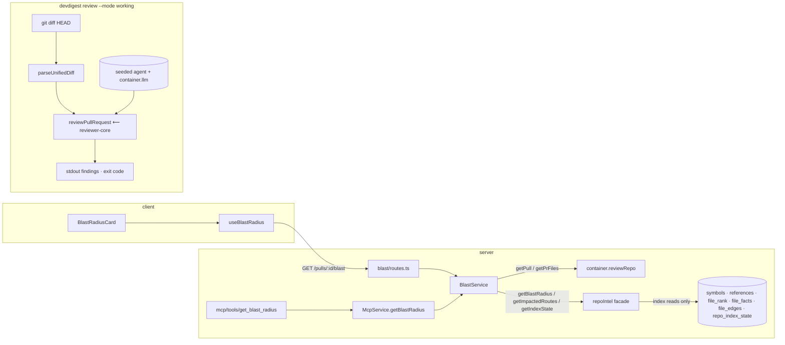

## Development Plan — Blast Radius (PR impact map) + MCP tool + pre-push CLI
**Date:** 2026-07-05
**Status:** APPROVED 2026-07-05. §12 resolved: Q1 = `General Reviewer` default; Q2 = `git diff HEAD`; Q3 = reviewRepo third-consumer cleanup INCLUDED in T1.

### 1. Objective

Give reviewers a deterministic "what does this PR touch downstream" map: for a
PR's changed files, show the declared symbols, who calls them (file:line, top-20
per symbol by file rank), and which HTTP routes / crons are reachable within
depth-2 of the import graph. Surface it in three entry points that all reuse the
same application logic: the PR Overview tab (existing `BlastRadiusCard` slot),
the MCP `get_blast_radius` tool (currently a stub), and — as a separate reuse
exercise — a `devdigest review --mode working` CLI that runs the product's
review agent against the local working-tree diff. The blast feature makes ZERO
LLM calls and reads only from the persistent index via the `repoIntel.*` facade.

### 2. Acceptance criteria

1. **Given** an indexed repo (`repo_index_state.status = full`) and a demo PR
   changing a shared helper, **when** `GET /pulls/:id/blast` is called, **then**
   the response contains ≥2 callers and ≥1 endpoint for that helper's symbol,
   and the server log shows no parse/clone-read events on that request (index
   reads only, fast).
2. **Given** the same PR, **when** the Overview tab renders, **then** the
   Blast-radius card shows header counts (N symbols · N callers · N endpoints ·
   N cron) and a tree: changed symbol → caller rows (`file:line`) → endpoint /
   cron badges per symbol.
3. **When** a caller row is clicked, **then** a new tab opens at
   `githubBlobUrl(repoFullName, pr.head_sha, file, line)` — code at that exact
   line, pinned to the PR head sha.
4. **Given** `repo_index_state.status = partial` or a degraded/absent index,
   **then** the card renders its data (possibly empty) PLUS an explanatory
   "Partial index" badge — never a blank screen.
5. **Given** a PR with no blast data at all (no symbols, index absent), **then**
   the card renders the existing honest empty state (`brief.noBlast` copy).
6. Callers are limited to 20 **per symbol** (not globally), sorted by caller
   file rank desc, and never include the declaring file itself.
7. Endpoints are found via reverse import-graph traversal up to depth 2
   (`file_edges` + `file_facts`), plus direct caller-file facts.
8. No `container.llm` usage anywhere on the blast path (route, service, facade,
   MCP tool, UI). `summary` is composed deterministically from counts.
9. MCP `get_blast_radius {repo, pr}` returns the same `BlastResponse` payload
   (or a P4 `{message, next}` error when repo/PR is unknown) — no longer
   `not_implemented`.
10. `pnpm devdigest review --mode working` (or
    `./node_modules/.bin/tsx src/cli/index.ts review --mode working`) run in a
    git repo with uncommitted changes prints the same structured findings the
    product produces (verdict, score, grounding, `[SEVERITY] file:lines — title`
    rows) via the same `reviewPullRequest` engine and the same DB-seeded agent;
    exits 1 when blockers ≥ the agent's `ciFailOn` gate, 0 otherwise, 2 on
    usage/config errors. `--mode staged|branch` parse but exit 2 with
    "not implemented yet".

### 3. Scope

- IN:
  - Fix two facade gaps in `repo-intel/service.ts`: per-symbol caller cap;
    new `getImpactedRoutes` depth-2 reverse-import read (both paths of
    `getBlastRadius` apply the per-symbol cap).
  - New server module `server/src/modules/blast/` + `GET /pulls/:id/blast`,
    registered in `server/src/modules/index.ts`.
  - Blast module reads PR data via `container.reviewRepo`; per
    `server/INSIGHTS.md` 2026-07-03 (third cross-domain consumer rule),
    `intent/service.ts` and `smart-diff/service.ts` are switched from
    `new ReviewRepository(container.db)` to `container.reviewRepo` in the same
    task (2-line changes; test escape hatches unchanged). *(pending §12 Q3)*
  - Client: `useBlastRadius` hook, live `BlastRadiusCard` (counts header, tree,
    caller deep-links, degraded badge, empty state), prop threading
    `page.tsx → OverviewTab → BlastRadiusCard`, new `brief.json` keys.
  - MCP: wire `get_blast_radius` to `BlastService` through `McpService`
    (SDK-isolation pattern preserved); real output schema.
  - CLI: `server/src/cli/` — `devdigest review --mode working` reusing
    `reviewPullRequest` + the seeded reviewer agent + `container.llm`;
    `devdigest` script in `server/package.json`. No DB writes (print-only).
- OUT:
  - LLM-generated one-paragraph blast summary (developer decision: deterministic
    counts string instead).
  - No new PR-page tab (developer decision: existing Overview card slot).
  - Edits to `server/src/vendor/`, `client/src/vendor/`, DB schema/migrations
    (none needed — reads only), `repo-intel` indexing pipeline.
  - `--mode staged` / `--mode branch` implementations (flag designed, modes
    rejected with exit 2).
  - Prior-PRs bar inside the card (stays as-is, separate feature).
  - Persisting CLI review results to the DB; GitHub posting.
  - New npm dependencies (hard env constraint — `node:util.parseArgs`,
    `node:child_process` only).

### 4. Affected packages & modules

| Package/module | Onion layer(s) | Why touched |
|---|---|---|
| `server/src/modules/repo-intel/` (`service.ts`, `types.ts`, new `service.test.ts`) | application (facade) | Per-symbol caller cap in `tryPersistentBlast` + degraded path; new `getImpactedRoutes`; optional `repo?` ctor param for tests |
| `server/src/modules/blast/` (new) | presentation + application | `GET /pulls/:id/blast`; maps facade `BlastResult`/`ImpactedRouteRow`/`IndexState` → shared `BlastRadius` + index badge info |
| `server/src/modules/index.ts` | composition | Register `blast` module (one import + one entry) |
| `server/src/modules/intent/service.ts`, `smart-diff/service.ts` | application | Switch to `container.reviewRepo` (third-consumer cleanup, §12 Q3) |
| `server/src/mcp/` (`application/mcp-service.ts`, `tools/get-blast-radius.ts`, `schemas.ts`, `server.ts`, tests) | application + presentation | De-stub `get_blast_radius` → `BlastService` via `McpService` |
| `server/src/cli/` (new), `server/package.json` (scripts) | presentation (new entry point) | `devdigest review` CLI over `reviewPullRequest` |
| `client/src/lib/hooks/` (`blast.ts` new, `index.ts`) | data layer | `useBlastRadius` TanStack Query hook |
| `client/.../pulls/[number]/_components/BlastRadiusCard/`, `OverviewTab/`, `page.tsx` | UI | Live card; thread `repoFullName`/`headSha` down |
| `client/messages/en/brief.json` | copy | New `blast.*` keys |

Not touched: `server/src/vendor/`, `client/src/vendor/` (contract `BlastRadius`
already exists in both mirrors of `contracts/brief.ts`), `server/src/db/`,
`reviewer-core/` (consumed as-is), `e2e/`.

### 5. Frozen interface contracts

Implementers MUST NOT alter these shapes. All Zod imports from `zod`;
`BlastRadius`, `UnifiedDiff` etc. from `@devdigest/shared` (vendored, verified
present in both mirrors — do not edit vendor).

#### 5.1 repoIntel facade delta (`server/src/modules/repo-intel/types.ts` + `service.ts`)

```ts
// NEW row + method on the RepoIntel interface (types.ts):
export interface ImpactedRouteRow {
  /** Changed file the reverse-import BFS started from. */
  seedFile: string;
  /** Reached file (depth 0 = the seed itself, up to BFS_DEPTH=2 hops). */
  file: string;
  depth: number; // 0 | 1 | 2
  endpoints: string[]; // "METHOD /path" strings from file_facts
  crons: string[];
}

// RepoIntel interface addition:
getImpactedRoutes(repoId: string, files: string[]): Promise<ImpactedRouteRow[]>;
```

Semantics (service.ts):
- Pure reads: `repo.getEdges(repoId)` + `repo.getFileFacts(repoId, reachedFiles)`.
  BFS over REVERSED edges (`toFile → fromFile`, i.e. "who imports me"), per seed
  file, up to existing `BFS_DEPTH` (= 2, `constants.ts`).
- Only rows where `endpoints.length + crons.length > 0` are returned. Depth 0
  included (a changed route file counts as impacted).
- Degraded contract (array method): flag off / no edges / empty input → `[]`.
  Never throws.

`getBlastRadius` fix (both paths):
- `MAX_CALLERS_PER_SYMBOL` (= 20) is applied **per `viaSymbol` group** (sort by
  `rank` desc inside the group, slice 20), replacing the current global
  `callers.slice(0, MAX_CALLERS_PER_SYMBOL)` at `service.ts:386`. The flat
  `callers` array stays rank-desc sorted overall. Declaring-file exclusion and
  `factsByFile` behavior unchanged.

Testability: `RepoIntelService` constructor gains an optional escape hatch,
mirroring `SmartDiffService`:
```ts
constructor(private container: Container, repoOverride?: RepoIntelRepository)
// this.repo = repoOverride ?? new RepoIntelRepository(container.db);
```

#### 5.2 Blast module public API (`server/src/modules/blast/`)

```ts
// schemas.ts — module-local Zod (vendor is do-not-touch; wrapper composes the
// existing shared BlastRadius with index state instead of editing it):
import { BlastRadius } from '@devdigest/shared';

export const BlastIndexInfo = z.object({
  status: z.enum(['full', 'partial', 'degraded', 'failed']),
  /** True when results came from a fallback / incomplete index. */
  degraded: z.boolean(),
  reason: z.string().nullable(),
});
export type BlastIndexInfo = z.infer<typeof BlastIndexInfo>;

export const BlastResponse = z.object({
  blast: BlastRadius,
  index: BlastIndexInfo,
});
export type BlastResponse = z.infer<typeof BlastResponse>;

// service.ts:
export class BlastService {
  // reviewRepo via container.reviewRepo getter; overrides for unit tests only.
  constructor(container: Container, overrides?: { reviewRepo?: ReviewRepository });
  /** @throws NotFoundError('Pull request not found') — 404, same as smart-diff */
  getBlast(workspaceId: string, prId: string): Promise<BlastResponse>;
}
```

Route (`routes.ts`, mirrors `smart-diff/routes.ts` exactly):
```
GET /pulls/:id/blast
  params: IdParams (modules/_shared/schemas)
  scoping: getContext(container, req) → workspaceId
  200 → BlastResponse; 404 → NotFoundError envelope
  ZERO container.llm usage; no clone/fs reads in the module itself.
```

Composition rules (service, frozen):
1. `pull = reviewRepo.getPull(workspaceId, prId)` → 404 if absent.
   `changedFiles = reviewRepo.getPrFiles(prId).map(f => f.path)`.
2. Facade reads only: `container.repoIntel.getBlastRadius(pull.repoId, changedFiles)`,
   `container.repoIntel.getImpactedRoutes(pull.repoId, changedFiles)`,
   `container.repoIntel.getIndexState(pull.repoId)`.
3. `blast.changed_symbols` = `blastResult.changedSymbols` → `{name, file, kind}`.
4. `blast.downstream` = one entry per changed symbol, in `changed_symbols`
   order, INCLUDING symbols with zero callers (UI shows the full tree):
   - `callers` = flat `blastResult.callers` where `viaSymbol === symbol.name`
     (already per-symbol-capped/sorted by the facade) → `{name: c.symbol, file: c.file, line: c.line}`.
   - `endpoints_affected` = dedup + asc-sort of:
     `factsByFile[callerFile].endpoints` over that symbol's caller files
     ∪ `impactedRoutes.filter(r => r.seedFile === symbol.file).flatMap(r => r.endpoints)`.
   - `crons_affected` = same union over `crons`.
5. `blast.summary` (deterministic, exact format):
   `` `${S} symbols · ${C} callers · ${E} endpoints · ${K} crons` `` where
   S = `changed_symbols.length`, C = total caller rows across `downstream`,
   E/K = distinct endpoints/crons across `downstream`.
6. `index` = `{ status: state.status, degraded: (blastResult.degraded ?? false) || (state.degraded ?? false), reason: blastResult.reason ?? state.degradedReason ?? null }`.

#### 5.3 Client contracts

```ts
// client/src/lib/hooks/blast.ts (server-side repo-intel types stay server-side,
// so the wrapper is mirrored locally — same precedent as RepoIntelState):
import type { BlastRadius } from "@devdigest/shared";

export interface BlastIndexInfo {
  status: "full" | "partial" | "degraded" | "failed";
  degraded: boolean;
  reason: string | null;
}
export interface BlastResponse { blast: BlastRadius; index: BlastIndexInfo; }

/** GET /pulls/:id/blast — queryKey ["pull", prId, "blast"], enabled when prId != null. */
export function useBlastRadius(
  prId: string | number | null | undefined,
): UseQueryResult<BlastResponse>;
```

Component props (page.tsx already holds both values — it passes them to
FindingsTab today):
```ts
// OverviewTab: { prId: string | number; repoFullName: string | null; headSha: string | null }
// BlastRadiusCard: { prId: string | number; repoFullName: string | null; headSha: string | null }
```

Card states (all four required; no blank renders):
- loading → muted placeholder text;
- error OR `blast.changed_symbols.length === 0` with no callers → existing
  `t("noBlast")` empty state;
- data → counts header + tree (symbol row → caller rows → endpoint/cron badges);
- `index.degraded || index.status === "partial" || index.status === "failed"` →
  additionally a badge `t("blast.degraded")` with hint `t("blast.degradedHint")`
  (shown alongside data or the empty state — never instead of them).

Caller click: `<a href={githubBlobUrl(repoFullName, headSha, file, line)}
target="_blank" rel="noreferrer">` — rendered as plain text `file:line` row when
`repoFullName`/`headSha` is null. The Prior-PRs bar block is left untouched.

New copy keys in `client/messages/en/brief.json` (existing keys `block.blast`,
`noBlast`, `priorPrs`, `noHistory` reused as-is):
```json
"blast": {
  "symbols": "{count} symbols",
  "callers": "{count} callers",
  "endpoints": "{count} endpoints",
  "crons": "{count} cron",
  "degraded": "Partial index",
  "degradedHint": "The code index is incomplete — callers and endpoints may be missing.",
  "loading": "Computing blast radius…"
}
```
Header counts are computed on the client from `blast.*` fields (not parsed from
`summary`).

#### 5.4 MCP contracts (`server/src/mcp/`)

```ts
// application/mcp-service.ts additions:
export interface IBlastService { getBlast: BlastService['getBlast']; }
// ctor overrides gains: blastService?: IBlastService
//   (default: new BlastService(container))

async getBlastRadius(
  repoFullName: string,
  prNumber: number,
): Promise<McpResult<BlastResponse>>;
// P4 errors (exact reuse of runAgentOnPr messages):
//   repo unknown → err(`repo "${repoFullName}" not found in this workspace`,
//                      'add it in DevDigest, then retry')
//   PR unknown   → err(`PR #${prNumber} not found for ${repoFullName}`,
//                      'open the PR in DevDigest to import it, then retry')

// schemas.ts — getBlastRadiusInput unchanged; output REPLACED:
export const GetBlastRadiusOutput = z.object({
  blast: BlastRadius, // from '@devdigest/shared'
  index: z.object({
    status: z.enum(['full', 'partial', 'degraded', 'failed']),
    degraded: z.boolean(),
    reason: z.string().nullable(),
  }),
});

// tools/get-blast-radius.ts — signature becomes
//   registerGetBlastRadius(server: McpServer, service: McpService)
// handler: convert McpResult via existing toolError/toolSuccess; description
// updated (no longer "STUB"). server.ts passes the service.
```
SDK-isolation invariant preserved: SDK runtime imports remain only in
`mcp/index.ts` / `mcp/server.ts`; `mcp-service.ts` stays SDK-free and returns
`McpResult`.

#### 5.5 CLI contract (`server/src/cli/`)

Invocation (no new deps; no `bin` field — installs are not viable in this env;
mirrors the existing `"mcp": "tsx src/mcp/index.ts"` script precedent):
```
pnpm devdigest review --mode working [--agent "<name>"] [--path <dir>]
# script in server/package.json: "devdigest": "tsx src/cli/index.ts"
# direct (sandbox-safe): ./node_modules/.bin/tsx src/cli/index.ts review --mode working
```
- Args via `node:util.parseArgs`. Subcommand `review` required.
- `--mode` ∈ `working | staged | branch` (zod-validated). Only `working` is
  implemented; others → stderr `mode "<m>" is not implemented yet`, exit 2.
- Target repo dir: `--path` > `process.env.INIT_CWD` (set by pnpm to the
  invoking cwd) > `process.cwd()`.
- `--agent`: agent NAME within the default workspace; default
  `"General Reviewer"` (§12 Q1). Resolved via `container.agentsRepo.list(workspaceId)`
  → find by name; not found → exit 2 listing available agent names.
- Diff: `execFile('git', ['diff', 'HEAD'], { cwd: targetDir, maxBuffer: 32 MiB })`
  (§12 Q2) → `parseUnifiedDiff` (`server/src/adapters/git/diff-parser.js`).
  Not a git repo → exit 2. Empty diff → stdout `No changes in working tree.`,
  exit 0.
- Engine: exactly `reviewPullRequest({ systemPrompt: agent.systemPrompt,
  model: agent.model, diff, llm: await container.llm(agent.provider),
  strategy: agent.strategy ?? REVIEW_STRATEGY,
  task: `Review the local ${mode} diff (${diff.files.length} changed files).`,
  sessionId: `cli:${basename(targetDir)}:${mode}`, onEvent → stderr })`.
  No DB writes; workspace resolved via `container.auth.currentWorkspace(null)`.
- Output format (stdout; progress/events → stderr, mirroring the MCP
  stdout-discipline pattern):
```
DevDigest review — mode: working · agent: General Reviewer (openrouter/deepseek-v4-flash)
Diff: 4 file(s)

VERDICT: request_changes   SCORE: 62
GROUNDING: 5/6 passed

[CRITICAL] src/api/users.ts:45-52 — N+1 query in user list endpoint
  Loop issues one query per user → N+1.
  Suggestion: Use a single IN query and group in memory.

2 finding(s) · 1 blocker(s) (gate: CRITICAL)
```
  One block per finding: `[SEVERITY] file:startLine-endLine — title`, rationale
  line, optional `Suggestion:` line. Footer counts + `countBlockers(findings,
  agent.ciFailOn)` (from `@devdigest/reviewer-core`).
- Exit codes: `0` = reviewed, no blockers (or empty diff); `1` = blockers ≥ the
  agent's `ciFailOn` gate (pre-push semantics); `2` = usage/config errors (bad
  args, unknown agent, not a git repo, missing API key `ConfigError`).
- Files: `src/cli/index.ts` (entry: dotenv, argv, container boot — thin),
  `src/cli/review-command.ts` (pure-ish orchestration, injectable deps for
  tests), `src/cli/format.ts` (pure output formatting + exit-code decision,
  unit-testable), `src/cli/git-diff.ts` (execFile wrapper).
- Note: the CLI DOES call the LLM (it runs a real review) — the zero-LLM rule
  applies to the blast feature only.

### 6. Directory ownership map (non-overlapping)

| Task | Agent surface | Owns (dirs/files) |
|---|---|---|
| T1 | backend | `server/src/modules/blast/**` (new), `server/src/modules/repo-intel/{service.ts,types.ts,service.test.ts}`, `server/src/modules/index.ts`, `server/src/modules/intent/service.ts`, `server/src/modules/smart-diff/service.ts` (cleanup only, §12 Q3) |
| T2 | ui | `client/src/lib/hooks/{blast.ts,index.ts}`, `client/src/app/repos/[repoId]/pulls/[number]/_components/BlastRadiusCard/**`, `.../OverviewTab/**`, `.../page.tsx`, `client/messages/en/brief.json` |
| T3 | backend | `server/src/mcp/**`, `server/src/cli/**` (new), `server/package.json` (scripts block only) |

Never touched by anyone: `server/src/vendor/**`, `client/src/vendor/**`,
`server/src/db/migrations/**`, lockfiles, root/`tsconfig.json`s,
`reviewer-core/**`. T2 must not touch `FindingCard/` (it has unrelated
uncommitted local changes on this branch).

### 7. Parallelizable tasks

**T1 — facade fixes + blast module + route** (surface: backend; deps: none;
merge order: 1st)
- Goal: §5.1 facade delta (per-symbol cap in both `getBlastRadius` paths,
  `getImpactedRoutes`, `repoOverride` ctor hook) + §5.2 blast module + module
  registration + `container.reviewRepo` third-consumer cleanup (§12 Q3).
- Unit tests: `blast/service.test.ts` (stub `reviewRepo` via overrides, stub
  facade via `ContainerOverrides.repoIntel` — the container already supports
  it): grouping, per-symbol attribution, summary string, 404, degraded/empty
  passthrough. `repo-intel/service.test.ts` (stub `RepoIntelRepository` via the
  new ctor param): per-symbol cap (21 callers on one symbol → 20; two symbols
  keep their own 20), decl-file exclusion regression, depth-2 BFS (reached at
  depth 3 → excluded; depth 0 route file → included), `[]` on flag-off/no-edges.
- Skills: `onion-architecture`, `fastify-best-practices`,
  `drizzle-orm-patterns`, `zod`, `typescript-expert`, `engineering-insights`.

**T2 — BlastRadiusCard + hook** (surface: ui; deps: none — contract mirrored
locally, tests mock the hook; merge order: any)
- Goal: §5.3 — hook, card (counts header, symbol tree, caller deep-links,
  degraded badge, honest empty state, loading), `OverviewTab`/`page.tsx` prop
  threading, `brief.json` keys. Keep the Prior-PRs bar intact. Styles in
  `styles.ts` with `var(--token)`; NO hand-rolled severity/status colors — grep
  for existing token maps first (repeat-offender pattern, see §9).
- Unit tests (rewrite `BlastRadiusCard.test.tsx`): mock `useBlastRadius`
  (`as unknown as ReturnType<typeof ...>` cast pattern), wrap in
  `NextIntlClientProvider` with `messages/en/brief.json`; assert the four states
  + caller href = `githubBlobUrl(repoFullName, headSha, file, line)`.
- Skills: `ui-architecture`, `react-best-practices`, `next-best-practices`,
  `react-testing-library`, `zod`, `typescript-expert`, `engineering-insights`.

**T3 — MCP tool wiring + pre-push CLI** (surface: backend; deps: **T1 merged**
(imports `BlastService`); merge order: after T1)
- Goal: §5.4 (McpService.getBlastRadius + overrides, tool de-stub, schemas,
  server.ts) + §5.5 (CLI). Preserve SDK isolation and stdout discipline.
- Unit tests: `mcp-service` blast paths via `overrides.blastService` stub (repo
  unknown / PR unknown / ok — follow the existing no-DB stub patterns in
  `server/INSIGHTS.md` 2026-07-05); `cli/format.test.ts` (pure formatting +
  exit-code matrix); `cli/review-command.test.ts` with injected stub deps (git
  wrapper, agent list, LLM outcome) — no real git/DB/LLM.
- Skills: `onion-architecture`, `zod`, `typescript-expert`, `security`
  (CLI arg/path handling, execFile — never shell interpolation),
  `engineering-insights`.

Wave plan: T1 ∥ T2 in parallel, then T3. Every task runs the
`engineering-insights` check at session end (mandatory). Automatic stages after
implementation: per-surface unit tests (above) and a `plan-verifier` audit
against this spec.

### 8. Test commands per scope

All from the package dir, local binaries only (`pnpm test`/`pnpm typecheck`
abort in this env — `ERR_PNPM_IGNORED_BUILDS`):

- T1: `cd server && ./node_modules/.bin/vitest run blast repo-intel smart-diff intent && ./node_modules/.bin/tsc --noEmit -p tsconfig.json`
  (pre-existing tsc noise in `reviewer-core`/`adapters/llm` is env-related — ignore).
- T2: `cd client && ./node_modules/.bin/vitest run BlastRadiusCard OverviewTab && ./node_modules/.bin/tsc --noEmit`
  (vitest filters are plain substrings — bracketed route dirs don't regex-match).
- T3: `cd server && ./node_modules/.bin/vitest run mcp cli && ./node_modules/.bin/tsc --noEmit -p tsconfig.json`;
  smoke: `cd server && ./node_modules/.bin/tsx src/cli/index.ts review --mode working --path ../` (this repo's own working tree; needs `.env` / `DOTENV_CONFIG_PATH`).
- Integration acceptance (manual, developer): indexed demo repo → open demo PR
  Overview → criteria 1–5; `/mcp` → `get_blast_radius`.

### 9. Relevant engineering insights

- `server/INSIGHTS.md` 2026-07-05 — SDK-isolation template for `mcp/`: SDK
  runtime imports only in `index.ts`/`server.ts`; application returns
  `McpResult`; tools convert via `toolError`/`toolSuccess`. T3 must preserve it.
- `server/INSIGHTS.md` 2026-07-05 — MCP unit-test patterns without a real DB:
  `overrides` ctor stubs, `CallToolResult.content` needs `type === 'text'`
  guard, `currentWorkspace(null)` in no-auth mode. Template for T3 tests.
- `server/INSIGHTS.md` 2026-07-03 — `container.reviewRepo` getter exists;
  `intent`/`smart-diff` bypass it; a THIRD cross-domain consumer must trigger
  the all-three cleanup, not another one-off → folded into T1 (§12 Q3).
- `server/INSIGHTS.md` 2026-06-20/2026-07-03 Tooling — no new npm deps
  (`ERR_PNPM_IGNORED_BUILDS`); run local binaries, not `pnpm test`/`typecheck`.
  Drives the CLI design (builtins only, tsx script, no `bin`).
- `server/INSIGHTS.md` 2026-07-05 — MCP/tsx cwd pitfalls (`dotenv` loads from
  cwd; tsconfig path alias needs `server/tsconfig.json`): same applies to the
  CLI entry when launched outside `server/` — document `--path`/`DOTENV_CONFIG_PATH`.
- `client/INSIGHTS.md` 2026-07-02 Decisions — `BlastRadiusCard` empty-state slot
  was built exactly for this lesson: "replace the empty-state bodies… the layout
  slots are already in place". T2 fills the slot; no layout rework.
- `client/INSIGHTS.md` 2026-06-20/24 + 2026-07-03 — file:line deep links via
  `githubBlobUrl(repoFullName, headSha, file, line)` pinned to PR head sha;
  never hand-roll severity/status colors (missed twice; plan text is not
  self-enforcing — T2 must grep token maps first); long unbroken paths in flex
  rows need `minWidth: 0` + ellipsis + `title` attr (caller file paths!).
- `client/INSIGHTS.md` 2026-06-28/30 — next-intl namespace json + provider-wrap
  test pattern; TanStack hook mock cast pattern; pages need explicit padding
  (not relevant here — card already placed); `vitest run` substring filters.
- `server/INSIGHTS.md` 2026-06-28 — `ConfigError` (missing API key) is a bare
  500/throw: the CLI must catch it and exit 2 with the provider-key message.

### 10. Architecture diagram



Blast path (Card/MCP → DB): zero LLM, zero clone parsing on the indexed path.
CLI path: same engine + agent as product reviews, different entry point.

### 11. Risks & integration concerns

- **T3 hard-depends on T1** (imports `BlastService`) — sequence waves; the §5.4
  interface is frozen so T3 can be specced/reviewed but not merged first.
- **Unindexed repo fallback**: `getBlastRadius`'s ripgrep path reads the clone
  (parse events in logs). Acceptance #1 is measured on an indexed repo; the
  fallback stays as the facade's existing degraded behavior (honest badge).
- **`file_edges` sparsity on `partial` index**: depth-2 traversal may find fewer
  endpoints than direct caller facts — the union in §5.2 rule 4 covers it; badge
  explains partial state.
- **Endpoint attribution is per-symbol via seed decl file** — two symbols in the
  same changed file show identical endpoint sets (acceptable; deterministic).
- **CLI env coupling**: needs `server/.env` (DATABASE_URL + provider key) even
  when reviewing another repo; frozen `--path`/`INIT_CWD` resolution + docs line
  in the command's `--help` mitigate; `ConfigError` → exit 2.
- **`server/package.json` scripts edit** (T3) — lockfile untouched (no dep
  changes), so no install needed; do NOT run `pnpm install`.
- **OverviewTab prop change** ripples into `page.tsx` only (verified: sole
  consumer at line 138); `OverviewTab` has no own test file today — T2's card
  test covers the states, prop threading is typechecked.
- **brief.json is ASCII** — safe for `Edit`; if non-ASCII copy (`…`, `·`) is
  added, mind the smart-quote corruption note (server/INSIGHTS.md 2026-06-30).

### 11a. Design-parity rework (2026-07-06, developer-mandated)

The first T2 delivery failed the "similar to the design" acceptance bar
(developer verdict). The card must match the mock
(`~/Desktop/Screenshot 2026-07-06 at 21.14.58.png`) 1:1 in structure:

1. Counts row: per-count icons (code / corner-down-right / globe / clock) with
   BOLD numbers, plus a functional **Tree | Graph** segmented toggle on the
   right (dark pill container, active segment elevated). Graph mode must be a
   REAL working view (no stub): a simple SVG graph of symbol → caller →
   endpoint/cron nodes with edges; caller nodes clickable (same deep links).
2. Symbol rows: full-width dark band rows — chevron (expand/collapse toggle),
   blue `<>` icon, monospace `name()` (parens only for callable kinds),
   right-aligned muted "N callers". NO file path in the row. First symbol
   expanded by default, the rest collapsed.
3. Expanded body: caller rows as a tree (vertical guide line + ↳ per row),
   monospace `file:line`, whole row a deep link (hover underline); then
   endpoint badges (blue pill, globe icon, `METHOD /path` monospace) and cron
   badges (orange/warn pill, clock icon) wrapping in rows.
4. Header icon: network/share-style glyph per mock (pick the closest existing
   `Icon.*`), monospace styling throughout per mock.
5. States (loading/empty/degraded) keep their approved §5.3 semantics, restyled
   consistently. Prior-PRs bar unchanged (no count badge — backend absent).

1. **CLI default agent**: the TЗ names "Structured Reviewer", but no such agent
   exists in this repo's seed (`server/src/db/seed.ts` seeds `General Reviewer`,
   `Security Reviewer`, …). Frozen default: `"General Reviewer"` (the repo's
   structured-output reviewer), overridable via `--agent`. Confirm or name
   another default.
2. **`--mode working` git command**: frozen as `git diff HEAD` (staged +
   unstaged vs HEAD — the useful pre-push semantics). The TЗ literally says
   "git diff" (unstaged only, misses staged changes). Confirm `git diff HEAD`.
3. **`container.reviewRepo` third-consumer cleanup** (switching
   `intent/service.ts` + `smart-diff/service.ts` alongside the new blast module,
   per server/INSIGHTS.md 2026-07-03 prescription): included in T1 as ~2-line
   changes. Strike if you want the TЗ scope strictly minimal.
