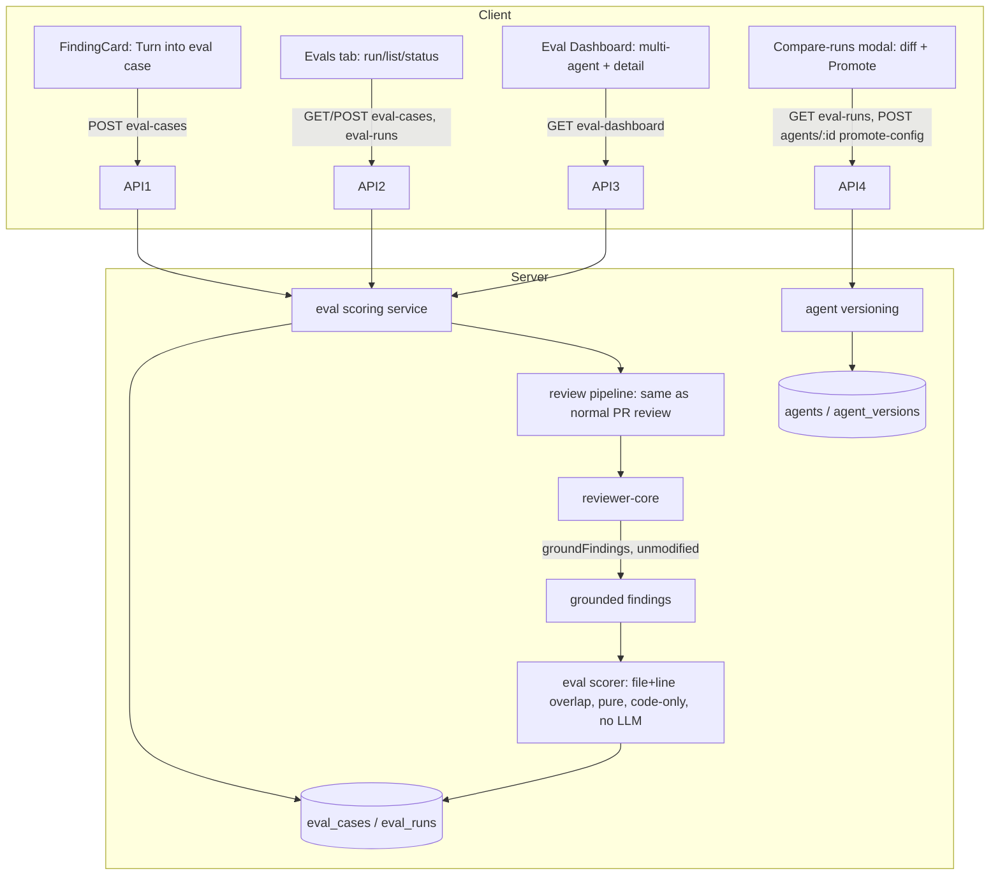

# SPEC-03 — Eval Pipeline  |  Status: draft

## Vision

Регресійний тестинг для рев'ю-агентів: від знахідки в PR до кейсу, запуску й метрик — без жодного LLM-судді. Дозволяє відповісти на питання "чи стала якість агента кращою/гіршою" при зміні `system_prompt`, моделі чи скілів, і показати цю різницю видимо (recall/precision/citation_accuracy) між двома версіями агента.

## Scope

**IN:**
- Створення eval-кейсу одним кліком з FindingCard (accepted → must_find, dismissed → must_not_flag).
- Прогін агента на всьому наборі кейсів набору через API, code-only скоринг (без LLM-судді).
- Вкладка Evals в AgentEditor; окрема сторінка Eval Dashboard (multi-agent overview + per-agent detail).
- Eval-case editor modal (створення/редагування кейсу).
- Compare-runs modal (дельти метрик + system prompt diff + реальний Promote).
- `owner_kind = "agent"` тільки (дивись Non-goals).

**OUT (non-goals):**
- MCP CI export (є в `eval-ci.ts`, окрема фіча).
- Conformance checks, composed reviews.
- `owner_kind = "skill"` eval-кейси — enum це підтримує на рівні контракту, але жоден UI/API цієї фічі їх не використовує; skill-scoped evals лишаються майбутньою роботою.
- Будь-яка LLM-суддя оцінка якості (тільки file:line-скоринг).

## User stories

- Як розробник агента, я хочу перетворити реальну прийняту/відхилену знахідку на eval-кейс одним кліком, щоб не писати кейси вручну.
- Як розробник агента, я хочу прогнати весь набір кейсів і побачити recall/precision/citation_accuracy, щоб знати, чи агент досі знаходить те, що повинен, і не галюцинує зайвого.
- Як розробник агента, я хочу порівняти прогін до і після зміни `system_prompt` (включно з самим diff'ом промпту), щоб зрозуміти, що саме змінилося і чи варто цю зміну лишати.
- Як розробник агента, я хочу одним кліком повернути (promote) конфіг агента до версії, що показала кращі метрики.

## Frozen decisions (D1–D8)

- **D1** (заморожено раніше) — `expected_output` кодується як JSON-масив finding-скелетів. `must_find` = непустий масив, `must_not_flag` = порожній масив `[]`. Тип очікування — похідний від `expected_output.length`, не окреме поле; порожній масив = свідомий `must_not_flag`, а не забуте очікування.
- **D2** (заморожено раніше) — спека переписується на місці, шлях `specs/eval-pipeline.md`, заголовок `SPEC-03 — Eval Pipeline` збережено.
- **D3** (заморожено раніше) — знімок прогону `{system_prompt, model, skills, version}` кладеться в ІСНУЮЧУ `eval_runs.actual_output` (jsonb) поруч із фактичними findings під час виконання прогону. Без нових колонок/міграцій.
- **D4** — «прогін» (run/batch) не має власного id в схемі; ідентифікується групуванням per-case рядків `eval_runs` за полем `version` всередині їхнього `actual_output` (== `agents.version` на момент виконання). «current» = група з максимальною версією серед наявних; «Recent runs»/trend/Compare оперують version-групами, а не окремими рядками.
- **D5** — знімок вводу кейсу (`input_diff`/`input_files`) — це diff-фрагмент навколо вихідної знахідки, НЕ весь PR-diff. Координата вихідної знахідки (`file` + діапазон рядків, плюс `severity`/`category`/`title` для відображення) додатково копіюється в `input_meta` для ОБОХ типів кейсів (must_find і must_not_flag однаково).
- **D6** — єдиний overlap-примітив для скорингу (файл збігається І рядки перетинаються), застосований до різних джерел координат залежно від типу: must_find звіряється проти скелетів у `expected_output`; must_not_flag звіряється проти «забороненої» координати з `input_meta`. Окремої гілки логіки для must_not_flag не потрібно.
- **D7** — поріг алерта дашборда — іменована константа `ALERT_THRESHOLD_PP`, дефолт **2 процентні пункти**: алерт спрацьовує, коли recall/precision/citation_accuracy поточної version-групи просіли на ≥ цього порогу відносно попередньої version-групи.
- **D8** — «Promote v7» у Compare-runs modal — реальна дія: застосовує знімок-конфіг обраного прогону (`system_prompt`/`model`/`skills`) як живий конфіг агента через ІСНУЮЧИЙ механізм версіонування (`agents.version` bump + новий рядок `agent_versions`), той самий, що й при звичайному редагуванні агента. Нової підсистеми не створюється; видимий контрол має реально працювати (не заглушка).

## Acceptance criteria (EARS)

### A — Створення eval-кейсу з FindingCard

- **AC-1**: WHEN a developer clicks "Turn into eval case" on an **accepted** finding's FindingCard, the system SHALL create an eval case with `owner_kind="agent"`, `owner_id` = that finding's agent, and `expected_output` = a one-element JSON array containing a finding skeleton `{file, start_line, end_line, severity, category, title}` copied from the accepted finding.
- **AC-2**: WHEN a developer clicks "Turn into eval case" on a **dismissed** finding's FindingCard, the system SHALL create an eval case with `expected_output = []`.
- **AC-3**: Ubiquitous — regardless of case type, the system SHALL always populate the new case's `input_meta` with the origin finding's coordinate (`file`, `start_line`, `end_line`) and descriptive fields (`severity`, `category`, `title`) (D5).
- **AC-4**: WHEN "Turn into eval case" is clicked, the system SHALL snapshot `input_diff`/`input_files` as a diff fragment scoped to the origin finding's file (not the full PR diff) (D5).
- **AC-5**: Ubiquitous — the system SHALL derive a case's type purely from `expected_output.length` (non-zero → must_find; zero → must_not_flag); an empty array SHALL always be treated as an intentional must_not_flag expectation (D1).
- **AC-6**: Ubiquitous — clicking "Turn into eval case" on the same finding more than once SHALL create a new, independent eval case each time (no deduplication against an existing case for that finding).

### B — Прогін на всьому наборі

- **AC-7**: WHEN `POST /agents/:id/eval-runs` is invoked, the system SHALL execute the agent's current live configuration against every eval case owned by that agent (`owner_kind="agent"`, `owner_id=:id`) via the same review pipeline used for a normal PR review, including the mandatory citation-grounding gate.
- **AC-8**: WHEN a case's execution completes, the system SHALL persist one `eval_runs` row for that case whose `actual_output` contains both the grounded findings produced AND the run snapshot `{system_prompt, model, skills, version}` (`version` = `agents.version` at execution time) (D3, D4).
- **AC-9**: IF a case's agent execution fails (timeout/provider error) THEN the system SHALL still persist that case's `eval_runs` row (`pass=false`, `recall`/`precision`/`citation_accuracy` = null) and SHALL continue executing the remaining cases in the same run rather than aborting the batch.
- **AC-10**: Ubiquitous — all cases executed within one `POST .../eval-runs` invocation SHALL run against an identical agent snapshot (same `system_prompt`/`model`/`skills`/`version`), so different agent versions' runs are directly comparable per case.

### C — Скоринг (code-only, без LLM)

- **AC-11**: Ubiquitous — the system SHALL score every case with a single overlap primitive requiring NO LLM call: a match exists when an actual finding's `file` equals the reference coordinate's `file` AND `[actual.start_line, actual.end_line]` intersects `[reference.start_line, reference.end_line]`.
- **AC-12**: WHEN scoring a must_find case, the system SHALL match each element of `expected_output` against that case's actual findings using AC-11's primitive, 1:1 (each expected element and each actual finding consumed by at most one match); a matched element counts as one true positive (TP), an unmatched element counts as one false negative (FN).
- **AC-13**: WHEN scoring a must_not_flag case, the system SHALL check whether any actual finding overlaps (AC-11) the origin coordinate stored in that case's `input_meta`; an overlap counts as exactly one false positive (FP) for that case; no overlap counts as one true negative (TN) (D6).
- **AC-14**: Ubiquitous — `recall = TP / (TP + FN)` aggregated over all must_find skeleton elements in the run; `precision = TP / (TP + FP)` over the same TPs plus all must_not_flag FPs in the run; `citation_accuracy` = (count of TPs where `actual.start_line == reference.start_line AND actual.end_line == reference.end_line`) / TP.
- **AC-15**: Ubiquitous — a must_find case's case-level pass/fail is true only when ALL of its `expected_output` elements matched; a must_not_flag case's case-level pass/fail is true only when it produced a true negative.
- **AC-16**: Ubiquitous — `traces_total` = number of cases in the set scored; `traces_passed` = number of those cases whose case-level pass/fail (AC-15) is true.

### D — Evals tab (AgentEditor)

- **AC-17**: WHEN a developer opens an agent's Evals tab, the system SHALL display four metric cards (RECALL, PRECISION, CITATION ACCURACY, TRACES PASSED) reflecting the current version-group's aggregate, each with a delta indicator versus the immediately preceding version-group.
- **AC-18**: WHEN the Evals tab is open, the system SHALL list every eval case owned by the agent with a status of "passing"/"failing" (from that case's row in the current version-group) or "never-run" (no row yet in the current version-group), plus a severity·category badge sourced from the case's `input_meta`/`expected_output`.
- **AC-19**: WHEN a developer clicks "Run all evals", the system SHALL invoke the batch run (AC-7–AC-10) and refresh every case's status and the metric cards on completion.
- **AC-20**: WHEN a developer clicks "New eval case", the system SHALL open the eval-case editor (Group E) pre-filled with an empty Name/Input/Expected output.
- **AC-21**: WHEN a developer triggers a listed case's per-case run action, the system SHALL execute AC-7–AC-16's pipeline for that single case only and update just that case's status/badge.
- **AC-22**: Ubiquitous — the Evals tab SHALL show an "N/M passing" counter (current version-group) and a "View full dashboard →" link to that agent's Eval Dashboard detail view (Group F).

### E — Eval-case editor modal

- **AC-23**: Ubiquitous — the editor SHALL expose an editable Name field, an Input section with Diff / Files / PR-meta tabs, and an Expected output field editable as raw JSON.
- **AC-24**: WHEN the developer edits Expected output, the system SHALL validate it is well-formed JSON AND, if non-empty, that every array element contains at least `file` (string), `start_line` (integer), `end_line` (integer) — enforced at the eval module's boundary since the underlying contract field itself is typed as unknown; invalid input SHALL block Save with a visible validation error.
- **AC-25**: WHEN the developer clicks "Finding skeleton", the system SHALL insert a template skeleton object (`{file, start_line, end_line, severity, category, title}`) into the Expected output JSON.
- **AC-26**: Ubiquitous — a "Run on save" toggle SHALL control whether saving the case also triggers a single-case run (AC-21) immediately afterward.
- **AC-27**: WHEN a case has at least one persisted run, the editor SHALL display a last-run summary line ("Last run passed · expected N finding(s), got M · duration · cost") sourced from that case's most recent persisted run.

### F — Eval Dashboard (сайдбар, SKILLS LAB)

- **AC-28**: Ubiquitous — a new "Eval Dashboard" entry SHALL appear in the sidebar's existing SKILLS LAB navigation group, linking to a standalone page outside any single agent's editor.
- **AC-29**: WHEN the multi-agent overview loads, the system SHALL list every agent that owns at least one eval case, each row showing that agent's current-version-group recall/precision/citation_accuracy and a mini trend.
- **AC-30**: WHEN a developer clicks "Run all agents", the system SHALL trigger a batch run (AC-7–AC-10) for every listed agent and refresh the overview on completion.
- **AC-31**: Ubiquitous — the multi-agent overview SHALL show a "Recent eval runs · all agents" table listing individual persisted runs across agents, newest first.
- **AC-32**: WHEN a developer opens an agent's Eval Dashboard detail view, the system SHALL display metric cards with deltas (as AC-17), a "Metric trend" chart plotting recall/precision/citation_accuracy across version-groups in chronological order, and a "Recent runs" list with a checkbox per run and a "Compare" action enabled only once exactly two runs are checked.
- **AC-33**: WHEN the current version-group's recall, precision, or citation_accuracy has dropped by at least `ALERT_THRESHOLD_PP` (default 2 percentage points, D7) versus the immediately preceding version-group, the system SHALL surface a non-null alert string on the detail view; otherwise the alert SHALL be null. IF there is no preceding version-group (first run ever) THEN the alert SHALL be null.

### G — Compare-runs modal + Promote

- **AC-34**: WHEN a developer selects exactly two runs (version-groups) and clicks "Compare", the system SHALL open a modal showing the delta of each metric (recall/precision/citation_accuracy/cost) between the two selected version-groups.
- **AC-35**: Ubiquitous — the Compare-runs modal SHALL render a system-prompt diff between the two version-groups' snapshot `system_prompt` values, visually distinguishing added and removed lines.
- **AC-36**: WHEN a developer clicks "Promote \<version\>", the system SHALL apply that version-group's snapshot config (`system_prompt`, `model`, `skills`) as the agent's live configuration via the existing agent-versioning mechanism (new `agents.version` + new `agent_versions` row) — a real backend effect, not a visual-only affordance (D8).
- **AC-37**: WHEN a developer clicks "Close", the system SHALL dismiss the modal without any configuration change.

### H — Definition of done

- **AC-38**: Ubiquitous — the eval case set used to demonstrate this feature SHALL contain at least 8 cases.
- **AC-39**: WHEN the same agent is run before and after a `system_prompt` edit (two distinct version-groups), the system SHALL show a visibly different recall/precision between those two version-groups on the tab/dashboard.

## Edge cases

- "Run all evals"/"Run all agents" on an empty case set SHALL be a no-op with an empty-state message, not an error.
- A case snapshot references PR/diff state that has since changed upstream — scoring SHALL always run against the frozen snapshot, never the live PR.
- A must_find case with more than one skeleton where only some match: recall/precision credit partial TPs at the skeleton level (AC-12/AC-14), but the case's own pass/fail is still "failing" until ALL its skeletons match (AC-15) — this can look surprising in the case-list badge (badge = failing, but aggregate recall is non-zero); this is intended, not a bug.
- must_not_flag scoring only checks overlap against the ONE origin coordinate stored in `input_meta` (D6) — an unrelated actual finding elsewhere within the same diff fragment that does NOT overlap that coordinate does NOT count as a false positive.
- A run failing mid-batch (AC-9) must not blank out already-completed cases' results in the same batch.
- Promoting a version-group whose snapshot is identical to the agent's current live config still creates a new version row (same behavior as a no-op manual edit+save today — not special-cased here).

## Non-functional

- Cost: scoping case inputs to a diff fragment (D5) rather than the whole PR materially reduces per-case LLM cost/latency versus the original (rejected) whole-PR-diff approach, but ≥8 cases × repeated runs is still a real, non-trivial LLM spend — worth surfacing to the developer (e.g. via the existing cost badges), not a reason to fake/skip real execution.

## Referenced contracts (existing, no reprint)

- `server/src/vendor/shared/contracts/knowledge.ts` — `EvalCase`, `EvalOwnerKind`, `EvalRun` (aggregate: recall/precision/citation_accuracy/traces_passed/traces_total/per_trace), `EvalPerTrace`, `Agent`, `AgentVersion`, `AgentVersionConfig`.
- `server/src/vendor/shared/contracts/eval-ci.ts` — `EvalCaseInput` (create/update payload), `EvalRunRecord` (persisted per-case row — mirrors `eval_runs`), `EvalRunResult` (one case's run result + persisted id), `EvalTrendPoint` (one point per run/version-group), `EvalDashboard` (aggregate `current`/`delta`/`trend`/`recent_runs`/`alert` for an owner).
- `server/src/vendor/shared/contracts/findings.ts` — `Finding` (`severity`, `category`, `title`, `file`, `start_line`, `end_line`) — the source fields copied into a finding skeleton.
- `server/src/db/schema/eval.ts` — `eval_cases` (owner_kind/owner_id/name/input_diff/input_files/input_meta/expected_output/notes), `eval_runs` (case_id/ran_at/actual_output/pass/recall/precision/citation_accuracy/duration_ms/cost_usd) — **per-case row**, distinct from the `EvalRun`/`EvalDashboard.current` **aggregate**.
- `server/src/db/schema/reviews.ts` — `findings.accepted_at`/`dismissed_at` — the dataset FindingCard's "Turn into eval case" reads from.
- `reviewer-core/src/grounding.ts` — the existing, unmodified citation-grounding gate every real agent execution (incl. eval runs, AC-7) already passes through before eval-specific scoring runs on top of it.

API surface used by this spec (already implied by `eval-ci.ts`'s shapes, not new contracts):
`POST /agents/:id/eval-cases`, `GET /agents/:id/eval-cases`, `POST /agents/:id/eval-runs`, `GET /agents/:id/eval-runs`, `GET /eval/dashboard?owner_kind=agent&owner_id=`.

## Architecture / cross-module diagram

## Verification

- `pnpm verify:l06` (`scripts/verify-l06.sh`) green: server typecheck, server eval-module tests, client typecheck, client tests for EvalsTab / eval-dashboard / FindingCard.

## Risks / notes

- `reviewer-core/grounding.ts` MUST stay pure and unmodified — eval scoring is a new, separate pure function (may reuse the same file+line-intersection idea, but not by editing the grounding gate).
- Per-case row (`eval_runs`, `EvalRunRecord`) vs aggregate (`EvalRun`, `EvalDashboard.current`) are two different shapes at two different granularities — do not conflate them when computing dashboard numbers; the aggregate is always derived by grouping/summing per-case rows within a version-group (D4).
- ≥8 eval cases (AC-38) must be genuinely authored for the demo; the design mocks show 5 — that is mock/placeholder content only, not the DoD target.
- No new DB migration for this feature (D3) — `eval_cases`/`eval_runs` are reused exactly as they exist today.

## Untrusted inputs

- PR diff fragment, finding rationale/title text, and dismissed-finding context captured into `input_diff`/`input_meta`/`expected_output` at case-creation time originate from repository code and prior LLM-authored finding text — always treated as DATA fed back into the review pipeline on re-run (same prompt-injection handling as the existing review flow), never as instructions to the eval module itself.
- The `system_prompt` shown/diffed in the Compare-runs modal is developer-authored (trusted), not third-party text.
