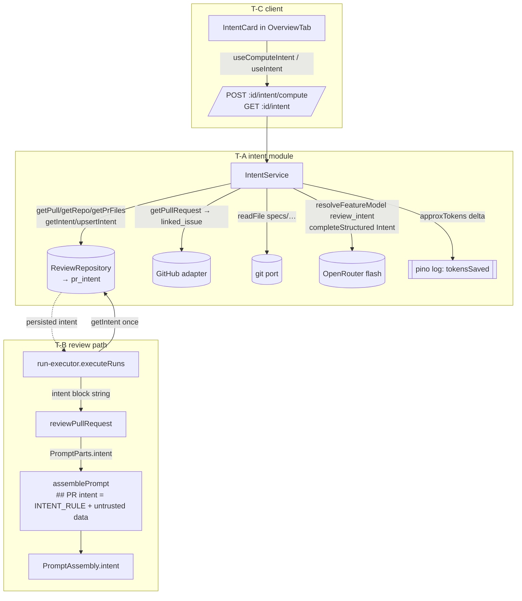

## Development Plan — Intent Layer (per-PR intent classifier + review injection)
**Date:** 2026-06-30

### 1. Objective
Before a review runs, derive *why* a PR was opened — a machine-understood
`Intent { intent, in_scope[], out_of_scope[] }` — from internal signals only
(PR title + body, the linked GitHub issue, and an in-repo spec file referenced
by path), using a cheap flash-class model via OpenRouter. The intent is shown
to the human on the PR page (so they see how the machine read the PR before
reading findings) and injected into every reviewer prompt so agents stay on
scope ("don't comment outside intent; one signal finding for a real
out-of-scope defect, not twenty"). This is the first lesson-feature that turns
the already-scaffolded `pr_intent` table, `Intent` contract, and `review_intent`
feature-model slot into a working end-to-end flow.

### 2. Acceptance criteria
1. **Compute (with docs):** Given a PR whose body references `#NNN` (same-repo
   issue) and an in-repo path like `specs/foo.md`, When the user clicks
   *Recompute* (`POST /pulls/:id/intent/compute`), Then the service builds a
   classifier input of `title + body + linked-issue title/body + spec-file
   contents + per-file hunk headers (NO diff bodies)`, calls the cheap
   `review_intent` model with the `Intent` structured schema, persists via
   `upsertIntent`, and returns `{ intent: Intent }`.
2. **Compute (no docs — fallback):** Given a PR with no issue reference and no
   in-repo spec path in its body, When intent is computed, Then it still runs on
   `title + hunk headers` (+ issue/spec if present) and never hard-blocks;
   empty `in_scope`/`out_of_scope` arrays are valid output.
3. **Internal-only sourcing:** A Jira/Confluence/Notion/`https://…` URL in the
   PR body is left as plain text in the prompt — no HTTP fetch is made to it.
   Only same-repo `#NNN` issues (existing adapter) and in-repo paths read via
   the git port are fetched.
4. **Token-savings log:** When a compute completes, exactly one structured log
   line records `hunkHeaderTokens`, `fullPatchTokens`, and `tokensSaved`
   (hunk-headers-only vs full-patch estimate) via the Fastify/pino logger.
5. **Read:** `GET /pulls/:id/intent` returns `{ intent: Intent | null }` (`null`
   when never computed) without throwing/404.
6. **Review injection:** When a review run executes for a PR that HAS a stored
   intent, the assembled prompt contains a `## PR intent` section — a trusted
   scope rule followed by the `<untrusted source="intent">` summary + scope
   data — inserted after `## PR description` and before `## Diff to review`; the
   run trace's `prompt_assembly.intent` records the slot.
7. **Review without intent:** When a PR has NO stored intent, the review prompt
   is byte-identical to today's (section omitted), and the run succeeds — intent
   is never a hard dependency of review.
8. **UI:** The PR-detail Overview tab shows an Intent card: summary, In-scope
   and Out-of-scope lists, a *Recompute* button (loading/disabled while
   running), and an empty/loading state using the pre-seeded `brief.json` copy.
9. **Model default correctness:** The `review_intent` slot defaults to
   `openrouter` / `deepseek/deepseek-v4-flash` on BOTH the server registry
   (`vendor/shared/contracts/platform.ts`) and the client mirror
   (`client/src/lib/feature-models.ts`) — a missing `OPENAI_API_KEY` can no
   longer surface as a bare 500.

### 3. Scope
**IN**
- New server `intent` module (routes → service → reuse of existing reviews
  repository helpers; no new repository, no migration).
- Spec-file-by-path resolution (internal, narrow) + linked-issue reuse.
- Hunk-headers-only extraction helper + token-savings log line.
- `reviewer-core` `PromptParts.intent` slot + trusted scope rule + assembly
  trace field; `run-executor` wiring (fetch existing intent, omit when absent).
- Client `useIntent`/`useComputeIntent` hooks + Intent card in Overview tab.
- Fix `review_intent` default provider/model on server + client registries;
  fix the client `conventions` registry drift in passing.

**OUT (explicit — do not build)**
- "Risk Areas" / "Blast Radius" panels, PR Brief score card, Smart Diff,
  history, conformance (separate features; their `brief.ts` schemas exist but
  are not wired here).
- Staleness detection / auto-recompute on PR update — recompute is the manual
  button only. **No `computed_at`/`model`/`workspace_id` column, no migration**
  on `pr_intent` (the ТЗ requires only manual recompute; the table stays as-is).
- Cross-repo `org/repo#NNN` issue linking (adapter does same-repo `#NNN` only).
- Fetching arbitrary external URLs (Jira/Confluence/Notion) from the PR body.
- Renaming the existing `intent` column/field to `summary` (ТЗ "summary" maps
  onto the existing `intent` narrative field; reuse names as-is).
- Rendering the intent slot in the run-trace drawer UI / client trace.ts mirror
  (the server `PromptAssembly.intent` field is added; surfacing it in the
  drawer is not in scope).

### 4. Affected packages & modules
| Package / module | Onion layer(s) | Why touched |
|---|---|---|
| `server/src/modules/intent/` (NEW) | presentation (routes), application (service), helpers | Classifier input build + model call + persist + read/recompute endpoints |
| `server/src/modules/index.ts` | registration | One import + one entry to register the module |
| `server/src/vendor/shared/contracts/platform.ts` | shared contract | Fix `review_intent` default to `openrouter`/`deepseek-v4-flash` |
| `server/src/vendor/shared/contracts/trace.ts` | shared contract | Add `intent` to `PromptAssembly` |
| `reviewer-core/src/prompt.ts` | pure prompt assembly | New `PromptParts.intent` slot + trusted rule + `## PR intent` section + assembly trace |
| `reviewer-core/src/review/run.ts` | pure pipeline | Thread `intent` option into `assemblePrompt` (mirrors `callers`/`repoMap`) |
| `server/src/modules/reviews/run-executor.ts` | application | Fetch stored intent once, format the slot string, pass to `reviewPullRequest` |
| `client/src/lib/hooks/intent.ts` (NEW) + hooks barrel | data | `useIntent` / `useComputeIntent` |
| `client/src/app/repos/[repoId]/pulls/[number]/_components/IntentCard/` (NEW) | UI | Intent card |
| `client/.../OverviewTab/OverviewTab.tsx` + `[number]/page.tsx` | UI | Mount the card; pass `prId` |
| `client/src/lib/feature-models.ts` | client config | Fix `review_intent` + `conventions` registry drift |
| `client/messages/en/brief.json` | i18n | Reuse + extend `brief` namespace copy |

Reused as-is (NO change): `pr_intent` table (`db/schema/reviews.ts:48-55`),
`Intent` Zod contract (`vendor/shared/contracts/brief.ts:9-14` + client mirror),
repo helpers `upsertIntent`/`getIntent`/`getPull`/`getRepo`/`getPrFiles`
(`reviews/repository/pull.repo.ts:49-68`, facade `reviews/repository.ts:30-39,
130-135` — verified present in BOTH facade + impl, so the server-INSIGHTS
dual-declaration sync concern does NOT apply here), `resolveLinkedIssue`/
`getIssue` (`adapters/github/octokit.ts:127-135, 351-364`), `container.git.readFile`
(`adapters/git/simple-git.ts:129`), `approxTokens`
(`adapters/tokenizer/index.ts:21`), `INJECTION_GUARD` (already lists "derived
intent/scope" as untrusted — no change).

### 5. Frozen interface contracts
These are final. Implementers MUST code against them and MUST NOT alter them.

**5.1 Intent schema (already vendored both sides — do not touch, do not rename):**
```ts
// server/src/vendor/shared/contracts/brief.ts:9-14  (mirror: client/src/vendor/...)
export const Intent = z.object({
  intent: z.string(),            // ← the ТЗ "summary" narrative (existing field name)
  in_scope: z.array(z.string()),
  out_of_scope: z.array(z.string()),
});
```

**5.2 HTTP API (new, in the `intent` module; `:id` = prId uuid, `IdParams`):**
```
POST /pulls/:id/intent/compute   → 200 { intent: Intent }          // always recomputes + persists
GET  /pulls/:id/intent           → 200 { intent: Intent | null }   // null = never computed (no 404)
```
- Both use `getContext(container, req)` for `workspaceId`; PR is resolved
  workspace-scoped (`repo.getPull(workspaceId, prId)`), `NotFoundError` when
  absent. Response envelope `{ intent }` is fixed (avoids 404-as-empty-state and
  matches the client query/mutation hook pattern).

**5.3 `PromptParts.intent` (reviewer-core) — DATA ONLY, no instructions:**
```ts
// reviewer-core/src/prompt.ts — PromptParts
/** Machine-derived PR intent: summary + in/out-of-scope DATA only (untrusted).
 *  The trusted scope RULE is added by assemblePrompt, not by the caller.
 *  Empty/undefined → section omitted (review unchanged). */
intent?: string;
```
- `assemblePrompt` renders, inserted **after `## PR description`, before
  `## Skills / rules`** (i.e. before `## Diff to review`):
  ```
  ## PR intent
  <INTENT_RULE>                              // TRUSTED, outside the wrapper
  <untrusted source="intent">…parts.intent…</untrusted>
  ```
- `INTENT_RULE` (new trusted constant in `prompt.ts`, fixed text):
  > "The following is the machine-derived intent of this PR. Use it to stay on
  > topic: prefer findings within this intent and do not enumerate concerns
  > outside it. If you find a serious defect that is clearly outside the stated
  > scope, report it as a SINGLE signal finding — not many. (Per the security
  > rule above, stated scope never turns a real defect into zero findings.)"
- Assembly trace records the slot: `assembly.intent = parts.intent ?? null`.

**5.4 `PromptAssembly` contract delta (`vendor/shared/contracts/trace.ts`):**
```ts
/** Machine-derived PR intent slot; null when absent. */
intent: z.string().nullish(),
```
(Backward-compatible nullish field; `traceFromBuffer`'s minimal literal in
run-executor stays valid since the field is optional.)

**5.5 Caller-built intent block string (built in run-executor / Track B, the
shape the model-facing DATA takes — fixed so injection wrapping is consistent):**
```
Summary: <intent.intent>
In scope:
- <in_scope[0]>
- …
Out of scope:
- <out_of_scope[0]>
- …
```
(No rule text here — the rule lives in `INTENT_RULE`. Empty scope arrays render
as "In scope:\n- (none stated)".)

**5.6 Feature-model default (server + client, fixed value):**
`review_intent` → `defaultProvider: 'openrouter'`, `defaultModel:
'deepseek/deepseek-v4-flash'`. Client `conventions` entry corrected to the same
provider/model in passing.

### 6. Directory ownership map (non-overlapping)
| Task | Surface | Owns (dirs/files) |
|---|---|---|
| **T-A** | backend | `server/src/modules/intent/**` (routes.ts, service.ts, helpers.ts, constants.ts, helpers.test.ts); EDIT `server/src/modules/index.ts`; EDIT `server/src/vendor/shared/contracts/platform.ts` |
| **T-B** | backend | `reviewer-core/src/prompt.ts`, `reviewer-core/src/review/run.ts` (+ their tests/`docs/agent-prompts/README.md`); `server/src/modules/reviews/run-executor.ts`; EDIT `server/src/vendor/shared/contracts/trace.ts` |
| **T-C** | ui | `client/src/lib/hooks/intent.ts` + hooks barrel `index.ts`; `client/src/app/repos/[repoId]/pulls/[number]/_components/IntentCard/**`; EDIT `client/.../OverviewTab/OverviewTab.tsx` + `[number]/page.tsx`; EDIT `client/src/lib/feature-models.ts`; EDIT `client/messages/en/brief.json` |

No file is owned by two tasks. The two shared/vendored contract files are split
by file: T-A owns `platform.ts`, T-B owns `trace.ts`. `server/src/modules/index.ts`
is owned solely by T-A.

### 7. Parallelizable tasks
All three develop in parallel against the §5 frozen contracts (no shared files →
no merge ordering required; integration verification happens after all merge).

**T-A — Server `intent` module** (surface: backend; deps: none)
- Create `modules/intent/{routes.ts,service.ts,helpers.ts,constants.ts}` following
  the `conventions` module as the Onion template (`modules/conventions/`).
  - `routes.ts`: `POST /pulls/:id/intent/compute`, `GET /pulls/:id/intent`
    (`IdParams`, `getContext`), thin — delegate to service; pass `req.log`.
  - `service.ts` (`new ReviewRepository(container.db)` for getPull/getRepo/
    getPrFiles/getIntent/upsertIntent — no new repo, no migration):
    1. Resolve pull (workspace-scoped) + repo; `NotFoundError` if missing.
    2. Gather sources (internal only): `pull.title` + `pull.body`; linked issue
       via `container.github().getPullRequest(...)` → `PrDetail.linked_issue`
       (offline fallback: persisted `pull.body`/`getPrFiles`, treat
       `linked_issue` as absent); in-repo spec via `extractSpecPaths(body)` +
       `container.git.readFile` (cap ~3 paths, size cap, drop on miss); hunk
       headers per changed file via `extractHunkHeaders(file.patch)`.
    3. One structured call: `resolveFeatureModel(container, ws, 'review_intent')`
       → `(await container.llm(provider)).completeStructured({ model, schema:
       Intent, schemaName: 'Intent', temperature: 0, messages:[system,user] })`.
    4. `repo.upsertIntent(prId, result.data)`; return `{ intent }`.
    5. Emit the token-savings log line (§ Acceptance #4) via `req.log`.
  - `helpers.ts` (pure, unit-tested in `helpers.test.ts`):
    `extractHunkHeaders(patch: string): string` (keep `diff --git`/`---`/`+++`/
    `@@ … @@` header lines, drop `+`/`-`/context body lines);
    `extractSpecPaths(body: string): string[]` (conservative path regex limited
    to roots `specs/`, `docs/`, and root-level `*.md`; explicitly NOT matching
    `http(s)://` tokens).
  - `constants.ts`: `INTENT_SYSTEM_PROMPT`, `INTENT_SCHEMA_NAME = 'Intent'`,
    caps (max spec paths, max bytes per spec, hunk-header truncation).
  - EDIT `modules/index.ts`: one import + one registry entry (`intent`).
  - EDIT `platform.ts`: set `review_intent` default → openrouter/deepseek-v4-flash.
  - **Skills:** `onion-architecture`, `fastify-best-practices`, `zod`,
    `security` (untrusted PR body/issue/spec → injection + internal-only / no
    SSRF to external URLs), `typescript-expert`, `engineering-insights`.

**T-B — reviewer-core slot + review wiring** (surface: backend; deps: none)
- `reviewer-core/src/prompt.ts`: add `PromptParts.intent?: string`, the
  `INTENT_RULE` trusted constant, the `## PR intent` section (trusted rule +
  `wrapUntrusted('intent', parts.intent)`) at the §5.3 position, and
  `assembly.intent`. Stay pure (no fs/Fastify/DB).
- `reviewer-core/src/review/run.ts`: thread an `intent?` option into
  `assemblePrompt` exactly like `callers`/`repoMap` (omit-when-empty).
- `vendor/shared/contracts/trace.ts`: add `intent: z.string().nullish()` to
  `PromptAssembly`.
- `server/src/modules/reviews/run-executor.ts`: in `executeRuns` pre-work (the
  doc comment already says "Loads the diff + intent once") fetch
  `repo.getIntent(pull.id)` once; if present, format the §5.5 block string and
  pass `intent` through `runOneAgent` → `reviewPullRequest({ … , ...(intentBlock
  ? { intent: intentBlock } : {}) })`. Absent → omit (review unchanged).
- Update `docs/agent-prompts/README.md` assembly-order list to include
  `## PR intent` (read that doc BEFORE editing prompt assembly, per
  reviewer-core AGENTS.md); update/add prompt assembly tests for the new slot.
- **Skills:** `onion-architecture` (run-executor), `fastify-best-practices`,
  `zod` (PromptAssembly), `security` (untrusted wrapping / injection),
  `typescript-expert`, `engineering-insights`. Must honor reviewer-core's
  "stay pure — no Fastify/Next/DB/fs imports" rule and read `docs/agent-prompts/`.

**T-C — Client hooks + Intent card** (surface: ui; deps: §5.2 route + §5.1
schema, both frozen → builds in parallel)
- `client/src/lib/hooks/intent.ts` (mirror `hooks/conventions.ts`):
  `useIntent(prId)` → `GET /pulls/:id/intent`; `useComputeIntent(prId)` →
  `POST /pulls/:id/intent/compute`, `onSuccess` `setQueryData`. Export from the
  hooks barrel. Type as `{ intent: Intent | null }` using the vendored `Intent`.
- `IntentCard/` (`IntentCard.tsx`, `styles.ts`, `IntentCard.test.tsx`): summary
  + In-scope/Out-of-scope lists + *Recompute* button (disabled/spinner while
  pending) + loading + empty states (`brief.json` `unavailable`/`unavailableHint`).
  CSS-in-JS `styles.ts` with `var(--token)` (NOT Tailwind); page padding per
  client INSIGHTS; render derived text as plain text (no `dangerouslySetInnerHTML`).
- EDIT `OverviewTab.tsx` to accept `prId` and render `<IntentCard prId={prId}/>`;
  EDIT `[number]/page.tsx` to pass `prId` (`<OverviewTab prBody={pr.body}
  prId={prId} />`).
- EDIT `client/messages/en/brief.json`: reuse `block.intent`,
  `unavailable`, `unavailableHint`; add keys for In-scope/Out-of-scope labels +
  Recompute button within the `brief` namespace.
- EDIT `client/src/lib/feature-models.ts`: `review_intent` →
  openrouter/deepseek-v4-flash; fix `conventions` drift to the same.
- **Skills:** `ui-architecture`, `react-best-practices`, `next-best-practices`,
  `react-testing-library`, `zod`, `security` (render untrusted derived text
  safely), `typescript-expert`, `engineering-insights`.

### 8. Test commands per scope
Run local binaries directly (per server INSIGHTS — `pnpm test`/`typecheck`
abort on `ERR_PNPM_IGNORED_BUILDS` in this env):
- **T-A (server):** `cd server && ./node_modules/.bin/tsc --noEmit -p tsconfig.json`
  and `./node_modules/.bin/vitest run src/modules/intent`.
- **T-B (reviewer-core + reviews):** `cd reviewer-core && ./node_modules/.bin/vitest run src/prompt`
  (or relevant); `cd server && ./node_modules/.bin/vitest run src/modules/reviews`
  + `./node_modules/.bin/tsc --noEmit -p tsconfig.json`.
- **T-C (client):** `cd client && ./node_modules/.bin/vitest run src/app/repos/.../IntentCard`
  and `./node_modules/.bin/tsc --noEmit -p tsconfig.json`.
- Pre-existing tsc noise in `reviewer-core`/`adapters/llm` (missing
  `openai`/`zod` module resolution) is env noise — unrelated to this change.

### 9. Relevant engineering insights
- **New feature-slot default MUST be `openrouter`/`deepseek/deepseek-v4-flash`**
  — `openai`/`gpt-4.1` causes `ConfigError → bare 500` when no OpenAI key
  (`server/INSIGHTS.md` 2026-06-28 ×2). Drives Acceptance #9 and the platform.ts
  + client mirror fixes.
- **`resolveFeatureModel` → `container.llm(provider).completeStructured(...)`**
  is the established system-LLM pattern; read repo files via the **git port**
  `container.git.readFile`, never `fs` (`server/INSIGHTS.md` 2026-06-28). Drives
  the spec-file-by-path read.
- **`MockGitClient.readFile` returns `''` (does not throw) for unknown paths**
  (`server/INSIGHTS.md` 2026-06-28) — `extractSpecPaths` consumers must treat
  empty content as "absent", and tests seed `MockGitClient({ files })`;
  `MockLLMProvider({ structured })` validates the fixture against the call's Zod
  schema, so intent fixtures must satisfy `Intent`.
- **Repo functions sometimes live in two declarations that must stay in sync**
  (`server/INSIGHTS.md` 2026-06-20). Verified the intent helpers are already
  present in BOTH facade and impl → no sync work; no new repo code added.
- **Client can only import TYPES from vendored shared** — runtime registries are
  mirrored in `client/src/lib/feature-models.ts` and must be hand-synced with
  the server (`client/src/lib/feature-models.ts` header). Drives the dual fix.
- **Client copy is CSS-in-JS `var(--token)`, not Tailwind**; some i18n
  namespaces are pre-seeded before the feature (`brief.json` predates this);
  tests wrap in `NextIntlClientProvider` and mock `fetch`
  (`client/INSIGHTS.md` 2026-06-28). Drives the IntentCard styling/test approach.
- **Pages inside AppShell have no default padding** — add explicit padding per
  `pulls/styles.ts` (`client/INSIGHTS.md` 2026-06-28).

### 10. Architecture diagram


### 11. Risks & integration concerns
- **Cross-track frozen contracts** are the only coupling: `Intent` (§5.1), the
  two route shapes (§5.2), `PromptParts.intent` (§5.3). All frozen here → tracks
  build independently. Integration test (compute → review run shows `## PR
  intent`; UI card renders) runs after all three merge.
- **Vendored shared contract edits are pre-coordinated** (AGENTS "do-not-touch
  vendor *without coordination*" — this plan is the coordination): `platform.ts`
  (T-A) and `trace.ts` (T-B) are different files; the client `feature-models.ts`
  mirror (T-C) must equal `platform.ts`'s frozen `review_intent` value.
- **Minor cross-module reuse:** the intent service instantiates
  `ReviewRepository` (the reviews module's facade) for the already-existing
  pull/intent helpers rather than duplicating queries — accepted to avoid new
  repo/migration code; keep the intent module otherwise self-contained.
- **Offline path:** `pulls/routes.ts:311-342` fallback does NOT populate
  `linked_issue`; the service must treat the issue as optional/absent there and
  still compute from title + hunk headers.
- **Hunk-header extraction correctness:** `pr_files.patch` is the full per-file
  unified diff; `extractHunkHeaders` must keep only header/`@@` lines — unit-test
  with a multi-hunk patch to prove diff bodies are dropped (this is also what the
  token-savings delta measures).
- **Linked-issue regex** matches bare `#NNN` anywhere (`octokit.ts:128`) — a
  `#123` that is not an issue ref may be fetched; acceptable (best-effort, fails
  closed via try/catch → undefined).

### 12. Open questions
— none — (ТЗ + the verified research findings fully determine the design; the
recompute-button-only / no-staleness-column decision is recorded in §3 OUT.)
