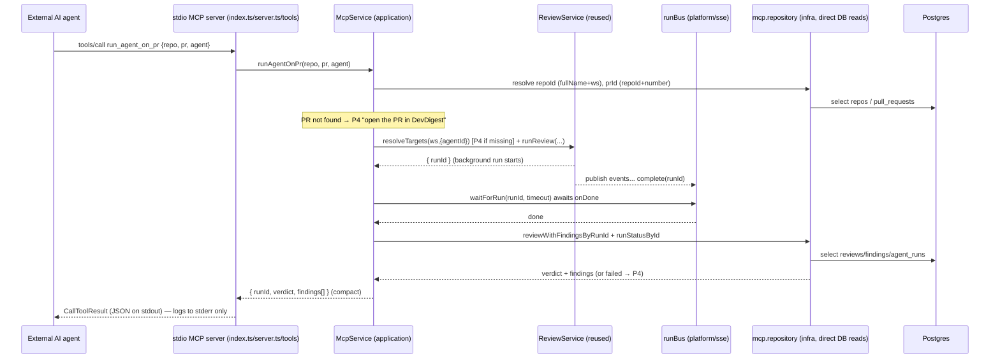

# Development Plan — Local MCP Server (stdio) for DevDigest

**Date:** 2026-07-05
**Status:** Approved by the developer. Confirmed decisions folded in — (1)
implementation = single implementer, (2) PR-not-imported = forward-leading P4
error (auto-import OUT of scope), (3) get_conventions returns ALL conventions
with their `status` (no accepted-only filtering).

## 1. Objective

Expose DevDigest's PR-review engine to external AI agents (Claude, Cursor, etc.)
through a **local-only Model Context Protocol server over stdio**, offering
**exactly 5 tools**. The server is a thin adapter over the existing server
domain (agents, reviews, conventions) — it boots the DI `Container` in its own
process, resolves workspace/repo context from env vars, and drives real review
runs to completion. It is single-purpose, read-only except for one write tool,
and token-frugal by design (~1–1.5k startup tokens).

## 2. Acceptance criteria

1. **Tool surface** — Starting the stdio server and listing tools returns
   EXACTLY these 5: `list_agents`, `run_agent_on_pr`, `get_findings`,
   `get_conventions`, `get_blast_radius`. No more, no fewer.
2. **list_agents** — Given a configured workspace, returns the workspace's
   agents as `{ agents: [{ id, name, provider, model, enabled }] }`. No
   `system_prompt` in the payload. No input required.
3. **run_agent_on_pr (blocking, the only write tool)** — Given
   `{ repo: "owner/name", pr: 42, agent: "<agentId>" }`, it (a) creates a run,
   (b) BLOCKS until the run finishes, (c) returns
   `{ runId, verdict, findings[] }` where each finding is compact
   (`id, severity, category, title, file, start_line, end_line`). It never
   returns before the run completes; it never returns a bare runId.
4. **get_findings** — Given `{ runId }` of an already-completed run, returns
   `{ runId, verdict, findings[] }` with the same compact finding shape. For a
   run that failed/cancelled or does not exist, returns a forward-leading error
   (P4), not a bare 404.
5. **get_conventions** — Returns the SAME conventions data the existing
   `conventions` module serves for the env-configured repo — ALL conventions
   (every status), whitelisted to `{ rule, category, evidence_path, status }`.
   No input; repo resolved from env.
6. **get_blast_radius** — Returns `{ status: "not_implemented", message }` with
   a minimal input schema and a one-line description (stub; real logic later).
7. **Error discipline (P4)** — Every tool failure returns actionable guidance
   (e.g. `agent not found — call list_agents first`), shaped by one shared
   helper, not a raw exception/404.
8. **stdout/stderr** — All diagnostic logging goes to stderr; stdout carries
   ONLY JSON-RPC. A stray log line to stdout would break the protocol and must
   not happen.
9. **In-sandbox verification** — All non-SDK files typecheck clean; unit tests
   for mappers, error-shaping, env/context resolution, the read repository, and
   the run-and-wait orchestration pass under `vitest`. (SDK-importing files show
   module-not-found until the developer runs a real install — documented, expected.)

## 3. Scope

**IN**
- New standalone stdio entrypoint under `server/src/mcp/` that boots the
  `Container` (no Fastify).
- 5 tools with frozen Zod input/output contracts (§5), honoring P1–P4.
- Env-based workspace/repo context (`MCP_WORKSPACE_ID`, `MCP_REPO`).
- Reuse of `ReviewService`, `container.agentsRepo`, the `conventions` read path,
  and the git/github adapters via the Container.
- One new dependency (`@modelcontextprotocol/sdk`) added to `server/package.json`
  + lockfile re-synced with `--lockfile-only`.
- Unit tests using the existing Mock adapters.

**OUT (explicit non-goals)**
- `get_blast_radius` real implementation — STUB only this iteration.
- Any HTTP/SSE transport or Fastify plugin/route for MCP — stdio only.
- Tool Search / Code Mode / gateway / lazy tool-loading / dynamic toolsets —
  over-engineering at 5 tools (see §9 rationale); do NOT add.
- **Auto-importing a PR from GitHub when it is not present locally** — CONFIRMED
  out of scope. The PR must already be imported (via the UI /
  `GET /repos/:id/pulls`). Absent PR → P4 forward-leading error
  ("open the PR in DevDigest to import it, then retry"). The pulls-import logic
  is route-inline, not a reusable service; refactoring it is out of scope.
- New DB tables/migrations — reuse `agents`, `pull_requests`, `repos`,
  `reviews`, `findings`, `agent_runs`, `conventions`.
- Editing `server/src/modules/index.ts` — the MCP server is NOT a Fastify module.
- AbortSignal / true mid-flight cancellation of the blocking run (out of scope
  per `server/INSIGHTS.md` 2026-07-03).

## 4. Affected packages & modules

| Package / path | Onion layer(s) | Why touched |
|---|---|---|
| `server/src/mcp/` (new, whole tree) | presentation + application + infrastructure | The entire feature |
| `server/package.json` | — (build config) | Add `@modelcontextprotocol/sdk` dep + `mcp` script (single owner, sequential) |
| `server/pnpm-lock.yaml` | — (lockfile) | Re-sync via `pnpm install --lockfile-only` (single owner, sequential) |
| `server/src/platform/container.ts` (READ-ONLY reuse) | composition root | `new Container(config, db)`, `container.agentsRepo`, `container.runBus`, `container.git`, `container.github()` — not modified |
| `server/src/modules/reviews/service.ts` (READ-ONLY reuse) | application | `new ReviewService(container)` → `resolveTargets` + `runReview` — not modified |
| `server/src/modules/conventions/*` (READ-ONLY reuse) | — | Convention data reused via a direct table read (see §4 note) — not modified |

**Reuse map (file:line for what each tool consumes):**

- **list_agents** → `container.agentsRepo.list(workspaceId)`
  (`server/src/platform/container.ts:97`, `AgentsRepository.list`
  `server/src/modules/agents/repository.ts:54`). Map via existing
  `toMcpAgent` (`server/src/mcp/helpers.ts:14`).
- **run_agent_on_pr** →
  - resolve repoId + prId via the MCP-owned read repository (direct
    `repos` + `pull_requests` reads — same "plain table read" precedent as
    `ConventionsRepository.getRepoBasics`,
    `server/src/modules/conventions/repository.ts:36`).
  - `new ReviewService(container)` → `resolveTargets(workspaceId, { agentId })`
    (`server/src/modules/reviews/service.ts:46`, throws `NotFoundError('Agent not
    found')` → reshape to P4) → `runReview(workspaceId, prId, targets)`
    (`service.ts:103`, returns runId immediately, executes in background).
  - block on `container.runBus` completion via a new `waitForRun` helper built
    on `RunBus.onDone(runId)` (`server/src/platform/sse.ts:90`, fires
    immediately if already complete).
  - read the finished review+findings by runId via the MCP read repository.
- **get_findings** → MCP read repository: `reviews` row where `run_id = runId`
  + its `findings` + the `agent_runs` status/error
  (`agent_runs` written by `completeAgentRun`,
  `server/src/modules/reviews/repository.ts:151`).
- **get_conventions** → MCP read repository: ALL `conventions` rows for the
  env-resolved repoId (mirrors `ConventionsRepository.listByRepo`,
  `server/src/modules/conventions/repository.ts:49`) — no status filtering.
  Whitelist fields.
- **get_blast_radius** → no data access; returns the stub object.

> **Data-access decision (frozen):** the MCP module gets its OWN thin read
> repository (`infrastructure/mcp.repository.ts`) for the three lookups the
> shared getters do NOT expose (repo-by-fullName+ws, pr-by-repoId+number,
> review+findings-by-runId). Rationale: `container.reviewRepo`/`agentsRepo`
> (`container.ts:92,97`) are used where they suffice (agents list), but adding
> by-runId / by-number methods to `ReviewRepository` would edit another module's
> shared file and create an ownership conflict. Reading `repos`/`pull_requests`/
> `reviews`/`findings`/`agent_runs`/`conventions` tables directly from an
> infra-layer file is the exact precedent set by `conventions` reading `repos`
> (`conventions/repository.ts:10` comment). The WRITE/run path still goes
> through the public `ReviewService` — never duplicate run logic.

## 5. Frozen interface contracts

All schemas live in `server/src/mcp/schemas.ts` (SDK-free). Compact mappers
extend `server/src/mcp/helpers.ts`. Error shaping in `server/src/mcp/errors.ts`.
These are FINAL — implementers must not alter shapes.

### 5.1 Shared compact output types

```ts
// helpers.ts — EXTEND the existing file (McpAgent/toMcpAgent already present).

// Existing (reuse as-is, already omits system_prompt):
export const McpAgent = z.object({
  id: z.string(), name: z.string(), version: z.number().int(),
  provider: z.string(), model: z.string(), enabled: z.boolean(),
});
export function toMcpAgent(row: Agent): McpAgent { /* existing */ }

// NEW — P3 compact finding: essentials only; NO rationale/evidence/suggestion/confidence.
export const McpFinding = z.object({
  id: z.string(),
  severity: z.string(),        // CRITICAL | WARNING | SUGGESTION
  category: z.string(),
  title: z.string(),
  file: z.string(),
  start_line: z.number().int(),
  end_line: z.number().int(),
});
export type McpFinding = z.infer<typeof McpFinding>;
export function toMcpFinding(row: FindingRow): McpFinding;

// NEW — P3 compact convention: drop the heavy evidence_snippet. ALL statuses surfaced.
export const McpConvention = z.object({
  rule: z.string(),
  category: z.string().nullable(),
  evidence_path: z.string(),
  status: z.string(),          // pending | accepted | rejected — always included
});
export type McpConvention = z.infer<typeof McpConvention>;
export function toMcpConvention(row: ConventionRow): McpConvention;
```

### 5.2 Per-tool contracts (input = flat ZodRawShape per P2; output = compact per P3)

> MCP `registerTool` takes an `inputSchema` as a **ZodRawShape** (a plain object
> of zod fields), NOT a `z.object(...)`. Descriptions ≤ ~120 chars, one line, few
> `.describe()`, sparing enums (P2 + token budget).

```ts
// 1. list_agents — description: "List the configured review agents and their ids."
input:  {}                                   // no PR context
output: { agents: McpAgent[] }

// 2. run_agent_on_pr — description:
//    "Run one review agent on a PR and block until it finishes; returns verdict + findings."
input:  { repo: z.string(), pr: z.number().int().positive(), agent: z.string() }  // FLAT
output: { runId: z.string(), verdict: z.string(), findings: McpFinding[] }

// 3. get_findings — description: "Fetch the verdict and findings of a completed run by runId."
input:  { runId: z.string() }
output: { runId: z.string(), verdict: z.string(), findings: McpFinding[] }

// 4. get_conventions — description: "List the repository conventions for the configured repo."
input:  {}                                   // repo resolved from env
output: { conventions: McpConvention[] }      // ALL statuses, no filtering

// 5. get_blast_radius — description: "STUB: blast radius of a PR (not implemented yet)."
input:  { repo: z.string(), pr: z.number().int() }   // minimal, future-compatible flat shape
output: { status: z.literal('not_implemented'), message: z.string() }
```

### 5.3 Response envelope + error shaping (P3 + P4)

Every tool returns a `CallToolResult`. Success:

```ts
{ content: [{ type: 'text', text: JSON.stringify(<output>) }] }
```

Failure — ONE shared helper in `errors.ts`:

```ts
// P4: errors lead forward. `next` is a concrete next action for the calling agent.
export function toolError(message: string, next?: string): CallToolResult {
  const payload = next ? { error: message, next } : { error: message };
  return { content: [{ type: 'text', text: JSON.stringify(payload) }], isError: true };
}
```

Frozen forward-leading messages (P4):

| Situation | message | next |
|---|---|---|
| agent id not found | `agent not found` | `call list_agents to get a valid agent id` |
| repo not configured/known | `repo "<x>" not found in this workspace` | `add it in DevDigest, then retry` |
| PR not imported locally | `PR #<n> not found for <repo>` | `open the PR in DevDigest to import it, then retry` |
| run failed/cancelled (get_findings / run) | `run <id> did not complete: <error>` | `check the run in DevDigest or start a new run` |
| run still running / not found (get_findings) | `run <id> is not a completed run` | `wait for it to finish, or start one with run_agent_on_pr` |
| run exceeded MCP timeout | `run <id> is still running after <ms>ms` | `call get_findings with runId=<id> once it finishes` |
| MCP_REPO unset (get_conventions) | `no repo configured` | `set the MCP_REPO env var to "owner/name"` |

### 5.4 Env context (frozen)

```ts
// env.ts — parsed once at startup, SDK-free.
export const McpEnv = z.object({
  MCP_WORKSPACE_ID: z.string().optional(),   // workspace UUID; unset → default workspace
  MCP_REPO: z.string().optional(),           // "owner/name"; required only by get_conventions
  MCP_RUN_TIMEOUT_MS: z.coerce.number().int().positive().default(300_000),
});
```

- `workspaceId`: `MCP_WORKSPACE_ID` if set; else the seeded default workspace via
  `container.auth.currentWorkspace()` (LocalNoAuthProvider ignores the request arg,
  `server/src/adapters/auth/local.ts:28`).
- `MCP_REPO` is resolved to a repoId lazily; absent + `get_conventions` called →
  P4 error (§5.3).

### 5.5 DB schema deltas

— none — (reuses existing tables; no migration).

## 6. Directory ownership map (non-overlapping)

| Task | Surface | Owns (dirs/files) |
|---|---|---|
| T1 | backend | ALL of `server/src/mcp/**` (new files + the existing `helpers.ts`/`tools/`) |
| T1 (sequential sub-step) | backend | `server/package.json` (dep + `mcp` script) then `server/pnpm-lock.yaml` (`--lockfile-only`) |

No file is shared with any other task. `server/src/modules/index.ts` is NOT
touched. `server/src/vendor/**` and `server/src/db/migrations/**` are NOT touched.

Final structure under `server/src/mcp/`:

```
server/src/mcp/
  index.ts                    # BIN entrypoint (presentation/composition): loadConfig → createDb
                              #   → new Container → buildMcpServer → StdioServerTransport.connect.
                              #   stderr-only logging. THE ONLY place process wiring happens.
  server.ts                   # buildMcpServer(container, ctx): create McpServer, registerTool ×5.  [presentation, imports SDK]
  tools/
    list-agents.ts            # tool registration + handler → McpService.listAgents           [presentation, imports SDK]
    run-agent-on-pr.ts        # handler → McpService.runAgentOnPr                              [presentation, imports SDK]
    get-findings.ts           # handler → McpService.getFindings                              [presentation, imports SDK]
    get-conventions.ts        # handler → McpService.getConventions                           [presentation, imports SDK]
    get-blast-radius.ts       # handler → returns stub object                                 [presentation, imports SDK]
  application/
    mcp-service.ts            # orchestration: listAgents / runAgentOnPr(block) / getFindings /
                              #   getConventions. Uses ReviewService + agentsRepo + mcp.repository +
                              #   runBus. SDK-FREE.                                            [application]
    wait-for-run.ts           # waitForRun(runBus, runId, timeoutMs): Promise on onDone + timeout. SDK-FREE. [application]
  infrastructure/
    mcp.repository.ts         # direct reads: repoByFullName, prByRepoAndNumber,
                              #   reviewWithFindingsByRunId, runStatusById, conventionsByRepo. SDK-FREE. [infrastructure]
    env.ts                    # McpEnv parse + workspace/repo resolution. SDK-FREE.           [infrastructure/config]
  helpers.ts                  # EXISTING McpAgent/toMcpAgent + NEW McpFinding/McpConvention mappers. SDK-FREE.
  schemas.ts                  # Frozen tool input/output zod (§5.2). SDK-FREE.
  errors.ts                   # toolError (P4). Imports only the SDK CallToolResult TYPE (type-only).
```

**SDK-isolation rule (frozen):** only `index.ts`, `server.ts`, and `tools/*.ts`
import runtime values from `@modelcontextprotocol/sdk`. `application/`,
`infrastructure/`, `helpers.ts`, `schemas.ts` stay SDK-free so they typecheck and
unit-test in-sandbox before the real install. `errors.ts` uses a type-only import
for `CallToolResult`.

## 7. Parallelizable tasks

**Implementation approach: a SINGLE implementer (CONFIRMED).** The work is one
cohesive backend feature in one new directory; the files form a tight
contract→mapper→service→tool→entrypoint chain with heavy interdependence.
Splitting it into parallel same-surface tracks would add protocol/agent overhead
and force coordination on freshly-created shared files (`helpers.ts`,
`schemas.ts`, `mcp-service.ts`) for little wall-clock gain. Presented as one task
with an internal build order.

### T1 — MCP stdio server (backend, single implementer)

- **Goal:** implement the whole `server/src/mcp/**` tree per §5–§6, add the dep +
  lockfile, and the `mcp` npm script.
- **Dependencies:** none.
- **Internal build order (do in this sequence):**
  1. `schemas.ts` + `helpers.ts` mappers (freeze the contracts in code).
  2. `errors.ts` (P4 helper).
  3. `infrastructure/env.ts` + `infrastructure/mcp.repository.ts`.
  4. `application/wait-for-run.ts` + `application/mcp-service.ts`.
  5. `tools/*.ts` + `server.ts` + `index.ts` (SDK wiring).
  6. `server/package.json`: add `@modelcontextprotocol/sdk` to `dependencies`
     and a script `"mcp": "tsx src/mcp/index.ts"`; then
     `pnpm install --lockfile-only` to re-sync `pnpm-lock.yaml`.
  7. Unit tests (§8).
- **Merge order:** standalone; merges independently (no other track).
- **Skills to apply:** `onion-architecture` (layer the mcp tree; deps point
  inward — tools→application→infrastructure), `zod` (freeze §5 schemas, flat
  inputs, whitelisted outputs), `drizzle-orm-patterns` (the read repository),
  `typescript-expert` (SDK typing, type-only imports, `unknown` handling),
  `security` (env handling; NEVER write secrets or anything to stdout; validate
  tool inputs; the run tool is the only write and is scoped by workspace),
  `engineering-insights` (end of session, mandatory).
  - `fastify-best-practices`: **not applicable** — this is a stdio JSON-RPC
    server, not an HTTP server. Carry over only its error-contract discipline
    (structured, forward-leading errors — already captured by P4).

## 8. Test commands per scope

Run from `server/` (per `server/INSIGHTS.md` Tooling Notes — invoke local
binaries directly; `pnpm typecheck`/`pnpm test` abort on `ERR_PNPM_IGNORED_BUILDS`):

```bash
# Typecheck. SDK-importing files (index.ts, server.ts, tools/*.ts, errors.ts)
# will report "Cannot find module '@modelcontextprotocol/sdk'" until the real
# install on the developer machine — EXPECTED noise (documented). Every SDK-FREE
# file MUST be clean.
./node_modules/.bin/tsc --noEmit -p tsconfig.json

# Unit tests (SDK-free units only).
./node_modules/.bin/vitest run src/mcp
```

**Unit test plan (Mock adapters, per `server/INSIGHTS.md` 2026-06-28):**
- `helpers.test.ts` — `toMcpFinding` / `toMcpConvention` whitelist exactly the
  frozen fields (no rationale/evidence/snippet/system_prompt leak); convention
  mapper preserves `status` for every status value.
- `errors.test.ts` — `toolError` sets `isError`, embeds `error` + `next`.
- `env.test.ts` — `McpEnv` parsing; workspace defaulting; MCP_REPO-absent path.
- `mcp.repository.test.ts` — resolve repo/pr/run/conventions against a seeded
  test `Db`; not-found paths return undefined; conventions read returns all
  statuses.
- `mcp-service.test.ts` — the blocking orchestration end to end with
  `ContainerOverrides`: `MockLLMProvider({ structured })` (fixture satisfies the
  real review schema) + `MockGitClient({ files })`, driving `ReviewService` to
  completion and asserting `run_agent_on_pr` returns `{ runId, verdict,
  findings[] }` only AFTER `runBus` completes; unknown-agent → P4 error;
  PR-not-imported → P4 error; `get_findings` on a done run vs a failed/absent run.

**Developer-machine verification (cannot run in sandbox):**
`pnpm install` (real), then configure the MCP client (or `pnpm mcp`) to spawn
`tsx src/mcp/index.ts`; confirm the JSON-RPC handshake, `tools/list` returns the
5 tools, and `run_agent_on_pr` performs a real blocking review. Confirm nothing
but JSON-RPC appears on stdout.

## 9. Relevant engineering insights

- **Container getters over `new XRepository`** (`server/INSIGHTS.md` 2026-07-03):
  `container.reviewRepo`/`agentsRepo` exist so cross-domain code doesn't reach
  into another module's folder. → list_agents uses `container.agentsRepo`; the
  run path uses the public `ReviewService`; the MCP-owned read repository only
  covers lookups no getter exposes (documented tradeoff, §4).
- **git port, never `fs`** (`server/INSIGHTS.md` 2026-06-28): repo files only via
  `container.git.readFile({owner,name}, path)`. MCP does no direct file reads, but
  any future blast-radius work must obey this.
- **Mock adapters for tests** (`server/INSIGHTS.md` 2026-06-28):
  `MockGitClient.readFile` returns `''` (not throw) for unknown paths;
  `MockLLMProvider({ structured })` validates the fixture against the call's Zod
  schema — the review fixture must satisfy the real `Review` schema.
- **`completeAgentRun` DB-level status guard** (`server/INSIGHTS.md` 2026-07-03):
  a cancelled/failed run is terminal; `runBus.complete(runId)` is always called on
  every terminal path (done/failed/cancelled/pre-work-fail) — so `onDone` is
  guaranteed to fire and `waitForRun` will not hang (still add a timeout for
  safety). Note: the cancelled flag is deleted from the bus on `complete`, so rely
  on the DB `agent_runs.status`, not the in-memory flag, to classify the outcome.
- **pnpm env constraint** (`server/INSIGHTS.md` 2026-06-20 / 2026-07-03): adding a
  NEW package needs a real install (not viable in sandbox); `pnpm install
  --lockfile-only` works to re-sync the lockfile. → dep added + lockfile synced
  here; real install deferred to the developer machine.
- **Token-efficiency rationale (bake in, do NOT re-litigate):** at 5 tools we are
  nowhere near tool-bloat territory (that starts at dozens–hundreds of tools). No
  Tool Search / Code Mode / gateway / lazy-loading — that would be
  over-engineering. The entire startup budget is: 5 tools, one-line descriptions
  (≤120 chars), flat/minimal input schemas (P2), compact whitelisted outputs
  (P3). Target ~1–1.5k startup tokens. Do not add lazy tool-loading later
  thinking it is required.

## 10. Architecture diagram



## 11. Risks & integration concerns

- **Blocking duration:** `run_agent_on_pr` can take minutes (a real LLM review).
  This is intended (P1) but a client with a short call timeout may drop the
  connection. Mitigation: `MCP_RUN_TIMEOUT_MS` (default 300s) → on timeout return
  a P4 error carrying the runId so the agent can `get_findings` later.
- **stdout contamination:** any accidental `console.log` (or a dependency logging
  to stdout) breaks JSON-RPC. Mitigation: route ALL logging to `console.error`/
  stderr; the Container/ReviewService pass a stderr-backed `Logger`; add a
  regression note. (Security skill covers "no secret/anything to stdout".)
- **PR must be pre-imported:** MCP does not import PRs from GitHub (§3 OUT,
  CONFIRMED). If an agent references a PR not yet in DevDigest, it gets a
  forward-leading P4 error. Acceptable for v1; revisit if it proves annoying.
- **SDK typecheck noise in sandbox:** SDK-importing files won't typecheck until
  the real install. Mitigated by the SDK-isolation rule so the bulk of the code
  (logic + tests) verifies in-sandbox.
- **Sequential lockfile step:** package.json + pnpm-lock.yaml are single-owner,
  edited last in T1; no other task touches them.

## 12. Open questions

— none, all resolved —
